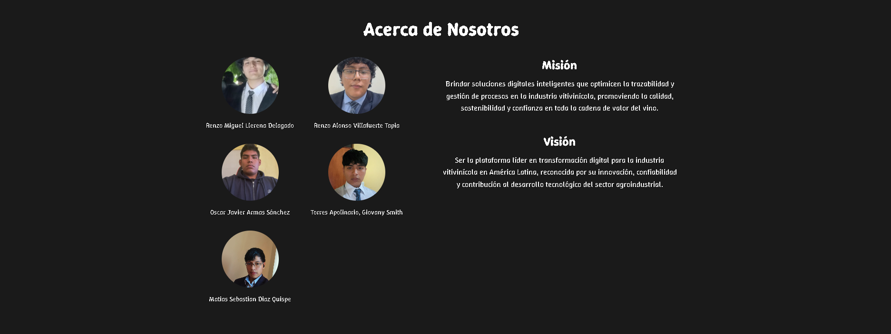
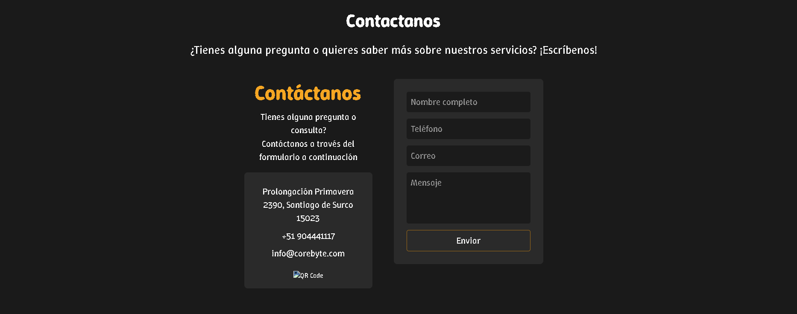
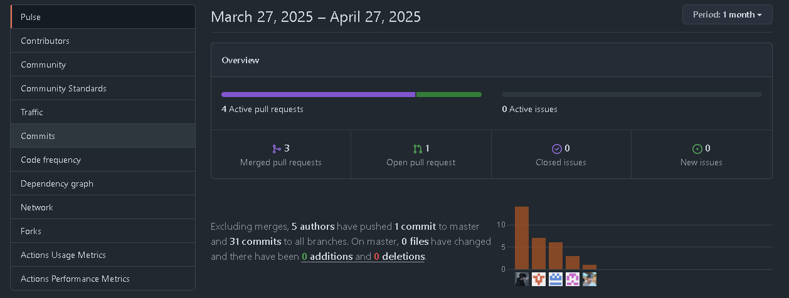
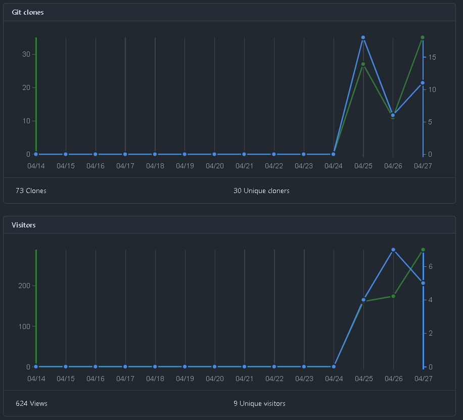

# Capítulo V: Product Implementation, Validation & Deployment.

## 5.1. Software Configuration Management.

### 5.1.1. Software Development Environment Configuration.

### 5.1.2. Source Code Management.

### 5.1.3. Source Code Style Guide & Conventions.

### 5.1.4. Software Deployment Configuration.

## 5.2. Landing Page, Services & Applications Implementation.

### 5.2.1. Sprint 1
En la fase inicial de nuestro proyecto, nos propusimos llevar a cabo la implementación del diseño de nuestra Landing Page utilizando WebStorm como entorno de desarrollo. Esto implica que al concluir el Sprint, todas las secciones, ya sea Home, Services, Pricing, Testimonials o About Us, deben estar completadas. A continuación, adjuntamos imágenes que ilustran cómo gestionamos las tareas en Jira Software.

Repositorio: [https://github.com/4424-Corebyte-App-Web/Corebyte-Landing-Page](https://github.com/4424-Corebyte-App-Web/Corebyte-Landing-Page)

Landing Page Deployed: https://4424-corebyte-app-web.github.io/Corebyte-Landing-Page/

#### 5.2.1.1. Sprint Planning 1.

<table>
    <thead>
        <tr>
            <th>Sprint #</th>
            <th>Sprint 1</th>
        </tr>
    </thead>
    <tbody>
        <tr>
            <td colspan="2"> <p1 style="text-align: center;"> Sprint Planning Background </p1></td>
        </tr>
        <!--FILA 1-->
        <tr>
            <td>Date</td>
            <td>20-04-2025</td>
        </tr>
        <!--FILA 2-->
        <tr>
            <td>Time</td>
            <td> 10:00 p.m </td>
        </tr>
        <!--FILA 3-->
        <tr>
            <td>Location</td>
            <td>Discord</td>
        </tr>
         <!--FILA 4-->
        <tr>
            <td>Prepared By</td>
            <td>Oscar Armas</td>
        </tr>
         <!--FILA 5-->
        <tr>
            <td>Attendees (to planning meeting)</td>
            <td>Renzo Llerena - Matías Diaz - Renzo Villafuerte - Giovany Torres </td>
        </tr>
        <!--FILA 6-->
        <tr>
            <td colspan="2"> <p1 style="text-align: center;"> Sprint Goal & User Stories </p1></td>
        </tr>
        <!--FILA 7-->
        <tr>
            <td>Sprint 1 Goal</td>
            <td> 
              Nuestro enfoque está en implementar la landing page de TraceWine, incluyendo todas las 
              secciones acordadas y el requisito de cambio de idioma para la aplicación. Creemos que esto
              mejora la accesibilidad y la experiencia del usuario, permitiendo que más productores de vinos y 
              distribuidores se conecten con la plataforma. Esto se confirmará cuando la landing page 
              esté completa, funcional y los usuarios puedan navegar por las secciones en su idioma 
              preferido, reportando satisfacción con la interfaz y la usabilidad.
            </td>
        </tr>
        <!--FILA 8-->
        <tr>
            <td>Sprint 1 Velocity</td>
            <td>  </td>
        </tr>
        <!--FILA 9-->
        <tr>
            <td>Sum of Story Points</td>
            <td>  </td>
        </tr>
    </tbody>
</table>

#### 5.2.1.2. Aspect Leaders and Collaborators.

<table>
    <thead>
        <tr>
            <th colspan="7">Sprint #</th>
            <th> Sprint 1</th>
        </tr>
    </thead>
    <tbody>
        <!--FILA 1-->
        <tr>
            <td colspan="1">User Story</td>
            <td colspan="15">Work-Item / Task</td>
        </tr>
        <!--FILA 2-->
        <tr>
            <td>Id</td>
            <td>Title</td>
            <td>Id</td>
            <td>Title</td>
            <td>Description</td>
            <td>Estimation (hours)</td>
            <td>Assigned To</td>
            <td>Status</td>
        </tr>
        <!--FILA 3-->
        <tr>
            <td rowspan="4" >US-001</td>
            <td rowspan="4" >Hipervínculos en el encabezado</td>
            <td>T001</td>
            <td>Definir enlaces del encabezado</td>
            <td>Identificar y organizar los enlaces del encabezado.</td>
            <td>1</td>
            <td></td>
            <td>Done</td>
        </tr>
        <!--FILA 4-->
        <tr>
            <td>T002</td>
            <td>Implementar hipervínculos</td>
            <td>Añadir hipervínculos en HTML</td>
            <td>1</td>
            <td></td>
            <td>Done</td>
        </tr>
        <!--FILA 5-->
        <tr>
            <td>T003</td>
            <td>Estilizar con CSS</td>
            <td>Aplicar estilos básicos a los enlaces del encabezado</td>
            <td>2</td>
            <td></td>
            <td>Done</td>
        </tr>
        <!--FILA 6-->
        <tr>
            <td>T004</td>
            <td>Pruebas de funcionamiento</td>
            <td>Asegurarse de que los hipervínculos funcionen correctamente.</td>
            <td>1</td>
            <td></td>
            <td>Done</td>
        </tr>
        <!--FILA 7-->
        <tr>
            <td rowspan="4" >US-002</td>
            <td rowspan="4" >Información sobre beneficios de la aplicación</td>
            <td>T001</td>
            <td>Definir contenido de beneficios</td>
            <td>Identificar los beneficios clave de la aplicación.</td>
            <td>2</td>
            <td></td>
            <td>Done</td>
        </tr>
        <!--FILA 8-->
        <tr>
            <td>T002</td>
            <td>Redactar sección de beneficios</td>
            <td>Escribir los beneficios de la aplicación de forma clara.</td>
            <td>2</td>
            <td></td>
            <td>Done</td>
        </tr>
        <!--FILA 9-->
        <tr>
            <td>T003</td>
            <td>Estilizar la sección de beneficios</td>
            <td>Aplicar estilos visuales a la sección de beneficios</td>
            <td>2</td>
            <td></td>
            <td>Done</td>
        </tr>
        <!--FILA 10-->
        <tr>
            <td>T004</td>
            <td>Pruebas de funcionalidad de beneficios</td>
            <td>Asegurarse de que la sección de beneficios sea accesible y clara.</td>
            <td>1</td>
            <td></td>
            <td>Done</td>
        </tr>
        <!--FILA 11-->
        <tr>
            <td rowspan="4" >US-003</td>
            <td rowspan="4" >Información sobre beneficios de la aplicación para vinicultores</td>
            <td>T001</td>
            <td>Definir beneficios específicos para vinicultores</td>
            <td>Identificar beneficios clave que impactan directamente a los vinicultores.</td>
            <td>2</td>
            <td></td>
            <td>Done</td>
        </tr>
        <!--FILA 12-->
        <tr>
            <td>T002</td>
            <td>Redactar contenido para vinicultores</td>
            <td>Escribir los beneficios específicos para vinicultores de forma clara.</td>
            <td>2</td>
            <td></td>
            <td>Done</td>
        </tr>
        <!--FILA 13-->
        <tr>
            <td>T003</td>
            <td>Estilizar la sección de beneficios para vinicultores</td>
            <td>Aplicar estilos visuales a la sección específica de vinicultores.</td>
            <td>2</td>
            <td></td>
            <td>Done</td>
        </tr>
        <!--FILA 14-->
        <tr>
            <td>T004</td>
            <td>Pruebas de funcionalidad de beneficios para vinicultores</td>
            <td>Asegurarse de que la sección sea clara y útil para los vinicultores.</td>
            <td>1</td>
            <td></td>
            <td>Done</td>
        </tr>
        <!--FILA 3-->
        <tr>
            <td rowspan="4" >US-004</td>
            <td rowspan="4" >Opciones de Precios Claras para Decisiones Informadas</td>
            <td>T001</td>
            <td>Definir opciones de precios</td>
            <td>Establecer diferentes opciones de precios para los usuarios.</td>
            <td>2</td>
            <td></td>
            <td>Done</td>
        </tr>
        <!--FILA 4-->
        <tr>
            <td>T002</td>
            <td>Redactar descripción de precios</td>
            <td>Escribir descripciones claras y transparentes para cada opción de precio.</td>
            <td>2</td>
            <td></td>
            <td>Done</td>
        </tr>
        <!--FILA 5-->
        <tr>
            <td>T003</td>
            <td>Estilizar opciones de precios</td>
            <td>Aplicar diseño visual para hacer las opciones de precios fáciles de identificar.</td>
            <td>2</td>
            <td></td>
            <td>Done</td>
        </tr>
        <!--FILA 6-->
        <tr>
            <td>T004</td>
            <td>Pruebas de funcionalidad de precios</td>
            <td>Verificar que todas las opciones de precios funcionen correctamente.</td>
            <td>1</td>
            <td></td>
            <td>Done</td>
        </tr>
        <!--FILA 7-->
        <tr>
            <td rowspan="4" >US-005</td>
            <td rowspan="4" >Acceso fácil a soporte y asesoramiento</td>
            <td>T001</td>
            <td>Definir canales de soporte</td>
            <td>Establecer los diferentes canales a través de los cuales los usuarios pueden recibir soporte.</td>
            <td>2</td>
            <td></td>
            <td>Done</td>
        </tr>
        <!--FILA 8-->
        <tr>
            <td>T002</td>
            <td>Redactar contenido de soporte</td>
            <td>Escribir instrucciones claras para acceder al soporte y asesoramiento.</td>
            <td>2</td>
            <td></td>
            <td>Done</td>
        </tr>
        <!--FILA 9-->
        <tr>
            <td>T003</td>
            <td>Estilizar el acceso a soporte</td>
            <td>Asegurarse de que el acceso al soporte sea fácil de encontrar y utilizar.</td>
            <td>2</td>
            <td></td>
            <td>Done</td>
        </tr>
        <!--FILA 10-->
        <tr>
            <td>T004</td>
            <td>Pruebas de funcionalidad de soporte</td>
            <td>Verificar que todos los canales de soporte sean funcionales.</td>
            <td>1</td>
            <td></td>
            <td>Done</td>
        </tr>
        <!--FILA 11-->
        <tr>
            <td rowspan="4" >US-006</td>
            <td rowspan="4" >Opiniones de usuarios que inspiran confianza</td>
            <td>T001</td>
            <td>Recopilar opiniones de usuarios</td>
            <td>Solicitar y recopilar opiniones de usuarios sobre la aplicación.</td>
            <td>2</td>
            <td></td>
            <td>Done</td>
        </tr>
        <!--FILA 12-->
        <tr>
            <td>T002</td>
            <td>Redactar opiniones destacadas</td>
            <td>Seleccionar y escribir las opiniones más destacadas de los usuarios.</td>
            <td>2</td>
            <td></td>
            <td>Done</td>
        </tr>
        <!--FILA 13-->
        <tr>
            <td>T003</td>
            <td>Estilizar opiniones de usuarios</td>
            <td>Aplicar un diseño visual atractivo para mostrar las opiniones de los usuarios.</td>
            <td>2</td>
            <td></td>
            <td>Done</td>
        </tr>
        <!--FILA 14-->
        <tr>
            <td>T004</td>
            <td>Pruebas de funcionalidad de opiniones</td>
            <td>Asegurarse de que las opiniones se muestren correctamente.</td>
            <td>1</td>
            <td></td>
            <td>Done</td>
        </tr>
        <!--FILA 15-->
        <tr>
            <td rowspan="4" >US-007</td>
            <td rowspan="4" >Navegación fluida en dispositivos móviles</td>
            <td>T001</td>
            <td>Optimizar navegación para dispositivos móviles</td>
            <td>Asegurarse de que la navegación sea fluida en dispositivos móviles.</td>
            <td>3</td>
            <td></td>
            <td>Done</td>
        </tr>
        <!--FILA 16-->
        <tr>
            <td>T002</td>
            <td>Rediseñar menús para móviles</td>
            <td>Ajustar los menús de navegación para mejorar la experiencia móvil.</td>
            <td>3</td>
            <td></td>
            <td>Done</td>
        </tr>
        <!--FILA 17-->
        <tr>
            <td>T003</td>
            <td>Pruebas de funcionalidad móvil</td>
            <td>Verificar que la navegación móvil funcione correctamente.</td>
            <td>2</td>
            <td></td>
            <td>Done</td>
        </tr>
        <!--FILA 18-->
        <tr>
            <td>T004</td>
            <td>Realizar pruebas de rendimiento móvil</td>
            <td>Asegurarse de que la experiencia de navegación sea rápida en dispositivos móviles.</td>
            <td>2</td>
            <td></td>
            <td>Done</td>
        </tr>
        <!--FILA 19-->
        <tr>
            <td rowspan="4" >US-008</td>
            <td rowspan="4" >Adaptación de la landing page en tabletas</td>
            <td>T001</td>
            <td>Rediseñar layout para tabletas</td>
            <td>Adaptar la landing page para una visualización optimizada en tabletas.</td>
            <td>3</td>
            <td></td>
            <td>Done</td>
        </tr>
        <!--FILA 20-->
        <tr>
            <td>T002</td>
            <td>Rediseñar elementos interactivos</td>
            <td>Ajustar botones y enlaces para mejorar la experiencia en tabletas.</td>
            <td>2</td>
            <td></td>
            <td>Done</td>
        </tr>
        <!--FILA 21-->
        <tr>
            <td>T003</td>
            <td>Pruebas de funcionalidad en tabletas</td>
            <td>Verificar que la landing page funcione correctamente en tabletas.</td>
            <td>2</td>
            <td></td>
            <td>Done</td>
        </tr>
        <!--FILA 22-->
        <tr>
            <td>T004</td>
            <td>Realizar pruebas de rendimiento en tabletas</td>
            <td>Asegurarse de que la experiencia sea rápida y fluida en tabletas.</td>
            <td>2</td>
            <td></td>
            <td>Done</td>
        </tr>
        <!--FILA 23-->
        <tr>
            <td rowspan="4" >US-009</td>
            <td rowspan="4" >Compatibilidad en computadoras de escritorio</td>
            <td>T001</td>
            <td>Optimizar layout para computadoras de escritorio</td>
            <td>Asegurarse de que la landing page sea completamente funcional en escritorios.</td>
            <td>3</td>
            <td></td>
            <td>Done</td>
        </tr>
        <!--FILA 24-->
        <tr>
            <td>T002</td>
            <td>Rediseñar elementos para escritorio</td>
            <td>Ajustar el diseño de botones y menús para computadoras de escritorio.</td>
            <td>2</td>
            <td></td>
            <td>Done</td>
        </tr>
        <!--FILA 25-->
        <tr>
            <td>T003</td>
            <td>Pruebas de funcionalidad en escritorio</td>
            <td>Verificar que todos los elementos funcionen correctamente en computadoras de escritorio.</td>
            <td>2</td>
            <td></td>
            <td>Done</td>
        </tr>
        <!--FILA 26-->
        <tr>
            <td>T004</td>
            <td>Realizar pruebas de rendimiento en escritorio</td>
            <td>Asegurarse de que la página cargue rápidamente y sin errores en computadoras de escritorio.</td>
            <td>2</td>
            <td></td>
            <td>Done</td>
        </tr>
    </tbody>
</table>

#### 5.2.1.3. Sprint Backlog 1.

<table>
    <thead>
        <tr>
            <th rowspan="" >Repository</th>
            <th>Branch</th>
            <th>Commit Id</th>
            <th>Commit Message</th>
            <th>Commit Message Body</th>
            <th>Commited on (Date)</th>
        </tr>
    </thead>
    <tbody>
        <!--FILA 1 -->
        <tr>
            <td rowspan="14">https://github.com/4424-Corebyte-App-Web/Corebyte-Landing-Page</td>
            <td>master</td>
            <td>989c513aff9000ef61b828540ba489a75c4cc05d</td>
            <td>Initial commit</td>
            <td></td>
            <td>24/24/2025</td>
        </tr>
        <!--FILA 2 -->
        <tr>
            <td>develop</td>
            <td>c77773e32554125a0c306c9fe2fd24fe79bd46c6</td>
            <td>feat(start): add start section and styles</td>
            <td></td>
            <td>24/24/2025</td>
        </tr>
        <!--FILA 3 -->
        <tr>
            <td>feature/about</td>
            <td>989c513aff9000ef61b828540ba489a75c4cc05d</td>
            <td>Initial commit</td>
            <td></td>
            <td>24/24/2025</td>
        </tr>
        <!--FILA 4 -->
        <tr>
            <td>feature/about-app</td>
            <td>44b743ac8c78ae066b0e07ab8b55ebec37b3956b</td>
            <td>feat(prices): add prices section and styles</td>
            <td></td>
            <td>24/24/2025</td>
        </tr>
        <!--FILA 5 -->
        <tr>
            <td>feature/contact</td>
            <td>2e1735e81ffa8d485708e38e52caefe681a3a3ee</td>
            <td>docs:update index.html</td>
            <td></td>
            <td>24/24/2025</td>
        </tr>
        <!--FILA 6 -->
        <tr>
            <td>feature/prices</td>
            <td>44b743ac8c78ae066b0e07ab8b55ebec37b3956b</td>
            <td>feat(prices): add prices section and styles</td>
            <td></td>
            <td>24/24/2025</td>
        </tr>
        <!--FILA 7 -->
        <tr>
            <td>feature/services</td>
            <td>ed0ba970539a24d09c25d94c221effaf4ee77b7e</td>
            <td>commit: update services section</td>
            <td></td>
            <td>26/24/2025</td>
        </tr>
        <!--FILA 8 -->
        <tr>
            <td>feature/start</td>
            <td>c77773e32554125a0c306c9fe2fd24fe79bd46c6</td>
            <td>feat(start): add start section and styles</td>
            <td></td>
            <td>24/24/2025</td>
        </tr>
        <!--FILA 9 -->
        <tr>
            <td>release</td>
            <td>989c513aff9000ef61b828540ba489a75c4cc05d</td>
            <td>Initial commit</td>
            <td></td>
            <td>24/24/2025</td>
        </tr>
    </tbody>
</table>

#### 5.2.1.4. Development Evidence for Sprint Review.

Para este primer sprint no se realizaron testing.

#### 5.2.1.5. Execution Evidence for Sprint Review.

Después de completar el Sprint 1, logramos implementar todas las secciones de nuestra Landing Page para garantizar una visualización perfecta. Además, le dimos un formato atractivo que captura la atención del usuario hacia sus diferentes componentes. También agregamos métodos de navegación en la página, como botones ubicados al principio, que te permiten moverte fácilmente de una sección a otra. A continuación, te mostraremos los avances a través de imágenes del resultado obtenido.

Es importante destacar que el objetivo principal de la Landing Page es convertir a los visitantes en futuros clientes o usuarios habituales de nuestro servicio. Para lograrlo, utilizamos llamados a la acción (Call To Action) que los guían hacia la aplicación web.

A continuación, te presentamos capturas de pantalla del desarrollo de la Landing Page:

**Encabezado y botones de desplazamiento:**

En la parte superior, se encuentra el encabezado (Header) que incluye botones de inicio (Home), beneficios (benefits), Pricing (Pricing), sobre la aplicación (about), testimonios de usuarios (testimonials), un formulario para que nos contacten (Contact), un apartado para saber sobre el equipo (About us) y un botón para cambiar el idioma entre inglés y español. Estos elementos permiten a los visitantes desplazarse fácilmente a la sección que deseen visualizar.

Imagen 01: Encabezado y botones de desplazamiento

**Sección Hero:**

Se presenta la sección "Hero", que incluye una breve descripción y una frase representativa de TraceWine. Además, permite iniciar el uso del servicio web y proporciona una imagen relacionada con el mismo.

Imagen 02: Sección Hero

**Sección Services:**

Se presenta la sección de servicio que ofrecemos para nuestros segmentos objetivos. En esta sección, se describen los beneficios y características de TraceWine, lo que permite a los visitantes conocer más sobre el servicio.

Imagen 03: Sección Services

**Sección Pricing:**

En la sección de precios, se detallan los planes y precios de TraceWine. Esta información es esencial para que los visitantes conozcan las opciones disponibles y puedan elegir la que mejor se adapte a sus necesidades.

Imagen 04: Sección Pricing

**Sección About the App:**

En esta sección, se presenta información detallada sobre la aplicación TraceWine, sus características y funcionalidades. Esto permite a los visitantes conocer más sobre la aplicación y cómo puede ayudarles en su día a día.

Imagen 05: Sección About the App

**Sección About the Team:**

En la sección "About the Team", se presenta información sobre el equipo de desarrollo de TraceWine. Esto permite a los visitantes conocer a las personas detrás del servicio y generar confianza en la calidad y profesionalismo del equipo.

**Sección Contact:**

En la sección de contacto, se presenta un formulario que permite a los visitantes enviar consultas, comentarios o solicitudes de información sobre TraceWine. Esto facilita la comunicación con los usuarios y permite responder a sus necesidades de manera eficiente.

**Footer:**

En el pie de página (Footer), se incluyen enlaces a las redes sociales de TraceWine, información de contacto y un botón para volver al inicio de la página. Esto permite a los visitantes acceder a más información y mantenerse conectados con el servicio.

#### 5.2.1.6. Services Documentation Evidence for Sprint Review.

En el primer Sprint el equipo de desarrollo de CoreByte ha diseñado, programado y puesto en funcionamiento el sitio web (Landing Page) Para presentar la aplicación Web propuesta denominada "TraceWine". En este sitio web (Landing Page), se lográ visualizar varias secciones que ilustran en que consiste "TraceWine", cada integrante del equipo de desarrollo de CoreByte estuvo a cargo de una sección en especifico.

<table>
  <thead>
    <tr>
      <th>End Point</th>
      <th> Funciones</th>
    </tr>
  </thead>
  <tbody>
    <tr>
        <td>https://4424-corebyte-app-web.github.io/Corebyte-Landing-Page/</td>
        <td>Mostrar la Landing Page Desplegada</td>
    </tr>
  </tbody>
</table>

#### 5.2.1.7. Software Deployment Evidence for Sprint Review.

En esta entrega, nuestra meta principal fue la implementación de la Landing Page. Para llevar a cabo este objetivo, hicimos uso de diversas herramientas como GitHub, Visual Studio Code, WebStorm, HTML, CSS y JavaScript. A continuación, vamos a presentar los diagramas de flujo que representan los commits realizados por cada miembro del equipo CoreByte:

A continuación se muestra la cantidad de commits realizadas por cada integrante del equipo durante el desarrollo de la landing page.

Los siguientes gráficos ofrecen una representación visual de las clonaciones registradas en nuestro repositorio, junto con la fecha en que cada una de estas acciones se llevó a cabo. Además, se presenta información sobre la cantidad de visitantes que ha tenido el repositorio de nuestro equipo a lo largo del tiempo.

#### 5.2.1.8. Team Collaboration Insights during Sprint.

## 6. Conclusiones, Bibliografía y Anexos.

### Conclusiones 

### Bibliografía

### Anexos
