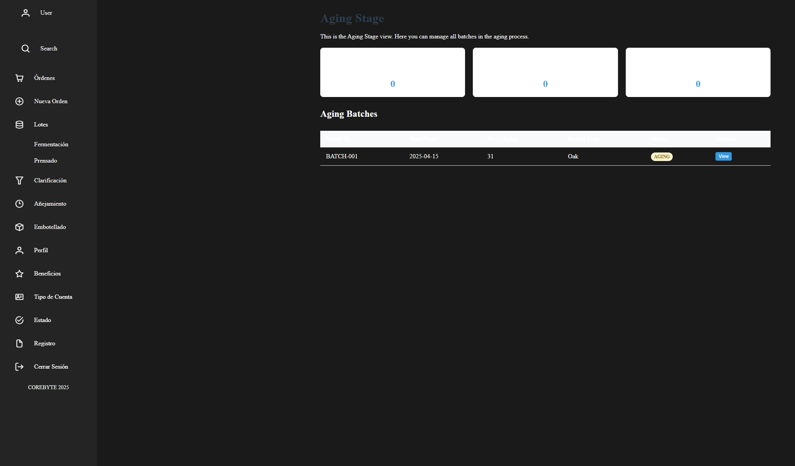
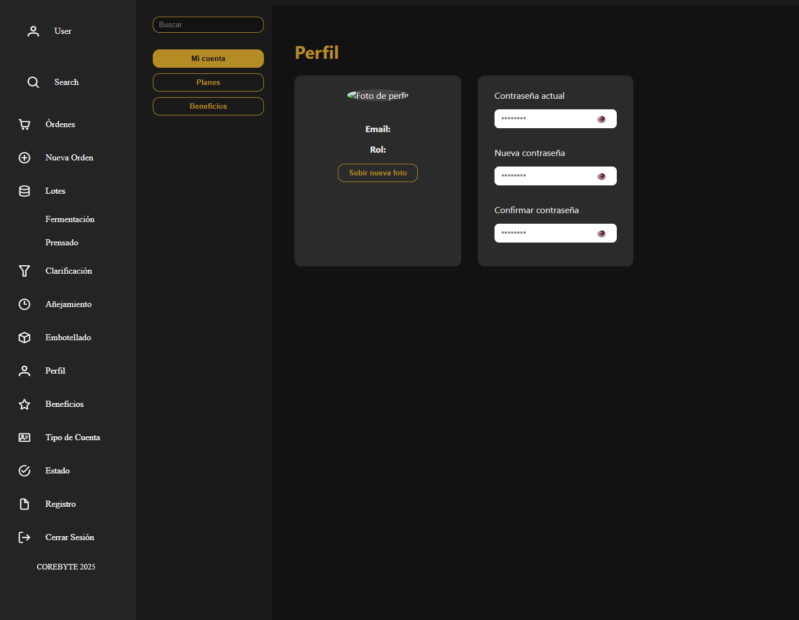

# Capítulo V: Product Implementation, Validation & Deployment.

## 5.1. Software Configuration Management.

### 5.1.1. Software Development Environment Configuration.

### 5.1.2. Source Code Management.

### 5.1.3. Source Code Style Guide & Conventions.

### 5.1.4. Software Deployment Configuration.

## 5.2. Landing Page, Services & Applications Implementation.

### 5.2.1. Sprint 1
En la fase inicial de nuestro proyecto, nos propusimos llevar a cabo la implementación del diseño de nuestra Landing Page utilizando WebStorm como entorno de desarrollo. Esto implica que al concluir el Sprint, todas las secciones, ya sea Home, Services, Pricing, Testimonials o About Us, deben estar completadas. A continuación, adjuntamos imágenes que ilustran cómo gestionamos las tareas en Jira Software.

Repositorio: [https://github.com/4424-Corebyte-App-Web/Corebyte-Landing-Page](https://github.com/4424-Corebyte-App-Web/Corebyte-Landing-Page)

Landing Page Deployed: https://4424-corebyte-app-web.github.io/Corebyte-Landing-Page/

#### 5.2.1.1. Sprint Planning 1.

<table>
    <thead>
        <tr>
            <th>Sprint #</th>
            <th>Sprint 1</th>
        </tr>
    </thead>
    <tbody>
        <tr>
            <td colspan="2"> <p1 style="text-align: center;"> Sprint Planning Background </p1></td>
        </tr>
        <!--FILA 1-->
        <tr>
            <td>Date</td>
            <td>20-04-2025</td>
        </tr>
        <!--FILA 2-->
        <tr>
            <td>Time</td>
            <td> 10:00 p.m </td>
        </tr>
        <!--FILA 3-->
        <tr>
            <td>Location</td>
            <td>Discord</td>
        </tr>
         <!--FILA 4-->
        <tr>
            <td>Prepared By</td>
            <td>Oscar Armas</td>
        </tr>
         <!--FILA 5-->
        <tr>
            <td>Attendees (to planning meeting)</td>
            <td>Renzo Llerena - Matías Diaz - Renzo Villafuerte - Giovany Torres </td>
        </tr>
        <!--FILA 6-->
        <tr>
            <td colspan="2"> <p1 style="text-align: center;"> Sprint Goal & User Stories </p1></td>
        </tr>
        <!--FILA 7-->
        <tr>
            <td>Sprint 1 Goal</td>
            <td> 
              Nuestro enfoque está en implementar la landing page de TraceWine, incluyendo todas las 
              secciones acordadas y el requisito de cambio de idioma para la aplicación. Creemos que esto
              mejora la accesibilidad y la experiencia del usuario, permitiendo que más productores de vinos y 
              distribuidores se conecten con la plataforma. Esto se confirmará cuando la landing page 
              esté completa, funcional y los usuarios puedan navegar por las secciones en su idioma 
              preferido, reportando satisfacción con la interfaz y la usabilidad.
            </td>
        </tr>
        <!--FILA 8-->
        <tr>
            <td>Sprint 1 Velocity</td>
            <td>  </td>
        </tr>
        <!--FILA 9-->
        <tr>
            <td>Sum of Story Points</td>
            <td>  </td>
        </tr>
    </tbody>
</table>

#### 5.2.1.2. Aspect Leaders and Collaborators.

<table>
    <thead>
        <tr>
            <th colspan="7">Sprint #</th>
            <th> Sprint 1</th>
        </tr>
    </thead>
    <tbody>
        <!--FILA 1-->
        <tr>
            <td colspan="1">User Story</td>
            <td colspan="15">Work-Item / Task</td>
        </tr>
        <!--FILA 2-->
        <tr>
            <td>Id</td>
            <td>Title</td>
            <td>Id</td>
            <td>Title</td>
            <td>Description</td>
            <td>Estimation (hours)</td>
            <td>Assigned To</td>
            <td>Status</td>
        </tr>
        <!--FILA 3-->
        <tr>
            <td rowspan="4" >US-001</td>
            <td rowspan="4" >Hipervínculos en el encabezado</td>
            <td>T001</td>
            <td>Definir enlaces del encabezado</td>
            <td>Identificar y organizar los enlaces del encabezado.</td>
            <td>1</td>
            <td></td>
            <td>Done</td>
        </tr>
        <!--FILA 4-->
        <tr>
            <td>T002</td>
            <td>Implementar hipervínculos</td>
            <td>Añadir hipervínculos en HTML</td>
            <td>1</td>
            <td></td>
            <td>Done</td>
        </tr>
        <!--FILA 5-->
        <tr>
            <td>T003</td>
            <td>Estilizar con CSS</td>
            <td>Aplicar estilos básicos a los enlaces del encabezado</td>
            <td>2</td>
            <td></td>
            <td>Done</td>
        </tr>
        <!--FILA 6-->
        <tr>
            <td>T004</td>
            <td>Pruebas de funcionamiento</td>
            <td>Asegurarse de que los hipervínculos funcionen correctamente.</td>
            <td>1</td>
            <td></td>
            <td>Done</td>
        </tr>
        <!--FILA 7-->
        <tr>
            <td rowspan="4" >US-002</td>
            <td rowspan="4" >Información sobre beneficios de la aplicación</td>
            <td>T001</td>
            <td>Definir contenido de beneficios</td>
            <td>Identificar los beneficios clave de la aplicación.</td>
            <td>2</td>
            <td></td>
            <td>Done</td>
        </tr>
        <!--FILA 8-->
        <tr>
            <td>T002</td>
            <td>Redactar sección de beneficios</td>
            <td>Escribir los beneficios de la aplicación de forma clara.</td>
            <td>2</td>
            <td></td>
            <td>Done</td>
        </tr>
        <!--FILA 9-->
        <tr>
            <td>T003</td>
            <td>Estilizar la sección de beneficios</td>
            <td>Aplicar estilos visuales a la sección de beneficios</td>
            <td>2</td>
            <td></td>
            <td>Done</td>
        </tr>
        <!--FILA 10-->
        <tr>
            <td>T004</td>
            <td>Pruebas de funcionalidad de beneficios</td>
            <td>Asegurarse de que la sección de beneficios sea accesible y clara.</td>
            <td>1</td>
            <td></td>
            <td>Done</td>
        </tr>
        <!--FILA 11-->
        <tr>
            <td rowspan="4" >US-003</td>
            <td rowspan="4" >Información sobre beneficios de la aplicación para vinicultores</td>
            <td>T001</td>
            <td>Definir beneficios específicos para vinicultores</td>
            <td>Identificar beneficios clave que impactan directamente a los vinicultores.</td>
            <td>2</td>
            <td></td>
            <td>Done</td>
        </tr>
        <!--FILA 12-->
        <tr>
            <td>T002</td>
            <td>Redactar contenido para vinicultores</td>
            <td>Escribir los beneficios específicos para vinicultores de forma clara.</td>
            <td>2</td>
            <td></td>
            <td>Done</td>
        </tr>
        <!--FILA 13-->
        <tr>
            <td>T003</td>
            <td>Estilizar la sección de beneficios para vinicultores</td>
            <td>Aplicar estilos visuales a la sección específica de vinicultores.</td>
            <td>2</td>
            <td></td>
            <td>Done</td>
        </tr>
        <!--FILA 14-->
        <tr>
            <td>T004</td>
            <td>Pruebas de funcionalidad de beneficios para vinicultores</td>
            <td>Asegurarse de que la sección sea clara y útil para los vinicultores.</td>
            <td>1</td>
            <td></td>
            <td>Done</td>
        </tr>
        <!--FILA 3-->
        <tr>
            <td rowspan="4" >US-004</td>
            <td rowspan="4" >Opciones de Precios Claras para Decisiones Informadas</td>
            <td>T001</td>
            <td>Definir opciones de precios</td>
            <td>Establecer diferentes opciones de precios para los usuarios.</td>
            <td>2</td>
            <td></td>
            <td>Done</td>
        </tr>
        <!--FILA 4-->
        <tr>
            <td>T002</td>
            <td>Redactar descripción de precios</td>
            <td>Escribir descripciones claras y transparentes para cada opción de precio.</td>
            <td>2</td>
            <td></td>
            <td>Done</td>
        </tr>
        <!--FILA 5-->
        <tr>
            <td>T003</td>
            <td>Estilizar opciones de precios</td>
            <td>Aplicar diseño visual para hacer las opciones de precios fáciles de identificar.</td>
            <td>2</td>
            <td></td>
            <td>Done</td>
        </tr>
        <!--FILA 6-->
        <tr>
            <td>T004</td>
            <td>Pruebas de funcionalidad de precios</td>
            <td>Verificar que todas las opciones de precios funcionen correctamente.</td>
            <td>1</td>
            <td></td>
            <td>Done</td>
        </tr>
        <!--FILA 7-->
        <tr>
            <td rowspan="4" >US-005</td>
            <td rowspan="4" >Acceso fácil a soporte y asesoramiento</td>
            <td>T001</td>
            <td>Definir canales de soporte</td>
            <td>Establecer los diferentes canales a través de los cuales los usuarios pueden recibir soporte.</td>
            <td>2</td>
            <td></td>
            <td>Done</td>
        </tr>
        <!--FILA 8-->
        <tr>
            <td>T002</td>
            <td>Redactar contenido de soporte</td>
            <td>Escribir instrucciones claras para acceder al soporte y asesoramiento.</td>
            <td>2</td>
            <td></td>
            <td>Done</td>
        </tr>
        <!--FILA 9-->
        <tr>
            <td>T003</td>
            <td>Estilizar el acceso a soporte</td>
            <td>Asegurarse de que el acceso al soporte sea fácil de encontrar y utilizar.</td>
            <td>2</td>
            <td></td>
            <td>Done</td>
        </tr>
        <!--FILA 10-->
        <tr>
            <td>T004</td>
            <td>Pruebas de funcionalidad de soporte</td>
            <td>Verificar que todos los canales de soporte sean funcionales.</td>
            <td>1</td>
            <td></td>
            <td>Done</td>
        </tr>
        <!--FILA 11-->
        <tr>
            <td rowspan="4" >US-006</td>
            <td rowspan="4" >Opiniones de usuarios que inspiran confianza</td>
            <td>T001</td>
            <td>Recopilar opiniones de usuarios</td>
            <td>Solicitar y recopilar opiniones de usuarios sobre la aplicación.</td>
            <td>2</td>
            <td></td>
            <td>Done</td>
        </tr>
        <!--FILA 12-->
        <tr>
            <td>T002</td>
            <td>Redactar opiniones destacadas</td>
            <td>Seleccionar y escribir las opiniones más destacadas de los usuarios.</td>
            <td>2</td>
            <td></td>
            <td>Done</td>
        </tr>
        <!--FILA 13-->
        <tr>
            <td>T003</td>
            <td>Estilizar opiniones de usuarios</td>
            <td>Aplicar un diseño visual atractivo para mostrar las opiniones de los usuarios.</td>
            <td>2</td>
            <td></td>
            <td>Done</td>
        </tr>
        <!--FILA 14-->
        <tr>
            <td>T004</td>
            <td>Pruebas de funcionalidad de opiniones</td>
            <td>Asegurarse de que las opiniones se muestren correctamente.</td>
            <td>1</td>
            <td></td>
            <td>Done</td>
        </tr>
        <!--FILA 15-->
        <tr>
            <td rowspan="4" >US-007</td>
            <td rowspan="4" >Navegación fluida en dispositivos móviles</td>
            <td>T001</td>
            <td>Optimizar navegación para dispositivos móviles</td>
            <td>Asegurarse de que la navegación sea fluida en dispositivos móviles.</td>
            <td>3</td>
            <td></td>
            <td>Done</td>
        </tr>
        <!--FILA 16-->
        <tr>
            <td>T002</td>
            <td>Rediseñar menús para móviles</td>
            <td>Ajustar los menús de navegación para mejorar la experiencia móvil.</td>
            <td>3</td>
            <td></td>
            <td>Done</td>
        </tr>
        <!--FILA 17-->
        <tr>
            <td>T003</td>
            <td>Pruebas de funcionalidad móvil</td>
            <td>Verificar que la navegación móvil funcione correctamente.</td>
            <td>2</td>
            <td></td>
            <td>Done</td>
        </tr>
        <!--FILA 18-->
        <tr>
            <td>T004</td>
            <td>Realizar pruebas de rendimiento móvil</td>
            <td>Asegurarse de que la experiencia de navegación sea rápida en dispositivos móviles.</td>
            <td>2</td>
            <td></td>
            <td>Done</td>
        </tr>
        <!--FILA 19-->
        <tr>
            <td rowspan="4" >US-008</td>
            <td rowspan="4" >Adaptación de la landing page en tabletas</td>
            <td>T001</td>
            <td>Rediseñar layout para tabletas</td>
            <td>Adaptar la landing page para una visualización optimizada en tabletas.</td>
            <td>3</td>
            <td></td>
            <td>Done</td>
        </tr>
        <!--FILA 20-->
        <tr>
            <td>T002</td>
            <td>Rediseñar elementos interactivos</td>
            <td>Ajustar botones y enlaces para mejorar la experiencia en tabletas.</td>
            <td>2</td>
            <td></td>
            <td>Done</td>
        </tr>
        <!--FILA 21-->
        <tr>
            <td>T003</td>
            <td>Pruebas de funcionalidad en tabletas</td>
            <td>Verificar que la landing page funcione correctamente en tabletas.</td>
            <td>2</td>
            <td></td>
            <td>Done</td>
        </tr>
        <!--FILA 22-->
        <tr>
            <td>T004</td>
            <td>Realizar pruebas de rendimiento en tabletas</td>
            <td>Asegurarse de que la experiencia sea rápida y fluida en tabletas.</td>
            <td>2</td>
            <td></td>
            <td>Done</td>
        </tr>
        <!--FILA 23-->
        <tr>
            <td rowspan="4" >US-009</td>
            <td rowspan="4" >Compatibilidad en computadoras de escritorio</td>
            <td>T001</td>
            <td>Optimizar layout para computadoras de escritorio</td>
            <td>Asegurarse de que la landing page sea completamente funcional en escritorios.</td>
            <td>3</td>
            <td></td>
            <td>Done</td>
        </tr>
        <!--FILA 24-->
        <tr>
            <td>T002</td>
            <td>Rediseñar elementos para escritorio</td>
            <td>Ajustar el diseño de botones y menús para computadoras de escritorio.</td>
            <td>2</td>
            <td></td>
            <td>Done</td>
        </tr>
        <!--FILA 25-->
        <tr>
            <td>T003</td>
            <td>Pruebas de funcionalidad en escritorio</td>
            <td>Verificar que todos los elementos funcionen correctamente en computadoras de escritorio.</td>
            <td>2</td>
            <td></td>
            <td>Done</td>
        </tr>
        <!--FILA 26-->
        <tr>
            <td>T004</td>
            <td>Realizar pruebas de rendimiento en escritorio</td>
            <td>Asegurarse de que la página cargue rápidamente y sin errores en computadoras de escritorio.</td>
            <td>2</td>
            <td></td>
            <td>Done</td>
        </tr>
    </tbody>
</table>

#### 5.2.1.3. Sprint Backlog 1.

<table>
    <thead>
        <tr>
            <th rowspan="" >Repository</th>
            <th>Branch</th>
            <th>Commit Id</th>
            <th>Commit Message</th>
            <th>Commit Message Body</th>
            <th>Commited on (Date)</th>
        </tr>
    </thead>
    <tbody>
        <!--FILA 1 -->
        <tr>
            <td rowspan="14">https://github.com/4424-Corebyte-App-Web/Corebyte-Landing-Page</td>
            <td>master</td>
            <td>989c513aff9000ef61b828540ba489a75c4cc05d</td>
            <td>Initial commit</td>
            <td></td>
            <td>24/24/2025</td>
        </tr>
        <!--FILA 2 -->
        <tr>
            <td>develop</td>
            <td>c77773e32554125a0c306c9fe2fd24fe79bd46c6</td>
            <td>feat(start): add start section and styles</td>
            <td></td>
            <td>24/24/2025</td>
        </tr>
        <!--FILA 3 -->
        <tr>
            <td>feature/about</td>
            <td>989c513aff9000ef61b828540ba489a75c4cc05d</td>
            <td>Initial commit</td>
            <td></td>
            <td>24/24/2025</td>
        </tr>
        <!--FILA 4 -->
        <tr>
            <td>feature/about-app</td>
            <td>44b743ac8c78ae066b0e07ab8b55ebec37b3956b</td>
            <td>feat(prices): add prices section and styles</td>
            <td></td>
            <td>24/24/2025</td>
        </tr>
        <!--FILA 5 -->
        <tr>
            <td>feature/contact</td>
            <td>2e1735e81ffa8d485708e38e52caefe681a3a3ee</td>
            <td>docs:update index.html</td>
            <td></td>
            <td>24/24/2025</td>
        </tr>
        <!--FILA 6 -->
        <tr>
            <td>feature/prices</td>
            <td>44b743ac8c78ae066b0e07ab8b55ebec37b3956b</td>
            <td>feat(prices): add prices section and styles</td>
            <td></td>
            <td>24/24/2025</td>
        </tr>
        <!--FILA 7 -->
        <tr>
            <td>feature/services</td>
            <td>ed0ba970539a24d09c25d94c221effaf4ee77b7e</td>
            <td>commit: update services section</td>
            <td></td>
            <td>26/24/2025</td>
        </tr>
        <!--FILA 8 -->
        <tr>
            <td>feature/start</td>
            <td>c77773e32554125a0c306c9fe2fd24fe79bd46c6</td>
            <td>feat(start): add start section and styles</td>
            <td></td>
            <td>24/24/2025</td>
        </tr>
        <!--FILA 9 -->
        <tr>
            <td>release</td>
            <td>989c513aff9000ef61b828540ba489a75c4cc05d</td>
            <td>Initial commit</td>
            <td></td>
            <td>24/24/2025</td>
        </tr>
    </tbody>
</table>

#### 5.2.1.4. Development Evidence for Sprint Review.

Para este primer sprint no se realizaron testing.

#### 5.2.1.5. Execution Evidence for Sprint Review.

Después de completar el Sprint 1, logramos implementar todas las secciones de nuestra Landing Page para garantizar una visualización perfecta. Además, le dimos un formato atractivo que captura la atención del usuario hacia sus diferentes componentes. También agregamos métodos de navegación en la página, como botones ubicados al principio, que te permiten moverte fácilmente de una sección a otra. A continuación, te mostraremos los avances a través de imágenes del resultado obtenido.

Es importante destacar que el objetivo principal de la Landing Page es convertir a los visitantes en futuros clientes o usuarios habituales de nuestro servicio. Para lograrlo, utilizamos llamados a la acción (Call To Action) que los guían hacia la aplicación web.

A continuación, te presentamos capturas de pantalla del desarrollo de la Landing Page:

**Encabezado y botones de desplazamiento:**

En la parte superior, se encuentra el encabezado (Header) que incluye botones de inicio (Home), beneficios (benefits), Pricing (Pricing), sobre la aplicación (about), testimonios de usuarios (testimonials), un formulario para que nos contacten (Contact), un apartado para saber sobre el equipo (About us) y un botón para cambiar el idioma entre inglés y español. Estos elementos permiten a los visitantes desplazarse fácilmente a la sección que deseen visualizar.

Imagen 01: Encabezado y botones de desplazamiento

**Sección Hero:**

Se presenta la sección "Hero", que incluye una breve descripción y una frase representativa de TraceWine. Además, permite iniciar el uso del servicio web y proporciona una imagen relacionada con el mismo.

Imagen 02: Sección Hero

**Sección Services:**

Se presenta la sección de servicio que ofrecemos para nuestros segmentos objetivos. En esta sección, se describen los beneficios y características de TraceWine, lo que permite a los visitantes conocer más sobre el servicio.

Imagen 03: Sección Services

**Sección Pricing:**

En la sección de precios, se detallan los planes y precios de TraceWine. Esta información es esencial para que los visitantes conozcan las opciones disponibles y puedan elegir la que mejor se adapte a sus necesidades.

Imagen 04: Sección Pricing

**Sección About the App:**

En esta sección, se presenta información detallada sobre la aplicación TraceWine, sus características y funcionalidades. Esto permite a los visitantes conocer más sobre la aplicación y cómo puede ayudarles en su día a día.

Imagen 05: Sección About the App

**Sección About the Team:**

En la sección "About the Team", se presenta información sobre el equipo de desarrollo de TraceWine. Esto permite a los visitantes conocer a las personas detrás del servicio y generar confianza en la calidad y profesionalismo del equipo.

**Sección Contact:**

En la sección de contacto, se presenta un formulario que permite a los visitantes enviar consultas, comentarios o solicitudes de información sobre TraceWine. Esto facilita la comunicación con los usuarios y permite responder a sus necesidades de manera eficiente.

**Footer:**

En el pie de página (Footer), se incluyen enlaces a las redes sociales de TraceWine, información de contacto y un botón para volver al inicio de la página. Esto permite a los visitantes acceder a más información y mantenerse conectados con el servicio.

#### 5.2.1.6. Services Documentation Evidence for Sprint Review.

En el primer Sprint el equipo de desarrollo de CoreByte ha diseñado, programado y puesto en funcionamiento el sitio web (Landing Page) Para presentar la aplicación Web propuesta denominada "TraceWine". En este sitio web (Landing Page), se lográ visualizar varias secciones que ilustran en que consiste "TraceWine", cada integrante del equipo de desarrollo de CoreByte estuvo a cargo de una sección en especifico.

<table>
  <thead>
    <tr>
      <th>End Point</th>
      <th> Funciones</th>
    </tr>
  </thead>
  <tbody>
    <tr>
        <td>https://4424-corebyte-app-web.github.io/Corebyte-Landing-Page/</td>
        <td>Mostrar la Landing Page Desplegada</td>
    </tr>
  </tbody>
</table>

#### 5.2.1.7. Software Deployment Evidence for Sprint Review.

Para la implementación de nuestro sitio web, optamos por utilizar GitHub Pages. En este proceso, creamos un repositorio en GitHub donde gestionamos el control de versiones. En la sección de Configuración, publicamos el proyecto almacenado en la rama "develop" que previamente se encontrba en la rama release-1.0.

[Landing Page TraceWine](https://4424-corebyte-app-web.github.io/Corebyte-Landing-Page/) - https://4424-corebyte-app-web.github.io/Corebyte-Landing-Page/

#### 5.2.1.8. Team Collaboration Insights during Sprint.

En esta entrega, nuestra meta principal fue la implementación de la Landing Page. Para llevar a cabo este objetivo, hicimos uso de diversas herramientas como GitHub, Visual Studio Code, WebStorm, HTML, CSS y JavaScript. A continuación, vamos a presentar los diagramas de flujo que representan los commits realizados por cada miembro del equipo CoreByte:

A continuación se muestra la cantidad de commits realizadas por cada integrante del equipo durante el desarrollo de la landing page.

Los siguientes gráficos ofrecen una representación visual de las clonaciones registradas en nuestro repositorio, junto con la fecha en que cada una de estas acciones se llevó a cabo. Además, se presenta información sobre la cantidad de visitantes que ha tenido el repositorio de nuestro equipo a lo largo del tiempo.

### 5.2.2. Sprint 2 

#### 5.2.2.1. Sprint Planning 2. 

| Sprint #                                     | Sprint 2                                               |
|----------------------------------------------|--------------------------------------------------------|
| <b> Sprint planning Background </b>          | --                                                     |
| Date                                         | 2025/05/08                                             |
| Time                                         | 08:00 AM                                               |
| Location                                     | Reunión virtual-Meet                                   |
| Prepared By                                  | Oscar Armas                                            |
| Attendees                                    | Renzo Miguel Llerena Delagado / Diaz Quispe Matías Sebastian / Renzo Alonso Villafuerte Tapia / Oscar Javier Armas Sánchez / Torres Apolinario Giovany Smith |
| Sprint 1 Review Summary                      | En el sprint anterior, el equipo completó una primera vista de la página de destino, implementando las secciones y estilos básicos necesarios, como Contacto, Precios y Servicios sobre la startup. |
| Sprint 1 Retrospective Summary               | El principal aspecto que el equipo debe mejorar es la comunicación entre los miembros para que se mantengan al tanto del progreso de cada uno. Ahora, el plan para el próximo sprint es trabajar de forma más organizada para que cada miembro sepa qué hacer.  |
| <b> Sprint Goal & User Stories </b>          | --                                                     |
| Sprint 2 Goals                               | Nuestro objetivo es implementar la primera version funcional de la aplicaion front-end con funciones principales como ordenes, estado, historial, solicitudes, panel de control y gestion de lotes. Como equipo pensamos ofrecer una vizualizacion amigable y detallada para una mayor adaptabilidad de la página de destino de Corebyte, ademas, creemos que ofrece una primera visión completa de las funcionalidades que la aplicación ofrece a los segmentos objetivo. Esto nos confirmará cuando nuestros segmentos objetivo se registren en la aplicación y utilicen las principales funcionalidades, como almacenes y guías de anáilisis de venta |
| Sprint 2 Velocity                            | 130                                                    |
| Sum of Story Points                          | 130                                                    |

#### 5.2.2.2. Aspect Leaders and Collaborators. 

En esta sección, se incluye la matriz de liderazgo y colaboración desarrollada para este segundo sprint. Los principales aspectos que se toman en cuenta en este sprint se centran en cada las principales secciones que presenta el Front-End Web Application. Para esto, hemos definido las siguientes secciones: Login, Ordenes, Estados, Historial, Gestion de lotes, Análisis de venta y solicitud de stock

| Team Member                        | GitHub Username | Login  | Ordenes          | Historial y Estado | Gestion de lotes | Reabastecimiento              | 
|------------------------------------|-----------------|--------|------------------|--------------------|------------------|-------------------------------|
| Renzo Miguel Llerena Delagado      | Renxoll         |        |                  |                    | L                |                               |
| Diaz Quispe Matías Sebastian       | equinox-1092    |        |                  | L                  |                  |                               |
| Renzo Alonso Villafuerte Tapia     | RenzoVi21       | L      |                  |                    |                  |                               |
| Oscar Javier Armas Sánchez         | Racso24k        |        |                  |                    |                  | L                             |
| Torres Apolinario Giovany Smith    | Giovany7x       |        | L                |                    |                  |                               |

#### 5.2.2.3. Sprint Backlog 2. 

Como se mencionó previamente en el planeamiento del sprint número 2, el objetivo del mismo es (OBJETIVO).

Luego de definir el objetivo del sprint, se identificaron las historias de usuario útiles para este sprint. A continuación, se dividió cada historia de usuario en tareas relacionadas a la implementación y cumplimiento de dicha historia. 

A continuación, se presenta la tabla con las tareas necesarias para completar satisfactoriamente este segundo sprint. Además, se asignó un miembro del equipo a cada tarea a desarrollar y el estado de cada tarea.
[Link de acceso al Sprint Backlog #2 en Trello](https://trello.com/invite/b/681cc645085eedc15240526c/ATTIe5d02782fd704438be9b7f155b65d2cc3DDD1D0A/corebyte-sprint-backlog-2)

  

  

 
      
A continuación, se presenta la tabla con las tareas necesarias para completar el sprint nuemero 2, tambien, se asignó un miembro del equipo a cada tarea a desarrollar y el estado de cada tarea.

| Sprint 2     | Sprint Backlog 2                                              |             |                                                                                    |                                                                                                                                                                     |                    |                 |             |
|--------------|---------------------------------------------------------------|-------------|------------------------------------------------------------------------------------|---------------------------------------------------------------------------------------------------------------------------------------------------------------------|--------------------|-----------------|-------------|
| User Stories |                                                               | Work Item/Task                                                                                   |                                                                                                                                                                     |                    |                 |             |
| Id           | Title                                                         | Id          | Title                                                                              | Description                                                                                                                                                         | Estimation (Hours) | Assigned to     | Status      |
| US027        | Registro de nuevos insumos en el inventario               | US027T001   | Crear una seccion para el registro de insumos en el inventario                   | Crear un componente que registre em una tabla los productos.                                                                                    | 4                  | Oscar Javier  | In-Progress |
| US014        | Registro del estado de embotellado               | US014T001   |  Crear un boton para el registro de embotellado                  | Programar un boton dirija a al apartado de registro de embotellado.                                                                                    | 3                  | Renzo Miguel  | In-Progress |
| US016        | Crear un cliente distribuidor               | US016T001   | Crear un cliente                   | Programar una funcion que cree un nuevo usuario dependiendo si es distribuidor o productor.                                                                                    | 6                  | Renzo Alonso  | In-Progress |
|              |                                             | US016T002   | Crear seccion de detalle de tipo de cuenta                   | Crear un apartado para visualizar el tipo de cuenta actual.                                                                                    | 4.5                  | Renzo Alonso  | In-Progress |
|              |                                             | US016T003   | Crear seccion de detalle de plan para actualizar                   | Crear un apartado para visualizar el tipo de desea actualizar .                                                                                    | 3                  | Renzo Alonso  | In-Progress |
| US035        | Administrar el estado de un pedido               | US035T001   | Crear una tabla con los pedidos segun su estado                   | Crear un componente que muestre en una tabla los productos que tengan los estados de pendiente o entregado.                                                                                    | 4.5                  | Matías Diaz  | In-Progress |
| US013        | Registro del estado de añejamiento               | US013T001   | Crear un formulario para crear un registro de añejamiento                  | crear unos cuadrados para completar la informacion correspondiente para el añejamientto.                                                                                    | 7                  | Renzo Miguel  | In-Progress |
| US029        | Reabastecimiento de insumos directamente desde la plataforma               | US029T001   | Crear una sección para reabastecer insumos en el inventario                   | Crear un componente que permita ingresar y registrar los en el inventario directamente desde la plataforma.                                                                                    | 6                  | Oscar Javier  | In-Progress |
| US015        | Registro de pedido               | US015T001   | Crear una sección para registrar nuevos pedidos                   | Crear un componente que permita registrar un nuevo pedido con detalles de productos, cantidades, cliente y imagen de referencia.                                                                                    | 5                  | Giovany Torres  | In-Progress |
| US034        | Obtener detalles de un pedido               | US034T001   | Crear un boton para ver detalles de un pedido                   | Crear un boton que muestre la información detallada de un pedido.                                                                                    | 3                  | Giovany Torres  | In-Progress |
| US012        | Registro del estado de prensado               | US012T001   | Crear una sección para registrar el estado de prensado                   | Crear un componente que permita documentar el progreso del proceso de prensado con fecha, lote y tipo.                                                                                    | 8                  | Renzo Miguel  | In-Progress |
| US022        | Seguimiento del estado del pedido               | US022T001   | Crear una sección para seguir el estado de pedidos                   | Crear una tabla con la informacion del producto, ademas de mostrar en que estado se encuentra el producto.                                                                                    | 5                  | Matías Diaz  | In-Progress |
| US010        | Registro del estado de fermentación               | US010T001   | Crear una sección para registrar el estado de fermentación                   | Crear un componente que permita documentar el progreso del proceso de fermentacion con tipo y descripcion de la temperatura recomendado.                                                                                    | 6                  | Renzo Miguel  | In-Progress |
| US011        | Registro del estado de clarificación               | US011T001   | Crear una sección para registrar el estado de clarificación                   | Crear un componente que permita documentar el progreso del proceso de fermentacion con tipo y cantidad de agentes clarificantes.                                                                                    | 7                  | Renzo Miguel  | In-Progress |
|              |                                                    | US011T002   | Crear una sección para registrar el estado de clarificación                   | Crear un componente que permita registrar y actualizar el registro del estado de clarificación.                                                                                    | 5                  | Renzo Miguel  | In-Progress |
| US031        | Informes de inventario               | US031T001   | Crear una sección para generar informes de inventario                   | Crear un componente que genere informes de stock de insumos con la extencion pdf.                                                                                    | 4.5                  | Matías Diaz  | In-Progress |

#### 5.2.2.4. Development Evidence for Sprint Review. 

En esta sección, se describen los principales avances de implementación realizados en este segundo sprint.

A continuación, se muestra una tabla que contiene la información sobre los _commits_ hechos que contienen partes de las funcionalidades que debemos implementar para completar el primer sprint.

| Repository                             | Branch                           | Commit Id                                         | Commit Message                                                   | Commited On |
|----------------------------------------|----------------------------------|---------------------------------------------------|------------------------------------------------------------------|-------------|
| Corebyte/Corebyte-Front-End-App        | develop                          | d6056d8fec0e259095dcba758200073f9e1d273a          |  chore: add alerts                                               | 14/05/2025  |
| Corebyte/Corebyte-Front-End-App        | develop                          | 0c2e3e17800e89b392d8f61c169c28ab012028f1          |  chore: add batch management                                     | 14/05/2025  |
| Corebyte/Corebyte-Front-End-App        | develop                          | 3f8ebbc7322dc877c0b961c2da2a7b9050cb3e88          |  chore: add profile management                                   | 14/05/2025  |
| Corebyte/Corebyte-Front-End-App        | feature/fake-api                 | 76d549816f7968a276d714ef2bd165cbc2345807          |  feat(fake-api): add fake-api support with json server.          | 16/05/2025  |
| Corebyte/Corebyte-Front-End-App        | feature/i18n                     | 441658633db5ce77469d21d44ca1ced0ae9715bc          |  feat(i18n): add language english                                | 16/05/2025  |
| Corebyte/Corebyte-Front-End-App        | feature/i18n                     | ae3db439a86e03436a2d6f9a594af00639aba4c1          |  feat(i18n): add language spanish                                | 16/05/2025  |
| Corebyte/Corebyte-Front-End-App        | feature/history-status           | ee1318494817f374e0282a569fa76982df252c09          |  feat(services): add function get and update of record           | 16/05/2025  |
| Corebyte/Corebyte-Front-End-App        | feature/history-status           | 6d4a98066fbd38ec2bf7a745c492c60f0773b5fd          |  feat(status): add component status page                         | 16/05/2025  |
| Corebyte/Corebyte-Front-End-App        | feature/history-status           | 5c24c0181d955e8c32b9ce356605500d2bc0b299          |  feat(record): add components page record                        | 16/05/2025  |
| Corebyte/Corebyte-Front-End-App        | feature/authentication           | ca649730d4ad48a080b8db48421fc1c8be0a00fd          |  docs:update feature/authentication                              | 16/05/2025  |
| Corebyte/Corebyte-Front-End-App        | feature/batch-management         | 1e8a8b4e83f5bf2226e098d34aa4ec24e3c03458          |  batch-management ui                                             | 16/05/2025  |
| Corebyte/Corebyte-Front-End-App        | feature/profile-management       | cc510edd2035838756c16fda6eb219a0eaf6023a          |  Create benefits.component.vue                                   | 16/05/2025  |

#### 5.2.2.5. Execution Evidence for Sprint Review. 

El objetivo de este sprint fue realizar, en colaboracion con todo el equipo, la creacion del front-end application.

  

  

  

  

  

  

  

  

  

  

  

  

  

#### 5.2.2.6. Services Documentation Evidence for Sprint Review. 

| Endpoint                             | Acción                           | Verbo HTTP                                         | Descripción                                                   | Ejemplo de Response |
|--------------------------------------|----------------------------------|----------------------------------------------------|---------------------------------------------------------------|---------------------|
| /products      | almacenar los productos ingresados                          | POST           |  Mostrara los proudctos almacenados                                            | {"id": "1001","customer": "Carlos Vega","date": "2025-05-14","product": "Cabernet Sauvignon","amount": 6,"total": 1200,"status": "Pendiente"} |
| /record      | almacenar los los informes de los productos                          | POST           |  Mostrara la lista de productos registrado para generar el informe                                            | {"id": "1001","customer": "Carlos Vega","type": "Cabernet Sauvignon","year": "2025","producer":"Cabernet Sauvignon","batch": 6,"stock": 1200}, |
| /orders      | almacenar los productos ingresados de las ordenes generados                          | POST           |  Mostrara los proudctos en la tabla de ordenes                                            | {"id": "1001","client": "Bodega El Sol","date": "2025-06-01","product": "Vino Tinto Reserva 2020","quantity": 10,"total": 1200,"imageUrl": "https://ferrand.com.pe/cdn/shop/files/B3DC6785-9365-4C2B-A774-E75DE90C526B.png?crop=center&height=480&v=1729894924&width=480"} |

#### 5.2.2.7. Software Deployment Evidence for Sprint Review. 
La organizacion de nuestro codigo se realizo en un repositorio en GitHub. Para el despliegue del front-end application

- Primero, se creó un repositorio en GitHub para alojar el código fuente del Frontend, permitiendo así una gestión centralizada y control de versiones
- Segundo, cada miembro del equipo creó una rama individual para desarrollar una función específica del Frontend, lo que permitió trabajar en paralelo de manera organizada.

  

- Tercero, se creó un proyecto en WebStorm y se conectó al repositorio remoto, facilitando la integración del código con el control de versiones desde el entorno de desarrollo.
- Cuarto, se implementaron las diferentes funcionalidades asignadas y se realizaron los commits respectivos, siguiendo buenas prácticas para mantener un historial de cambios claro.
- Quinto, una vez completado el desarrollo, se hizo merge de las ramas individuales a develop, donde se resolvieron conflictos y se corrigieron errores detectados en la integración.
- Sexto, tras verificar el correcto funcionamiento en develop, se realizó el merge final hacia la rama master, consolidando una versión estable del proyecto.
- Septimo, se configuró Firebase como herramienta de despliegue, preparando los archivos necesarios y definiendo el entorno adecuado.
- Octavo, se realizó el despliegue del Frontend a través de Firebase. A continuación, se muestra la evidencia del despliegue:

Link Front end: [Front-end application](https://vuetb2.web.app)

#### 5.2.2.8. Team Collaboration Insights during Sprint. 

El proyecto se realizo mediante repositorio en GitHub. Integrantes participantes:

  

Commits de los integrantes en el Landing Page:

  

Grafico de los push y merge realizados por el equipo:

  

### 5.2.3. Sprint 3 

Repositorio: [Repositorio](https://github.com/orgs/4424-Corebyte-App-Web/repositories)

Landing page desployed: 

Front-end application: [Front-end application](https://vuetb2.web.app)

Back-end application: [Back-end application](https://github.com/4424-Corebyte-App-Web/corebyte-back-end-application)

#### 5.2.3.1. Spring Planning 3. 

<table border="1" cellpadding="8" cellspacing="0">
      <tbody>
        <tr>
          <th align="left">Sprint #</th>
          <td>3</td>
        </tr>
        <tr>
          <th align="left">Sprint planning Background</th>
          <td>--</td>
        </tr>
        <tr>
          <th align="left">Date</th>
          <td>2025/06/02</td>
        </tr>
        <tr>
          <th align="left">Time</th>
          <td>18: 30 PM</td>
        </tr>
        <tr>
          <th align="left">Location</th>
          <td>Reunión virtual - Meet</td>
        </tr>
        <tr>
          <th align="left">Prepared By</th>
          <td>Oscar Armas</td>
        </tr>
        <tr>
          <th align="left">Attendees</th>
          <td>
            Renzo Miguel Llerena Delagado / Diaz Quispe Matías Sebastian / Renzo
            Alonso Villafuerte Tapia / Oscar Javier Armas Sánchez / Torres
            Apolinario Giovany Smith
          </td>
        </tr>
        <tr>
          <th align="left">Sprint 2 Review Summary</th>
          <td>
            En el sprint anterior, el equipo completó gran parte escencial del front-end application,
            el cual implementa la seccion del usuario, el cual contiene la información del login registrado,
            ademas de mostrar el plan actual que usa, tambien se agrego la parte de ordenes, reportes si el cliente
            desea generara un pdf que muestre el historial de las ultimas semanas, por otro lado tenemos reabastecimiento,
            batch-management y profile-management
          </td>
        </tr>
        <tr>
          <th align="left">Sprint 2 Retrospective Summary</th>
          <td>
            El principal aspecto que el equipo debe mejorar es la comunicación
            entre los miembros para que se mantengan al tanto del progreso de
            cada uno. Ahora, el plan para el próximo sprint es trabajar de forma
            más organizada para que cada miembro sepa qué hacer, a la vez que priorizaremos
            los puntos a avanzar, lo cuales consideremos mas relevantes para el sprint.
          </td>
        </tr>
        <tr>
          <th align="left">Sprint Goal &amp; User Stories</th>
          <td>--</td>
        </tr>
        <tr>
          <th align="left">Sprint 3 Goals</th>
          <td>
            Nuestro objetivo es implementar endpoints para la gestión de procesos. Como
            modificar, ver detalle, agregar y eliminar los pedidos. Además, pensamos como equipo que
            al implementar las funciones del back end, esto propoorciona operaciones más ágiles y una mejor experiencia de usuario a los productories y                        distribuidores.
          </td>
        </tr>
        <tr>
          <th align="left">Sprint 3 Velocity</th>
          <td>130</td>
        </tr>
        <tr>
          <th align="left">Sum of Story Points</th>
          <td>100</td>
        </tr>
      </tbody>
    </table>

#### 5.2.3.2. Aspect Leaders and Collaborators. 

En esta sección, se incluye la matriz de liderazgo y colaboración desarrollada para este tercer sprint. Los principales aspectos que se toman en cuenta en este sprint se centran en cada las principales secciones que presenta el back-end. Para esto, hemos definido las siguientes secciones: 

<table border="1" cellpadding="8" cellspacing="0">
      <thead>
        <tr>
          <th align="left">Team Member</th>
          <th align="left">GitHub Username</th>
          <th align="left">Login</th>
          <th align="left">Ordenes</th>
          <th align="left">Historial y Estado</th>
          <th align="left">Gestion de lotes</th>
          <th align="left">Reabastecimiento</th>
        </tr>
      </thead>
      <tbody>
        <tr>
          <td>Renzo Miguel Llerena Delagado</td>
          <td>Renxoll</td>
          <td></td>
          <td></td>
          <td></td>
          <td></td>
          <td>L</td>
        </tr>
        <tr>
          <td>Diaz Quispe Matías Sebastian</td>
          <td>equinox-1092</td>
          <td></td>
          <td></td>
          <td>L</td>
          <td></td>
          <td></td>
        </tr>
        <tr>
          <td>Renzo Alonso Villafuerte Tapia</td>
          <td>RenzoVi21</td>
          <td>L</td>
          <td></td>
          <td></td>
          <td></td>
          <td></td>
        </tr>
        <tr>
          <td>Oscar Javier Armas Sánchez</td>
          <td>Racso24k</td>
          <td></td>
          <td></td>
          <td></td>
          <td></td>
          <td>L</td>
        </tr>
        <tr>
          <td>Torres Apolinario Giovany Smith</td>
          <td>Giovany7x</td>
          <td></td>
          <td>L</td>
          <td></td>
          <td></td>
          <td></td>
        </tr>
      </tbody>
    </table>

#### 5.2.3.3. Sprint Backlog 3. 

Como se mencionó previamente en el planeamiento del sprint número 3, el objetivo del mismo es (OBJETIVO).

Luego de definir el objetivo del sprint, se identificaron las historias de usuario útiles para este sprint. A continuación, se dividió cada historia de usuario en tareas relacionadas a la implementación y cumplimiento de dicha historia. 

A continuación, se presenta la tabla con las tareas necesarias para completar satisfactoriamente este segundo sprint. Además, se asignó un miembro del equipo a cada tarea a desarrollar y el estado de cada tarea.
[Link de acceso al Sprint Backlog #3 en Trello](https://trello.com/invite/b/683cc46878ea32ade67856f9/ATTI23b0375a9ab9a22dc3fbfa6b725d78072F320565/corebyte-sprint-backlog-3)

  
    
<table border="1" cellpadding="8" cellspacing="0">
      <thead>
        <tr>
          <th colspan="2" align="left">Sprint 3</th>
          <th colspan="6" align="left">Sprint Backlog 3</th>
        </tr>
        <tr>
          <th colspan="2" align="left">User Stories</th>
          <th colspan="6" align="left">Work Item/Task</th>
        </tr>
        <tr>
          <th align="left">Id</th>
          <th align="left">Title</th>
          <th align="left">Id</th>
          <th align="left">Title</th>
          <th align="left">Description</th>
          <th align="left">Estimation (Hours)</th>
          <th align="left">Assigned to</th>
          <th align="left">Status</th>
        </tr>
      </thead>
      <tbody>
        <tr>
          <td>US-033</td>
          <td>Buscar insumos en el inventario</td>
          <td>US-033T001</td>
          <td>Crear filtrado de búsqueda</td>
          <td>Diseño e implementación del barra de búsqueda</td>
          <td>5</td>
          <td>Renzo Miguel</td>
          <td>Done</td>
        </tr>
         <tr>
          <td>US-025</td>
          <td>Modificación de pedidos antes del envío</td>
          <td>US-025T001</td>
          <td>Crear boton de modificar</td>
          <td>Diseño e implementacion de boton para modificar un pedio</td>
          <td>4</td>
          <td>Matias Diaz</td>
          <td>Done</td>
        </tr>
         <tr>
          <td>US-030</td>
          <td>Asignación de insumos a diferentes fases de producción</td>
          <td>US-030T001</td>
          <td>Crear boton de agregado</td>
          <td>Diseño e implementacion de boton para productos a diferentes estados(fermentación, etc.)</td>
          <td>5</td>
          <td>Renzo Miguel</td>
          <td>Done</td>
        </tr>
        <tr>
    <td>US-019</td>
    <td>Ver detalles de un cliente distribuidor</td>
    <td>US-019T001</td>
    <td>Implementar vista de detalles</td>
    <td>Diseño e implementación de la pantalla de detalle de cliente distribuidor con todos los campos</td>
    <td>5</td>
    <td>Renzo Villafuerte</td>
    <td>Done</td>
  </tr>
  <tr>
    <td>US-021</td>
    <td>Creación de pedidos de vinos</td>
    <td>US-021T001</td>
    <td>Implementar formulario de pedido</td>
    <td>Diseño e implementación del formulario de selección de vinos y cantidades, y botón de envío</td>
    <td>5</td>
    <td>Giovany Torres</td>
    <td>Done</td>
  </tr>
  <tr>
    <td>US-017</td>
    <td>Editar un cliente distribuidor</td>
    <td>US-017T001</td>
    <td>Crear formulario de edición</td>
    <td>Diseño e implementación de formulario para editar datos de cliente distribuidor</td>
    <td>4</td>
    <td>Renzo Villafuerte</td>
    <td>Done</td>
  </tr>
  <tr>
    <td>US-028</td>
    <td>Actualización del stock de insumos en tiempo real</td>
    <td>US-028T001</td>
    <td>Implementar actualización de stock</td>
    <td>Diseño e implementación de lógica de descontar y sumar stock en tiempo real al interactuar con insumos</td>
    <td>5</td>
    <td>Oscar Javier</td>
    <td>Done</td>
  </tr>
  <tr>
    <td>US-023</td>
    <td>Confirmación de disponibilidad de stock</td>
    <td>US-023T001</td>
    <td>Verificar stock al crear pedido</td>
    <td>Diseño e implementación de validación de stock antes de confirmar el envío del pedido</td>
    <td>5</td>
    <td>Giovany Torres</td>
    <td>Done</td>
  </tr>
  <tr>
    <td>US-032</td>
    <td>Filtrar insumos del inventario por categoría</td>
    <td>US-032T001</td>
    <td>Crear filtros de categoría</td>
    <td>Diseño e implementación de dropdowns para filtrar insumos por Tipo, Proveedor, Unidad, etc.</td>
    <td>5</td>
    <td>Giovany Torres</td>
    <td>Done</td>
  </tr>
  <tr>
    <td>US-018</td>
    <td>Eliminar un cliente distribuidor</td>
    <td>US-018T001</td>
    <td>Implementar botón de eliminar</td>
    <td>Diseño e implementación de botón y confirmación modal para eliminación de cliente distribuidor</td>
    <td>5</td>
    <td>Renzo Villafuerte</td>
    <td>Done</td>
  </tr>
  <tr>
    <td>US-024</td>
    <td>Programación de entregas</td>
    <td>US-024T001</td>
    <td>Agregar selector de fecha</td>
    <td>Diseño e implementación de calendario para seleccionar fecha de entrega</td>
    <td>3</td>
    <td>Giovany Torres</td>
    <td>Done</td>
  </tr>
         <tr>
    <td>TS-007</td>
    <td>Eliminar un cliente distribuidor (API)</td>
    <td>TS-007T001</td>
    <td>Implementar endpoint DELETE</td>
    <td>Desarrollo del endpoint DELETE /distributors/{id} que responda 204, 404 y 403 según el caso</td>
    <td>3</td>
    <td>Renzo Villafuerte</td>
    <td>Done</td>
  </tr>
  <tr>
    <td>TS-013</td>
    <td>Seguimiento y Notificaciones del Estado del Pedido</td>
    <td>TS-013T001</td>
    <td>Implementar endpoint de seguimiento</td>
    <td>Desarrollo del endpoint GET /orders/track y lógica de envío de notificaciones por cambio de estado</td>
    <td>5</td>
    <td>Giovany Torres</td>
    <td>Done</td>
  </tr>
  <tr>
    <td>TS-014</td>
    <td>Ver detalles de un ítem del inventario</td>
    <td>TS-014T001</td>
    <td>Implementar endpoint GET</td>
    <td>Desarrollo del endpoint GET /inventory/items/{id} que responda 200, 404 y 403 según el caso</td>
    <td>3</td>
    <td>Oscar Javier</td>
    <td>Done</td>
  </tr>
  <tr>
    <td>TS-009</td>
    <td>Registrar un pedido</td>
    <td>TS-009T001</td>
    <td>Implementar endpoint POST</td>
    <td>Desarrollo del endpoint POST /orders que valide datos y responda 201, 400 y 403 según el caso</td>
    <td>4</td>
    <td>Giovany Torres</td>
    <td>Done</td>
  </tr>
  <tr>
    <td>TS-010</td>
    <td>Ver detalles de un pedido</td>
    <td>TS-010T001</td>
    <td>Implementar endpoint GET</td>
    <td>Desarrollo del endpoint GET /orders/{id} con manejo de errores 200, 400 e internos</td>
    <td>3</td>
    <td>Giovany Torres</td>
    <td>Done</td>
  </tr>
  <tr>
    <td>TS-016</td>
    <td>Agregar nuevo ítem al inventario</td>
    <td>TS-016T001</td>
    <td>Implementar endpoint POST</td>
    <td>Desarrollo del endpoint POST /inventory/items que valide campos y responda 201, 400 y 403</td>
    <td>4</td>
    <td>Matias Diaz</td>
    <td>Done</td>
  </tr>
      </tbody>
    </table>

#### 5.2.3.4. Development Evidence for Sprint Review. 

En esta sección, se describen los principales avances de implementación realizados en este segundo sprint.

A continuación, se muestra una tabla que contiene la información sobre los commits hechos que contienen partes de las funcionalidades que debemos implementar para completar el primer sprint.

<table border="1" cellpadding="8" cellspacing="0">
      <thead>
        <tr>
          <th align="left">Repository</th>
          <th align="left">Branch</th>
          <th align="left">Commit Id</th>
          <th align="left">Commit Message</th>
          <th align="left">Commited On</th>
        </tr>
      </thead>
      <tbody>
        <tr>
          <td>Corebyte/Corebyte-back-end-app</td>
          <td>develop</td>
          <td>90384d2c31027cb915299c2161c965f4133d820c</td>
          <td>fix: configuration AppDbContext</td>
          <td>22/06/2025</td>
        </tr>
           <tr>
          <td>Corebyte/Corebyte-back-end-app</td>
          <td>feature/authentication</td>
          <td></td>
          <td></td>
          <td>22/06/2025</td>
        </tr>
          <tr>
          <td>Corebyte/Corebyte-back-end-app</td>
          <td>feature/history-status</td>
          <td>f74ff15c21826775c4482afef1eedcd108bda337</td>
          <td>fix(program): solution bug in db</td>
          <td>22/06/2025</td>
        </tr>
          <tr>
          <td>Corebyte/Corebyte-back-end-app</td>
          <td>feature/batch-management</td>
          <td>24e0d11ea5ff7160e0c0bec259e1b8b3ed2f8467</td>
          <td>Initial import of Corebyte back-end application</td>
          <td>22/06/2025</td>
        </tr>
          <tr>
          <td>Corebyte/Corebyte-back-end-app</td>
          <td>feature/replenishment</td>
          <td>dc1eef36e0cadd7eaf1e6b994760d156f4bc255c</td>
          <td>feat(replenishment): Created , update, delete , show all.</td>
          <td>22/06/2025</td>
        </tr>
        <tr>
          <td>Corebyte/Corebyte-back-end-app</td>
          <td>feature/open-api</td>
          <td>02a42a75d672a05ea2a057ba497b0cdd182038dc</td>
          <td>feat(package): update package reference</td>
          <td>22/06/2025</td>
        </tr>
        <tr>
          <td>Corebyte/Corebyte-back-end-app</td>
          <td>feature/orders</td>
          <td>6b8ed13340ecb1aba0bc1bd063f726663cc7bbd7</td>
          <td>feat(create): Create OrderResourceFromEntityAssembler</td>
          <td>22/06/2025</td>
        </tr>
      </tbody>
    </table>

#### 5.2.3.5. Execution Evidence for Sprint Review. 

El objetivo de este sprint fue realizar, en colaboracion con todo el equipo, la creacion del back-end

**Update for web application**

  

  

  

  

  

**Web Services Execution**

  

  
    
#### 5.2.3.6. Services Documentation Evidence for Sprint Review. 

# Replenishment Endpoint

<table border="1" cellpadding="8" cellspacing="0">
  <thead>
    <tr>
      <th align="left">Endpoint</th>
      <th align="left">Acción</th>
      <th align="left">Verbo HTTP</th>
      <th align="left">Descripción</th>
      <th align="left">Ejemplo de Response</th>
    </tr>
  </thead>
  <tbody>
    <tr>
      <td>/api/v1/replenishment/{ReplenishmentId}</td>
      <td>Get Replenishment by ID</td>
      <td>GET</td>
      <td>Obtener un registro de replenishment por su ID</td>
      <td>
        <pre>
{
    "id": 1,
    "orderNumber": "12",
    "name": "Vino",
    "type": "Tinto",
    "date": "2025-12-10",
    "stockActual": 12,
    "stockMinimo": 2,
    "price": 120
}
        </pre>
      </td>
    </tr>
    <tr>
      <td>/api/v1/replenishment</td>
      <td>Create a Replenishment</td>
      <td>POST</td>
      <td>Crear un nuevo registro de replenishment</td>
      <td>
        <pre>
{
    "id": 4,
    "orderNumber": "16",
    "name": "Whisky",
    "type": "Escocés",
    "date": "2025-07-01",
    "stockActual": 30,
    "stockMinimo": 5,
    "price": 200
}
        </pre>
      </td>
    </tr>
    <tr>
      <td>/api/v1/replenishment</td>
      <td>Get all Replenishments</td>
      <td>GET</td>
      <td>Listar todos los registros de replenishment</td>
      <td>
        <pre>
    {
        "id": 2,
        "orderNumber": "14",
        "name": "Vino",
        "type": "Destilado",
        "date": "2025-10-11",
        "stockActual": 10,
        "stockMinimo": 9,
        "price": 100
    },
    {
        "id": 3,
        "orderNumber": "15",
        "name": "Cerveza",
        "type": "Rubia",
        "date": "2025-11-05",
        "stockActual": 50,
        "stockMinimo": 20,
        "price": 50
    }
        </pre>
      </td>
    </tr>
    <tr>
      <td>/api/v1/replenishment/{id}</td>
      <td>Delete Replenishment</td>
      <td>DELETE</td>
      <td>Eliminar un registro de replenishment por su ID</td>
      <td>
        <pre>
{
    "message": "Replenishment with id 4 deleted successfully"
}
        </pre>
      </td>
    </tr>
    <tr>
      <td>/api/v1/replenishment/{id}</td>
      <td>Update Replenishment</td>
      <td>PUT</td>
      <td>Actualizar un registro de replenishment existente</td>
      <td>
        <pre>
{
    "id": 4,
    "orderNumber": "16",
    "name": "Whisky",
    "type": "Escocés",
    "date": "2025-07-01",
    "stockActual": 40,
    "stockMinimo": 5,
    "price": 200
}
        </pre>
      </td>
    </tr>
  </tbody>
</table>

# Batch Endpoint

<table border="1" cellpadding="8" cellspacing="0">
  <thead>
    <tr>
      <th align="left">Endpoint</th>
      <th align="left">Acción</th>
      <th align="left">Verbo HTTP</th>
      <th align="left">Descripción</th>
      <th align="left">Ejemplo de Response</th>
    </tr>
  </thead>
  <tbody>
    <tr>
      <td>/batch-management</td>
      <td>List all batches</td>
      <td>GET</td>
      <td>Obtener la lista completa de batches</td>
      <td>
        <pre>
[
    {
        "id": 1,
        "name": "Lote A",
        "createdDate": "2025-06-01",
        "status": "OPEN"
    },
    {
        "id": 2,
        "name": "Lote B",
        "createdDate": "2025-06-10",
        "status": "CLOSED"
    }
]
        </pre>
      </td>
    </tr>
    <tr>
      <td>/batch-management</td>
      <td>Create a new batch</td>
      <td>POST</td>
      <td>Crear un nuevo batch</td>
      <td>
        <pre>
{
    "id": 3,
    "name": "Lote C",
    "createdDate": "2025-06-21",
    "status": "OPEN"
}
        </pre>
      </td>
    </tr>
    <tr>
      <td>/batch-management/{id}</td>
      <td>Get batch by id</td>
      <td>GET</td>
      <td>Obtener un batch específico por ID</td>
      <td>
        <pre>
{
    "id": 2,
    "name": "Lote B",
    "createdDate": "2025-06-10",
    "status": "CLOSED"
}
        </pre>
      </td>
    </tr>
    <tr>
      <td>/batch-management/{id}</td>
      <td>Update an existing batch</td>
      <td>PUT</td>
      <td>Actualizar datos de un batch existente</td>
      <td>
        <pre>
{
    "id": 2,
    "name": "Lote B Modificado",
    "createdDate": "2025-06-10",
    "status": "OPEN"
}
        </pre>
      </td>
    </tr>
    <tr>
      <td>/batch-management/{id}</td>
      <td>Delete a batch</td>
      <td>DELETE</td>
      <td>Eliminar un batch por su ID</td>
      <td>
        <pre>
{
    "message": "Batch with id 2 deleted successfully"
}
        </pre>
      </td>
    </tr>
  </tbody>
</table>
    
# Orders Endpoint

<table border="1" cellpadding="8" cellspacing="0">
  <thead>
    <tr>
      <th align="left">Endpoint</th>
      <th align="left">Acción</th>
      <th align="left">Verbo HTTP</th>
      <th align="left">Descripción</th>
      <th align="left">Ejemplo de Response</th>
    </tr>
  </thead>
  <tbody>
    <tr>
      <td>/api/v1/order</td>
      <td>Gets all orders</td>
      <td>GET</td>
      <td>Listar todas las órdenes</td>
      <td>
        <pre>
[
    {
        "id": 1,
        "customer": "Cliente A",
        "items": 5,
        "total": 250,
        "date": "2025-06-15"
    },
    {
        "id": 2,
        "customer": "Cliente B",
        "items": 3,
        "total": 120,
        "date": "2025-06-20"
    }
]
        </pre>
      </td>
    </tr>
    <tr>
      <td>/api/v1/order</td>
      <td>Creates an order</td>
      <td>POST</td>
      <td>Crear una nueva orden</td>
      <td>
        <pre>
{
    "id": 3,
    "customer": "Cliente C",
    "items": 2,
    "total": 80,
    "date": "2025-06-21"
}
        </pre>
      </td>
    </tr>
    <tr>
      <td>/api/v1/order/{id}</td>
      <td>Deletes an order by ID</td>
      <td>DELETE</td>
      <td>Eliminar una orden por su ID</td>
      <td>
        <pre>
{
    "message": "Order with id 2 deleted successfully"
}
        </pre>
      </td>
    </tr>
    <tr>
      <td>/api/v1/order/{id}</td>
      <td>Gets an order by ID</td>
      <td>GET</td>
      <td>Obtener una orden específica por su ID</td>
      <td>
        <pre>
{
    "id": 2,
    "customer": "Cliente B",
    "items": 3,
    "total": 120,
    "date": "2025-06-20"
}
        </pre>
      </td>
    </tr>
  </tbody>
</table>

    
# Records Endpoint

<table border="1" cellpadding="8" cellspacing="0">
  <thead>
    <tr>
      <th align="left">Endpoint</th>
      <th align="left">Acción</th>
      <th align="left">Verbo HTTP</th>
      <th align="left">Descripción</th>
      <th align="left">Ejemplo de Response</th>
    </tr>
  </thead>
  <tbody>
    <tr>
      <td>/api/v1/record</td>
      <td>Gets all records</td>
      <td>GET</td>
      <td>Listar todos los registros</td>
      <td>
        <pre>
[
    {
        "id": 1,
        "customerId": "12345",
        "type": "Tinto",
        "product": "Vino",
        "stock": 12,
        "date": "2025-06-15"
    },
    {
        "id": 2,
        "customerId": "67890",
        "type": "Rubia",
        "product": "Cerveza",
        "stock": 50,
        "date": "2025-06-20"
    }
]
        </pre>
      </td>
    </tr>
    <tr>
      <td>/api/v1/record</td>
      <td>Creates a record</td>
      <td>POST</td>
      <td>Crear un nuevo registro</td>
      <td>
        <pre>
{
    "id": 3,
    "customerId": "54321",
    "type": "Escocés",
    "product": "Whisky",
    "stock": 30,
    "date": "2025-06-21"
}
        </pre>
      </td>
    </tr>
    <tr>
      <td>/api/v1/record/customerid/{customerId}</td>
      <td>Gets records by customer</td>
      <td>GET</td>
      <td>Obtener registros filtrados por ID de cliente</td>
      <td>
        <pre>
[
    {
        "id": 1,
        "customerId": "12345",
        "type": "Tinto",
        "product": "Vino",
        "stock": 12,
        "date": "2025-06-15"
    },
    {
        "id": 4,
        "customerId": "12345",
        "type": "Rubia",
        "product": "Cerveza",
        "stock": 20,
        "date": "2025-06-18"
    }
]
        </pre>
      </td>
    </tr>
    <tr>
      <td>/api/v1/record/{id}</td>
      <td>Deletes a record by ID</td>
      <td>DELETE</td>
      <td>Eliminar un registro por su ID</td>
      <td>
        <pre>
{
    "message": "Record with id 2 deleted successfully"
}
        </pre>
      </td>
    </tr>
    <tr>
      <td>/api/v1/record/{id}</td>
      <td>Updates a record by ID</td>
      <td>PUT</td>
      <td>Actualizar un registro existente por su ID</td>
      <td>
        <pre>
{
    "id": 3,
    "customerId": "54321",
    "type": "Escocés",
    "product": "Whisky",
    "stock": 35,
    "date": "2025-06-21"
}
        </pre>
      </td>
    </tr>
    <tr>
      <td>/api/v1/record/{id}</td>
      <td>Gets a record by id</td>
      <td>GET</td>
      <td>Obtener un registro específico por su ID</td>
      <td>
        <pre>
{
    "id": 1,
    "customerId": "12345",
    "type": "Tinto",
    "product": "Vino",
    "stock": 12,
    "date": "2025-06-15"
}
        </pre>
      </td>
    </tr>
    <tr>
      <td>/api/v1/record/stock/{stock}</td>
      <td>Gets a record by stock</td>
      <td>GET</td>
      <td>Obtener registros con un nivel de stock específico</td>
      <td>
        <pre>
[
    {
        "id": 2,
        "customerId": "67890",
        "type": "Rubia",
        "product": "Cerveza",
        "stock": 50,
        "date": "2025-06-20"
    }
]
        </pre>
      </td>
    </tr>
    <tr>
      <td>/api/v1/record/type/{type}/product/{product}</td>
      <td>Gets a record by type and product</td>
      <td>GET</td>
      <td>Obtener registros filtrados por tipo y producto</td>
      <td>
        <pre>
[
    {
        "id": 1,
        "customerId": "12345",
        "type": "Tinto",
        "product": "Vino",
        "stock": 12,
        "date": "2025-06-15"
    }
]
        </pre>
      </td>
    </tr>
  </tbody>
</table>

# Report History Endpoint

<table border="1" cellpadding="8" cellspacing="0">
  <thead>
    <tr>
      <th align="left">Endpoint</th>
      <th align="left">Acción</th>
      <th align="left">Verbo HTTP</th>
      <th align="left">Descripción</th>
      <th align="left">Ejemplo de Response</th>
    </tr>
  </thead>
  <tbody>
    <tr>
      <td>/api/v1/history</td>
      <td>Gets all history records</td>
      <td>GET</td>
      <td>Listar todos los registros de historial</td>
      <td>
        <pre>
[
    {
        "id": 5,
        "customer": "12345",
        "action": "Replenished stock",
        "date": "2025-06-20",
        "details": "Stock increased from 5 to 15"
    },
    {
        "id": 6,
        "customer": "67890",
        "action": "Order created",
        "date": "2025-06-21",
        "details": "Order #3 for Cliente C"
    }
]
        </pre>
      </td>
    </tr>
    <tr>
      <td>/api/v1/history</td>
      <td>Creates a report history</td>
      <td>POST</td>
      <td>Crear un nuevo registro de historial</td>
      <td>
        <pre>
{
    "id": 7,
    "customer": "54321",
    "action": "Batch created",
    "date": "2025-06-21",
    "details": "Batch C opened"
}
        </pre>
      </td>
    </tr>
    <tr>
      <td>/api/v1/history/customer/{customer}</td>
      <td>Gets histories by customer</td>
      <td>GET</td>
      <td>Obtener todos los registros de historial de un cliente</td>
      <td>
        <pre>
[
    {
        "id": 5,
        "customer": "12345",
        "action": "Replenished stock",
        "date": "2025-06-20",
        "details": "Stock increased from 5 to 15"
    },
    {
        "id": 8,
        "customer": "12345",
        "action": "Order created",
        "date": "2025-06-21",
        "details": "Order #3 for Cliente C"
    }
]
        </pre>
      </td>
    </tr>
    <tr>
      <td>/api/v1/history/{id}</td>
      <td>Deletes history for a id</td>
      <td>DELETE</td>
      <td>Eliminar un registro de historial por su ID</td>
      <td>
        <pre>
{
    "message": "History record with id 6 deleted successfully"
}
        </pre>
      </td>
    </tr>
    <tr>
      <td>/api/v1/history/{id}</td>
      <td>Updates an existing history record by ID</td>
      <td>PUT</td>
      <td>Actualizar un registro de historial existente</td>
      <td>
        <pre>
{
    "id": 5,
    "customer": "12345",
    "action": "Replenished stock",
    "date": "2025-06-20",
    "details": "Stock increased from 5 to 20"
}
        </pre>
      </td>
    </tr>
    <tr>
      <td>/api/v1/history/{id}</td>
      <td>Gets a history by id</td>
      <td>GET</td>
      <td>Obtener un registro de historial específico por su ID</td>
      <td>
        <pre>
{
    "id": 5,
    "customer": "12345",
    "action": "Replenished stock",
    "date": "2025-06-20",
    "details": "Stock increased from 5 to 15"
}
        </pre>
      </td>
    </tr>
  </tbody>
</table>
    
#### 5.2.3.7. Software Deployment Evidence for Sprint Review. 

La organizacion de nuestro codigo se realizo en un repositorio en GitHub. Para el desarrollo del back-end

- Primero, se creó un repositorio en GitHub para alojar el código fuente del Backend, permitiendo así una gestión centralizada y control de versiones
- Segundo, cada miembro del equipo creó una rama individual para desarrollar una función específica del Backend, lo que permitió trabajar en paralelo de manera organizada.

  

- Tercero, se creó un proyecto en Visual Studio Community 2022 y se conectó al repositorio remoto, facilitando la integración del código con el control de versiones desde el entorno de desarrollo.
- Cuarto, se implementaron las diferentes funcionalidades asignadas y se realizaron los commits respectivos, siguiendo buenas prácticas para mantener un historial de cambios claro.
- Quinto, una vez completado el desarrollo, se hizo merge de las ramas individuales a develop, donde se resolvieron conflictos y se corrigieron errores detectados en la integración.
- Sexto, tras verificar el correcto funcionamiento en develop, se realizó el merge final hacia la rama master, consolidando una versión estable del proyecto.

#### 5.2.3.8. Team Collaboration Insights during Sprint. 

El proyecto se realizo mediante repositorio en GitHub. Integrantes participantes

  
    
Commits de los integrantes en el Back end application:

  
    
Grafico de los push y merge realizados por el equipo:

  
    
## 5.3. Validation Interviews. 

En esta sección se realizarán entrevistas mediante las cuales buscamos recoger opiniones y recomendaciones. Esto asegura que la aplicación web no solo cumpla con los requisitos técnicos, sino también con las expectativas de nuestros segmentos objetivos.

### 5.3.1. Diseño de Entrevistas. 

1. **User goal**: Landing Page

- **User persona**: Vinicultores y Distribuidores

- **User flow**: El usuario deberá ingresar a la landing page de la aplicación web. Una vez dentro, podrá desplazarse y visualizar información general sobre los servicios ofrecidos, así como los beneficios de utilizar la aplicación. Además, podrá cambiar el idioma a inglés o español a través de un botón. También, tendrá acceso directo a la aplicación web a través de un Call To Action situado en la vista principal de la landing page.

2. **User goal**: Productores

- Gestionar ordenes de pedido

  - **User Goal**: Como productor, necesito poder registrar pedido y ver los detalles del pedido para controlar el stock
  - **User Flow**: Los productores deberan ingresar a la sección de ordenes, esta puede realizar pedidos acorde a las necesidades del productor y permite un filtrado según la eleccion del mismo.

- Gestionar reabastecimiento

  - **User Goal**: Como productor, necesito poder reabastecer todos los productor de mi stock para tener un control sobre la cantidad de cada venta
  - **User Flow**: Los productores deberan ingresar a la sección de replenishment, esta puede registrar los pedido a reabastecer y actualizar los pedidos según como este el estado .

- Gestionar los lotes

  - **User Goal**: Como productor, , necesito poder llevar un registro detallado de cada lote de vino en producción, incluyendo las fases de fermentación, clarificación, prensado, añejamiento y embotellado.
  - **User Flow**: Desde la vista de batch management, deben crear y gestionar lotes en la aplicación, conforme el lote avanza, actualizan el estado de cada fase y pueden ingresar observaciones o ajustar los tiempos de cada una según el avance del lote.

3. **User goal**: Distribuidores

- Gestionar cliente de productores

    - **User Goal**: Como distribuidor, quiero tener control sobre los usuarios productores guardados, para eliminar los contactos guardados
    - **User Flow**: Desde la sección de cuenta, dependiendo del rol, en este caso como distribuidor podra eliminar y agregar contacto de productor

- Gestionar el estado del producto

    - **User Goal**: Como distribuidor, quiero ver el estado de entrega de cada pedido para tener mejor control sobre la fecha de entrega de los pedidos en estado pendiente
    - **User Flow**: Desde la sección status, el distribuidor ingresa y podra visualizar cada producto con un estado pendiente y podra modificar los productos dentro de la tabla

### 5.3.2. Registro de Entrevistas. 

<table>
<thead>
            <tr>
                <th>Entrevistado 1</th>
                <th>JeanPiero Landa</th>
            <tr>
                <th>Entrevistador </th>
                <th>Renzo Miguel Llerena Delgado</th>
            </tr>
</thead>        
<tbody>
            <tr>
                <td>Edad</td>
                <td>19</td>
            </tr>
            <tr>
                <td>Distrito</td>
                <td>Chorrillos</td>
            </tr>
            <tr>
                <td></td>
                <td> 
https://upcedupe-my.sharepoint.com/:v:/g/personal/u202311938_upc_edu_pe/EZ9IDzDy2PZCq7B5-T9RCKsB50ZpE47zIdOh3YAo5MghMw?nav=eyJyZWZlcnJhbEluZm8iOnsicmVmZXJyYWxBcHAiOiJPbmVEcml2ZUZvckJ1c2luZXNzIiwicmVmZXJyYWxBcHBQbGF0Zm9ybSI6IldlYiIsInJlZmVycmFsTW9kZSI6InZpZXciLCJyZWZlcnJhbFZpZXciOiJNeUZpbGVzTGlua0NvcHkifX0&e=vpj1ph
                </td>
            </tr>
            <tr>
                <td>Timing de la entrevista</td>
                <td>1:01</td>
            </tr>
            <tr>
                <td>Duración</td>
                <td>6:03</td>
            </tr>
            <tr>
                <td>Resumen</td>
                <td>JeanPiero Landa de 20, participo en la entrevista centrada en la evaluación de la interfaz de usuario de nuestra aplicacio. Durante el desarrollo de la entrevista, destaco el tema y la navegación es intuitiva y amigable, le agrada el como se maneja la información.
                    En el apartado "Gestion de lotes" la navegacion le parece intutiva lo cual ayuda al usuario a guiarse y navegar por la aplicación. Se concluye la entrevista, complentado todos los User Goals, destacando la faclidad de la intefaz de usuario y agregando comentarios para la implementacion de mejora                     en la aplicacion para que se pueda ser más intuitivo y se vea más profesional.
                </td>
            </tr>
</tbody>
</table>

<table>
<thead>
            <tr>
                <th>Entrevistado 2</th>
                <th></th>
            <tr>
                <th>Entrevistador </th>
                <th></th>
            </tr>
</thead>        
<tbody>
            <tr>
                <td>Edad</td>
                <td></td>
            </tr>
            <tr>
                <td>Distrito</td>
                <td></td>
            </tr>
            <tr>
                <td></td>
                <td>[Link de la entrevista]()</td>
            </tr>
            <tr>
                <td>Timing de la entrevista</td>
                <td></td>
            </tr>
            <tr>
                <td>Duración</td>
                <td></td>
            </tr>
            <tr>
                <td>Resumen</td>
                <td></td>
            </tr>
</tbody>
</table>

<table>
<thead>
            <tr>
                <th>Entrevistado 3</th>
                <th></th>
            <tr>
                <th>Entrevistador </th>
                <th></th>
            </tr>
</thead>        
<tbody>
            <tr>
                <td>Edad</td>
                <td></td>
            </tr>
            <tr>
                <td>Distrito</td>
                <td></td>
            </tr>
            <tr>
                <td></td>
                <td>[Link de la entrevista]()</td>
            </tr>
            <tr>
                <td>Timing de la entrevista</td>
                <td></td>
            </tr>
            <tr>
                <td>Duración</td>
                <td></td>
            </tr>
            <tr>
                <td>Resumen</td>
                <td></td>
            </tr>
</tbody>
</table>

### 5.3.3. Evaluaciones según heurísticas. 

__________________________________________________________________________________________

<strong> 
 UX Heuristics & Principles Evaluation 
 </strong> 
<strong> 
 Usability – Inclusive Design – Information Architecture
 </strong> 

**_CARRERA:_** Ingeniería de Software

**_CURSO:_** Aplicaciones Web

**_SECCIÓN:_** 4424

**_PROFESOR:_** Oscar Ivan Villafuerte Bazan

**_AUDITOR:_** Corebyte

**_CLIENTE:_** Corebyte

__________________________________________________________________________________________

**SITE o APP A EVALUAR:** TraceWine

**TAREAS A EVALUAR:**

**_Landing Page: TraceWine:_**

1. Información y descripción de la landing page y sus funcionalidades
2. Visualización de planes de precio de la aplicación
3. Interacción de la landing page con la aplicación

**_Web Application: TraceWine:_**

1. Acceso a la visualizacion de datos en el ordenes
2. Mejora de diseño en la interfaz en la seccion "Productor"
3. Optimización de la Interfaz de cliente
4. Implementación de Nuevas Funcionalidades (alertas y analisis de venta)

**ESCALA DE SEVERIDAD:**

Los errores serán puntuados tomando en cuenta la siguiente escala de severidad

<table>
<thead>
  <tr>
    <th> Nivel </th>
    <th> Descripción </th>
  </tr>
</thead>
<tbody>
  <!--========================================= FILA 1 ======================================-->
  <tr>
    <td> 1 </td>
    <td> 
      Problema superficial: puede ser fácilmente superador por el usuario ó ocurre con muy poco
      frecuencia. No necesita ser arreglado a no ser que exista disponibilidad de tiempo 
    </td>
  </tr>
  <!--========================================= FILA 2 ======================================-->
  <tr>
    <td> 2 </td>
    <td> 
      Problema menor: puede ocurrir un poco más frecuentemente o es un poco más difícil de
      superar para el usuario. Se le debería asignar una prioridad baja resolverlo de cara al siguiente
      reléase
    </td>
  </tr>
  <!--========================================= FILA 3 ======================================-->
  <tr>
    <td> 3 </td>
    <td> 
      Problema mayor: ocurre frecuentemente o los usuarios no son capaces de resolverlos. Es
      importante que sean corregidos y se les debe asignar una prioridad alta.
    </td>
  </tr>
  <!--========================================= FILA 4 ======================================-->
  <tr>
    <td> 4 </td>
    <td> 
      Problema muy grave: un error de gran impacto que impide al usuario continuar con el uso de
      la herramienta. Es imperativo que sea corregido antes del lanzamiento
    </td>
  </tr>
</tbody>
</table>

**TABLA DE RESUMEN - LANDING PAGE:**

| #  | Problema                                                                 | Escala de severidad | Heurística/Principio violada(o)                     |
|----|--------------------------------------------------------------------------|---------------------|-----------------------------------------------------|
| 1  | Falta de acción al elegir un plan en la sección de "Planes"             | 2                   | Usability: Visibilidad del estado del sistema       |
| 2  | Dificultades en la Navegación y Comprensión de la Propuesta de Valor en la Landing Page | 2                   | Usability: Visibilidad del estado del sistema       |
| 3  | Diseño inconsistente en la sección de "Servicios"                       | 2                   | Inclusive Design: Estética y diseño minimalista     |
| 4  | Call-to-Action poco destacado                                            | 3                   | Usability: Visibilidad del estado del sistema       |

**_DESCRIPCIÓN DE PROBLEMAS - LANDING PAGE:_**

**PROBLEMA #1:** Falta de acción al elegir un plan en la sección de "Planes" 

**Severidad: 2**
**Heurística violada: Usability: Visibilidad del estado del sistema**

**Problema:**  
En la sección de "Planes" de la landing page, al seleccionar un plan, el sistema no despliega ninguna pestaña ni redirige al usuario a otra página para completar el proceso de elección. Esto puede generar confusión en el usuario, ya que no hay una acción clara o retroalimentación al seleccionar una opción. Esta problemática tiene una severidad de nivel 2, ya que no impide completamente el acceso a la aplicación, pero sí afecta la experiencia del usuario al hacer que el proceso de selección sea poco intuitivo.

**Recomendación:**  
Se recomienda implementar una acción que guíe al usuario después de seleccionar un plan, como abrir una pestaña emergente con más detalles del plan o redirigir a una página de registro o pago. Esto facilitaría al usuario el proceso de completar su selección y mejoraría la experiencia de navegación al hacerlo más intuitivo y directo.

**PROBLEMA #2:** Dificultades en la Navegación y Comprensión de la Propuesta de Valor en la Landing Page

**Severidad: 2**
**Heurística violada: Usability: Visibilidad del estado del sistema**

**Problema:**  
Los usuarios encuentran dificultades para navegar en la landing page debido a la falta de claridad en la estructura de información y a un diseño visual poco intuitivo. Esto puede llevar a confusión y a una experiencia de usuario negativa, dificultando que los visitantes comprendan rápidamente la propuesta de valor del producto.

**Recomendación:**  
Se sugiere realizar una revisión completa de la arquitectura de información de la landing page, asegurando que los elementos más importantes (como beneficios, características clave y llamados a la acción) sean fácilmente accesibles y visualmente destacados. Implementar un diseño más limpio y organizado, utilizando jerarquías visuales efectivas, permitirá guiar a los usuarios a través de la página de manera más fluida. Además, incluir etiquetas y descripciones claras para cada sección ayudará a los usuarios a entender mejor el contenido presentado.

**PROBLEMA #3:** Diseño inconsistente en la sección de "Servicios"

**Severidad: 2**
**Heurística violada: Usability: Visibilidad del estado del sistema**

**Problema:**  
La sección de "Servicios" carece de una jerarquía visual clara, lo que dificulta que los usuarios identifiquen rápidamente las características ofrecidas por la aplicación. Los textos descriptivos no están suficientemente destacados, y la falta de íconos o elementos visuales de apoyo hace que la información no sea fácilmente escaneable.

**Recomendación:**  
Se sugiere rediseñar la sección utilizando una jerarquía visual clara que destaque títulos, descripciones e íconos representativos de cada servicio. Además, se recomienda mejorar el contraste y la organización del contenido para facilitar la lectura y comprensión rápida.

**PROBLEMA #4:** Diseño inconsistente en la sección de "Servicios""

**Severidad: 3**
**Heurística violada: Usability: Inclusive Design: Estética y diseño minimalista**

**Problema:**  
Los botones de llamado a la acción ("Star now", "Contact") no tienen suficiente prominencia en el diseño de la página. Esto podría llevar a que los usuarios no los perciban como elementos interactivos importantes, afectando la conversión y el flujo de navegación.

**Recomendación:**  
Se recomienda rediseñar los botones de CTA para que sean más visibles, utilizando colores llamativos que contrasten con el fondo, tamaños más grandes y ubicaciones estratégicas en la página. Incluir microinteracciones, como cambios de color al pasar el cursor, también puede aumentar la claridad de su función y atraer la atención del usuario.

**TABLA DE RESUMEN - WEB APPLICATION:**
<table>
<thead>
 <tr>
  <th> # </th>
  <th> Problema </th>
  <th> Escala de severidad </th>
  <th> Heurística/Principio violada(o) </th>
</tr>
</thead>
<tbody>
<!--========================================= FILA 1 ======================================-->
<tr>
  <td> 1 </td>
  <td> Falta de filtrado de historial </td>
  <td> 3 </td>
  <td> Usability: Control y libertad del usuario  </td>
</tr>
<!--========================================= FILA 2 ======================================-->
<tr>
  <td> 2 </td>
  <td> Mejora de diseño en la interfaz en la seccion analisis de venta </td>
  <td> 1 </td>
  <td> Inclusive Design: Estética y diseño minimalista </td>
</tr>
<!--========================================= FILA 3 ======================================-->
<tr>
  <td> 3 </td>
  <td> Mejora de diseño en la interfaz de navbar </td>
  <td> 1 </td>
  <td> Inclusive Design: Estética y diseño minimalista </td>
</tr>
<!--========================================= FILA 4 ======================================-->
<tr>
  <td> 4 </td>
  <td> Falta la opcion de busqueda </td>
  <td> 4  </td>
  <td> Usability: Visibilidad del estado del sistema </td>
</tr>
</tbody>
</table>

**_DESCRIPCIÓN DE PROBLEMAS - WEB APPLICATION:_**

**_PROBLEMA #1: Falta de filtrado de historial**

**_Severidad: 3_**
**Heurística violada: Usability: Control y libertad del usuario**

**_Problema:_**
La barra de busqueda en el apartado de "Records" no captura los datos correctamente, lo cual puede generar
confusion al usuario al momento de navegar en el dicho apartado. Esta problemática es de un nivel 3 de severidad,
ya que impide al usuario acceder a la aplicación y puede afectar negativamente
su experiencia.

**_Recomendación:_**
Se recomienda realizar un cambio en la estrcutura del codigo en la seccion de "Inventario" para que pueda captar bien los datos que
el usuario podra ir agregando. A partir de ello, el usuario ya podra visualizar correctamente los datos sin problema alguno.

**_PROBLEMA #2: Mejora de diseño en la interfaz en la seccion analisis de venta**

**_Severidad: 1_**
**Heurística violada: Inclusive Design: Estética y diseño minimalista**

**_Problema:_** 

En el apartado de "Sales Analysis" el usuario se le dificulta un poco en el momento de comprender la grafica y la tabla de información que estan integradas en el dicho apartado
ya que si cada vez que se actualiza la información sea mas detallado y simple para una mejor comprensión.

**_Recomendación:_**

Se recomienda realizar una breve mejora en la estructura del codigo en el apartado css para que tenga una mayor visualizacion para asi para lograr una apariencia más
cohesiva y profesional. 

**_PROBLEMA #3: Falta la opcion de busqueda**

**_Severidad: 4_**
**Heurística violada: Usability: Visibilidad del estado del sistema**

**_Problema:_**  
En la sección de orders, cuando el usuario guarda un nuevo registro, no se visualiza una barra de busqueda lo que puede ser confuso para el usuario, esto debido al momento de tener varios pedidos registrado le dificultara al momento de organizar cada uno de estos.

**_Recomendación:_**  
Implementar una notificación visual, como un mensaje de éxito o un icono de confirmación, que aparezca brevemente en la pantalla cada vez que se guarden los cambios en el inventario. Esto ayudará a mejorar la confianza del usuario en la funcionalidad y le permitirá continuar trabajando sin interrupciones o dudas sobre el resultado de sus acciones.

**_PROBLEMA #4: Mejora de diseño en la interfaz de navbar**

**_Severidad: 1_**
**Heurística violada: Inclusive Design: Estética y diseño minimalista*

**_Problema:_**

En la seccion del navbar, cuando el usuario quiere navegar en los features, ocupa mucho espacio en la pantalla de navegacion lo que provoca dificultad en la nvegacion del usuario. Haciendo que constantemente tenga que ir a la ruta de "User" para seguir navegando nuevamente sin problema alguno.

**_Recomendación:_**

Para mejorar la navegación en los features, se sugiere optimizar el menú agrupando los elementos en submenús o categorías desplegables, lo que reducirá el espacio ocupado en pantalla. Además, esto permitirá a los usuarios regresar fácilmente a secciones anteriores sin necesidad de volver al "Home". También se pueden ofrecer accesos directos a las secciones más utilizadas y realizar pruebas de usabilidad para identificar áreas de mejora.

## 5.4. Video About-the-Product. 

En esta sección presentamos el video sobre nuestro producto, TraceWine. Este video ofrece una perspectiva promocional, resumida en el modelo de nuestro negocio, que abarca las funcionalidades y beneficios de la plataforma. También incluye escenas de interacción con el sistema

Link: [About the product](https://upcedupe-my.sharepoint.com/:v:/g/personal/u202311938_upc_edu_pe/EYQmbu7U1KlFvSBYgfwbvWQB90KFfjBH24BjOisFt9XX_A?nav=eyJyZWZlcnJhbEluZm8iOnsicmVmZXJyYWxBcHAiOiJPbmVEcml2ZUZvckJ1c2luZXNzIiwicmVmZXJyYWxBcHBQbGF0Zm9ybSI6IldlYiIsInJlZmVycmFsTW9kZSI6InZpZXciLCJyZWZlcnJhbFZpZXciOiJNeUZpbGVzTGlua0NvcHkifX0&e=dHcaKB)

Link: [About the product-Youtube](https://youtu.be/gWQWmZM0gGk)

## 6. Conclusiones, Bibliografía y Anexos.

### Conclusiones 

### Bibliografía

### Anexos
