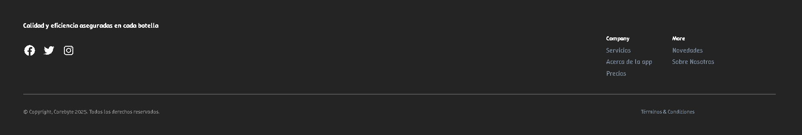
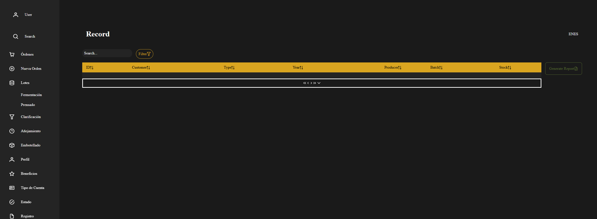

# Capítulo V: Product Implementation, Validation & Deployment.

## 5.1. Software Configuration Management.
En este punto del informe se describe las decisiones y los principios que ayudarán al 
equipo a garantizar la coherencia durante el desarrollo de la solución.

### 5.1.1. Software Development Environment Configuration.
En este apartado se proporcionan los enlaces a las aplicaciones y productos de 
software creados durante el ciclo del proyecto utilizando los programas correspondientes.

Con ese fin, se organizará en las siguientes secciones:
1. [ ] Project Management
2. [ ] Requirements Management
3. [ ] Product UX/UI Design
4. [ ] Software Development
5. [ ] Software Testing
6. [ ] Software Documentation

Asimismo, se clasificarán los elementos de estas secciones como rutas de referencia 
(para software basado en modelos Saas) o rutas de descarga (para productos que se 
ejecuten en las computadoras de los miembros del equipo) para cada uno de los productos 
de software.

**Project Management**

Esta disciplina se fundamenta en la administración de proyectos y busca principalmente la 
mejora de procesos y su entorno con el propósito de lograr los resultados esperados.

* Durante el ciclo digital del proyecto, se llevará a cabo la implementación de un producto 
de software basado en el modelo SaaS, el cual funcionará a través de un navegador web; no 
obstante, no se desarrollará una versión de la aplicación móvil correspondiente.

**Requirements Management:**

Este proceso se enfoca en asegurar que una organización documente, verifique y satisfaga las 
necesidades y expectativas de sus clientes, así como las de las partes interesadas internas 
o externas.


* **Jira Software:** Esta es una plataforma que facilita la gestión de historias de usuario, 
organizándolas en epopeyas y evaluando su importancia en el programa según su prioridad y puntos 
de historia. Se utiliza debido a su capacidad para permitir que cada miembro del equipo tenga una 
vista en tiempo real de los avances en cada proyecto, contribuyendo con diferentes secciones o 
ajustando el flujo del proyecto según sea necesario.

**Product UX/UI Design**

Esta herramienta facilita la creación digital de modelos que se integran en la vida del consumidor. 
En este caso, estamos desarrollando un modelo de sitio web compatible tanto con computadoras como 
con dispositivos móviles.

Para lograrlo, utilizamos varias herramientas de diseño y colaboración, que incluyen:

1. **Uxpressia:** Uxpressia es una plataforma en línea especializada en el mapeo de la trayectoria del
cliente. Nos ayuda a crear mapas de impacto y perfiles de usuario, como User Personas, Empathy Maps 
y Journey Maps. Puedes encontrar más información sobre Uxpressia en este [enlace](https://uxpressia.com/).

2. **MIRO:** MIRO es una pizarra digital colaborativa en línea que se adapta a diversas actividades 
colaborativas, como investigación, ideación, creación de lluvias de ideas y mapas mentales. Es una 
herramienta versátil que facilita el trabajo en equipo. Descubre más sobre MIRO en su 
[sitio web](https://miro.com/es/).

3. **Figma:** Figma es una herramienta de prototipado web y un editor de gráficos vectoriales. A 
diferencia de otras herramientas, Figma se ejecuta en línea, lo que permite crear modelos que 
funcionan tanto en navegadores web como en navegadores móviles. Puedes explorar 
Figma en [este enlace](https://www.figma.com/es-es/).

4. **Lucid Chart:** Esta es una aplicación de diagramación en línea que permite a los usuarios colaborar y
trabajar juntos en tiempo real para crear una variedad de diseños, incluidos diagramas UML, mapas 
mentales, prototipos de software y otros tipos de diagramas. Puedes conocer más acerca de Lucid Chart 
en [este enlace](https://www.lucidchart.com/pages/es).

5. **Overflow:** Overflow es una herramienta de diagramación que ofrece la posibilidad de colaborar en 
tiempo real. Utilizamos esta herramienta para crear diagramas de Userflows. Si deseas obtener más 
información sobre Overflow, visita su [sitio web](https://overflow.io/).

Estas herramientas nos ayudan a dar vida a nuestros diseños digitales y a garantizar que nuestros 
productos sean accesibles y atractivos en diferentes plataformas.


**Software Development:**

El desarrollo de software es una metodología aplicada en la creación de productos de software. Esta 
metodología se utiliza para establecer un proceso que guía el desarrollo del software, y cada uno de
sus pasos describe un enfoque específico para las distintas actividades que ocurren durante el proceso.

Aquí te presentamos algunas herramientas y tecnologías clave que utilizaremos en el proyecto:

1. **GitHub:** GitHub es una plataforma de repositorio comunitario que se utiliza para almacenar y 
gestionar los avances de proyectos realizados por grupos de personas. Puedes acceder al repositorio 
del proyecto en este [enlace](https://github.com/4424-Corebyte-App-Web).

2. **Webstorm:** Webstorm es un entorno de desarrollo de JetBrains, una empresa especializada en software, 
orientado al desarrollo web en JavaScript. Esta herramienta proporciona facilidades para probar 
sitios web en navegadores como Google Chrome. En nuestro proyecto, utilizaremos webstorm para 
trabajar con lenguajes como HTML, CSS y JavaScript. Obtén más información sobre WebStorm [aquí](https://www.jetbrains.com/webstorm/).

3. **HTML:** HTML es un lenguaje de marcado que se utiliza en el desarrollo de sitios web para crear
hipertextos y enlazar a otros documentos. Este lenguaje proporciona herramientas para diseñar 
sitios web y se puede combinar eficazmente con CSS y JavaScript. En nuestro proyecto, utilizaremos 
HTML para implementar la documentación de la página web. Obtén más información sobre la edición de
archivos HTML en WebStorm [aquí](https://www.jetbrains.com/help/idea/editing-html-files.html).

4. **CSS:** CSS es un lenguaje de diseño destinado al entorno web, que posibilita la mejora de la interfaz
de usuario previamente diseñada al añadir elementos como colores y tamaños, entre otros. Además, 
es posible crear un estilo en CSS y compartirlo en el sitio web creado en HTML. Este lenguaje será 
empleado en la implementación del diseño de nuestra plataforma web. Puedes obtener más información 
sobre CSS en [enlace](https://www.jetbrains.com/help/idea/style-sheets.html).

5. **JavaScript:** Es un lenguaje de programación que es interpretado por otros programas. Funciona bajo 
el paradigma de programación orientada a objetos (POO), utilizando prototipos en lugar de clases 
para la implementación. Este lenguaje permite crear dinámicas para los usuarios a través de la 
lógica de programación y será utilizado en la creación de las interacciones dinámicas en la plataforma 
web. Puedes encontrar más detalles sobre JavaScript en [enlace](https://www.jetbrains.com/help/idea/style-sheets.html).

Estas herramientas y tecnologías desempeñarán un papel fundamental en la creación exitosa de nuestro 
producto de software.

**Software Testing:**

Se trata de la acción de evaluar los elementos y el funcionamiento del software sometido a prueba 
mediante procesos de validación y verificación.

**Lenguaje Gherkin:** Este lenguaje, conocido como DSL (Lenguaje Específico de Dominio), está diseñado 
específicamente para abordar problemas particulares. Además de poder ser interpretado en código,
permite agregar historias de usuario del programa junto con sus componentes correspondientes, como 
Característica, Escenario, Ejemplo, Esquema de Escenario, Dado, Cuando, Entonces y Y.

**Software Documentation**

Se refiere a textos escritos o ilustraciones que acompañan al software de computadora o están 
integrados en su código fuente. Esta documentación tiene como objetivo explicar cómo funciona el 
software o cómo utilizarlo.
### 5.1.2. Source Code Management.
A continuación, se describe la gestión del código fuente, también conocida por las siglas SCM (Source Code Management). Su función principal es rastrear los cambios que realizará el equipo durante el desarrollo de su proyecto en el repositorio de código fuente. Se utilizará como un sistema de control de versiones que lepermitirá realizar un seguimiento de los cambios realizados por miembros o desarrolladores individuales del proyecto. Además, es importante tener en cuenta que usaremos GitHub como nuestro sistema de control de versiones.

1. [ ] URL de la organización: 4424-Corebyte-App-Web - https://github.com/4424-Corebyte-App-Web

2. [ ] URL del repositorio de la Landing Page: Corebyte-Landing-Page - https://github.com/4424-Corebyte-App-Web/Corebyte-Landing-Page

**GitFlow**

GitFlow es un modelo alternativo para la creación de ramas en Git que se ha convertido en una herramienta esencial para muchos desarrolladores en los últimos años. Este flujo de trabajo de control de versiones, desarrollado y popularizado por Vicent Driessen, desempeña un papel crucial en la gestión de las versiones de un código, facilitando la creación ordenada de nuevas características (Features) y correcciones de problemas urgentes (Hotfixes).


Como se mencionó previamente, GitFlow opera con ramas o "branches". A continuación, se detallan las ramas que se utilizarán en el flujo de trabajo de nuestro proyecto.

* **Main Branches:**
    * **Main:** Esta es la rama principal desde la cual se ramifican todas las demás. Contendrá la versión más reciente junto con las versiones anteriores creadas por los desarrolladores. Aquí se mantendrá el historial oficial de las versiones publicadas.
    * **Develop:** Esta rama puede ser creada a partir de la rama principal (Main) y contendrá todas las características (Features) estables. A través de esta rama, el equipo podrá integrar las funcionalidades de manera efectiva.

* **Support Branches**
A diferencia de las ramas principales, estas ramas secundarias tienen una vida útil limitada, ya que se eliminan al fusionarse con sus ramas primarias.
    * **Feature:**
        * Se ramifica de: develop
        * Debe fusionarse de nuevo en: develop
        * Se utilizan para desarrollar las nuevas funciones que se integrarán en la próxima versión. Es importante destacar que esta rama existe únicamente mientras está en proceso de desarrollo. Sin embargo, una vez que el desarrollador haya completado esa función, se fusionará nuevamente con la rama "develop".

* **Convenciones para nombrar los Features:**
    * **Feture Branch:** feature/name
    **Example:**
        1. feature/welcome
        2. feature/about
        3. feture/myfeture
    * **Conventional Commits**
    El commit debe seguir la siguiente estructura:
    **\<type> [optional scope]: \<description>**
    **[optional body]**
    **[optional footer(s)]**
        * **Type:**
        **1\. feat:** Cuando se agrega un nuevo feature.
        **2\. fix:** cuando corriges un error.
        **3\. build:** cuando afectan los componentes de compilación como la herramienta de compilación, las dependencias o la version del proyecto.
        **4\. chore:** modificaciones privadas del código.
        **5\. docs:** commits que afectan solo a la documentación.
        **6\. refractor:** commits que reescriben o reestructura el código, pero no cambia el comportamiento.
        **7\. perf:** commits especiales que mejoran el rendimiento.
        **8\. style:** commits que no afectan el programa. (espacios en blanco, formato, puntos o comas faltantes).
        **9\. test:** commits que agregan pruebas.
        * **Scope**
        Ofrece información contextual adicional. Aunque es opcional, es beneficioso incluirlo para proporcionar a los desarrolladores una descripción más detallada del commit.
        **\<description>**
        Es una parte obligatoria del formato de los commits. Siempre debemos usar lenguaje en modo imperativo y evitar escribir en mayúsculas
        **[optional body]**
        El cuerpo es opcional y, cuando se utiliza, debe explicar la motivación detrás del cambio y contrastarlo con el comportamiento anterior. Es ideal para mencionar identificadores de problemas y sus relaciones.
        **[optional footer(s)]**
        Esta sección es opcional y puede incluir información sobre cambios significativos. Puede hacer referencia al problema por su identificación y, en esta sección, se incluyen los cambios importantes precedidos por "BREAKING CHANGES:" seguido de uno o dos saltos de línea.
        **Ejemplos:**
            1. feat(welcome): add welcome section
            2. build(release): bump version to 1.0.0
            3. style: remove empty line
            4. feat(sign up): add the button to sign up
            5. feat!: email the costumer when product is shipped
            6. feat: remove ticket list endpoint
            refers to JIRA-1337
            BREAKING CHANGES: ticket enpoints no longer supports list all entites.

Como se mencionó previamente, la gestión de nuestro código fuente se llevará a cabo mediante
GitHub. El IDE utilizado en este caso, WebStorm, debe estar vinculado directamente al 
repositorio creado por nuestra StartUp. De esta manera, cada commit realizado por 
un miembro del equipo se subirá automáticamente y se cargará en el GitHub de la organización. Las instrucciones para completar con éxito este proceso de emparejamiento se detallan a continuación:

* **Activar el controlador de versiones del IDE**
Dado que utilizaremos GitHub para gestionar nuestro código, la opción que debe estar 
habilitada o seleccionada es aquella que indique que el sistema de control se realizará
mediante Git. Para hacer esto, siga los siguientes pasos:

  1. Diríjase a la pestaña "VCS" en WebStorm.
  2. Luego, seleccione la opción "Enable Version Control Integration".


Ahora se debe seleccionar el sistema de control a través de Git y, por último aceptar los cambios.


* **Aregar una cuenta de GitHub, siga estos pasos:**
  1. Diríjase a la sección de configuración en su aplicación.
  2. Dentro de la pestaña 'File', busque y seleccione la opción 'Settings'.
  3. En la configuración, busque la sección de version control.
  4. Agregue su cuenta de GitHub para obtener acceso a los repositorios.


* **Configurar el nombre de usuario de Git:** Una vez que hayas establecido el sistema de control de versiones que se vinculará con tu IDE, deberás ingresar la cuenta que utilizarás. Para hacerlo, sigue estos pasos:
  1. Realiza un commit en tu proyecto. Durante este proceso, se te solicitará que ingreses tu nombre de usuario de Git.
  2. Después de haberlo añadido, todos los cambios se guardarán en el repositorio especificado en esa plataforma, siempre y cuando des la orden correspondiente.
  3. Para configurar tu nombre de usuario de Git, primero selecciona la opción 'commit' que se encuentra dentro de la pestaña 'Git'.


* **Guardar el progreso en GitHub:** Con todo configurado en WebStorm, ahora puedes subir tu código a GitHub sin problemas. Simplemente dirígete a la opción 'GitHub' que se encuentra en la pestaña 'Git' y comparte el proyecto.


* **Configurar la propiedad del repositorio en GitHub:** Ahora, solo necesitas configurar la ubicación del repositorio. El código ya debería estar guardado en GitHub, pero solo estará presente en tu propia cuenta. Para cambiar la propiedad y transferirla a la organización deseada, sigue estos pasos:
  1. Ingresa al repositorio creado en GitHub.
  2. Selecciona la pestaña 'settings'
  3. Dirigite al apartado de 'DangerZone'
  4. Luego da click en 'transfer'
  5. Finalmente elegimos el nuevo lugar para guardar el repositorio.


### 5.1.3. Source Code Style Guide & Conventions.


En esta sección, se presentarán las pautas, convenciones, estilos y principios que se aplicarán a cada uno de los lenguajes utilizados en la creación de nuestra aplicación. La observancia de este conjunto de directrices reviste una importancia fundamental, ya que tiene el propósito de mantener la calidad estructural del software, mejorar la legibilidad del código fuente y simplificar el mantenimiento del mismo.

Dado que en este proyecto se emplearán varios lenguajes, como HTML, CSS, JavaScript, C# y TypeScript para el desarrollo de la plataforma web, así como Gherkin para el proceso de pruebas del programa, a continuación, se detallarán y describirán las reglas y recomendaciones generales que se tendrán en cuenta al utilizarlos.


**Nomenclatura General**

Para los nombres de variables, objetos, elementos y funciones que se utilicen en el proyecto, se emplearán términos en inglés que estén relacionados con lo que representan. No se utilizarán mayúsculas en estos nombres, ya que, de acuerdo con W3Schools (sin fecha), la combinación de mayúsculas y minúsculas puede dificultar la legibilidad del código. En su lugar, se optará por utilizar exclusivamente letras minúsculas, lo que contribuirá a una mayor claridad en el código.

Ejemplos de nomenclatura estándar, siguiendo las recomendaciones de Google (s.f.):

```
.gallery {}
.video {}
.login {}
```

Estas pautas de nomenclatura ayudarán a mantener una coherencia en el código y facilitarán su comprensión.

**Sangría**

Cuando se trabaje con HTML, CSS y/o JavaScript, se aplicará un espaciado de dos espacios antes de cada línea que se encuentre dentro de un bloque. Según W3Schools (sin fecha), no se recomienda el uso de la tecla "Tabulación". A continuación, se muestra un ejemplo de la sangría estándar en HTML siguiendo las directrices de W3Schools (s.f.):

``` html
<!DOCTYPE html>
<html>
  <head>
    <title>Título del Documento</title>
  </head>
  <body>
    <h1>Encabezado Principal</h1>
    <p>Este es un párrafo dentro del cuerpo del documento.</p>
  </body>
</html>
```

Este estilo de sangría proporciona una estructura clara y organizada al código, lo que facilita su lectura y mantenimiento.

Ejemplo de formato estándar de sangría en CSS, conforme a las recomendaciones de W3Schools (s.f):

``` CSS
html {
  background: #fff; /* Fondo blanco */
  color: #404;     /* Color de texto gris */
}
```

Ejemplo de nomenclatura estándar de la sangría en JavaScript según W3School (s.f.):

``` JavaScript
function toCelsius(fahrenheit) {
  return (5 / 9) * (fahrenheit - 32);
}
```

**Especificaciones generales**

A continuación, detallaremos las reglas específicas necesarias para comprender el código de nuestra aplicación en cada lenguaje.

**HTML:**

HTML, acrónimo de HyperText Markup Language en inglés, es un lenguaje de marcado que se utiliza para definir la estructura de una página web. También incluye funcionalidades que permiten controlar el comportamiento de diferentes elementos del contenido de la página, como cambiar el tamaño del texto o aplicar formato cursiva, entre otros. En nuestro proyecto, emplearemos HTML5, y a continuación, se presentan las características y directrices que debemos seguir para utilizar este lenguaje de la siguiente manera:

* **Declare Document Type**
  La declaración del tipo de documento debe realizarse en la primera línea del código. Según las recomendaciones de Google (s.f.), se prefiere la sintaxis de HTML5 para todos los documentos HTML. Para declararla, simplemente copia lo siguiente:

``` html
<!DOCTYPE html>
```

* **Blank Lines**
  Cada vez que comiences un nuevo bloque, lista o tabla de gran longitud, es recomendable dejar una línea en blanco después del elemento anterior para mejorar la legibilidad y la presentación del código, de acuerdo con las pautas de W3Schools (s.f.):

``` html
<!DOCTYPE html>
<html>
<head>
<title>Animales Exóticos</title>
</head>
<body>
<h1>Lemur de Madagascar</h1>
<p>El lémur de Madagascar es un primate endémico de la isla de Madagascar en el Océano Índico.</p>

<h1>Pangolín</h1>
<p>El pangolín es un mamífero cubierto de escamas que se encuentra en regiones de África y Asia.</p>

<h1>Ocelote</h1>
<p>El ocelote es un felino salvaje que habita en América del Sur y Central, conocido por su pelaje moteado.</p>
</body>
</html>
```

Esta práctica de dejar una línea en blanco mejora la estructura y legibilidad del código HTML.

* **Quote attribute Values**
  Para los valores de los atributos, es común utilizar comillas dobles alrededor de ellos, aunque esta característica no sea obligatoria. Según W3Schools (sin fecha), esto mejora la legibilidad del código y es una práctica común entre los desarrolladores. Aquí tienes un ejemplo:

``` html
<table class="striped">
```

Este enfoque de usar comillas dobles alrededor de los valores de los atributos es ampliamente aceptado y recomendado en la comunidad de desarrollo web.

* **Never Skip the \<title> Element**
  El elemento `<title>` permite que las páginas aparezcan en la lista de resultados al realizar búsquedas en un navegador web. Además, este elemento es responsable de proporcionar el nombre de la página cuando se agrega a marcadores o favoritos. A continuación, se muestra un ejemplo de su uso:

``` html
<title>Guía de Estilo HTML y Convenciones de Codificación</title>
```

Este elemento es esencial para mejorar la identificación y accesibilidad de una página web.

* **HTML Line-Wrapping**
  A pesar de que en un documento HTML no exista un límite estricto en la cantidad de palabras por línea, no se recomienda generar líneas de código excesivamente largas. De hecho, hacerlo dificulta la legibilidad del código. Para continuar en la siguiente línea, se deben utilizar al menos cuatro espacios para distinguir elementos secundarios. Aquí tienes un ejemplo basado en las recomendaciones de Google (sin fecha):

``` html
<button mat-icon-button color='primary' class="menu-button"
(click)="openMenu()">
<mat-icon>menu</mat-icon>
</button>
```

Este estilo de formateo ayuda a mantener un código más legible y facilita la identificación de los elementos y su jerarquía en la estructura del documento HTML.

**CSS:**

CSS, conocido por sus siglas en inglés, Cascading Style Sheets (Hojas de Estilo en Cascada), es un lenguaje que se enfoca en definir y mejorar la presentación de un documento basado en HTML. A continuación, se presentan las directrices que debemos seguir al utilizar CSS:

* **Shorthand Properties**
  Se recomienda utilizar abreviaturas de propiedades y declarar los campos de los elementos en la menor cantidad de líneas posible, según las pautas de Google (sin fecha). Esto aumenta la eficiencia del código y lo hace más legible. Además, se debe evitar agregar unidades después del valor cero. Aquí tienes un ejemplo:

``` css
border-top: 0;
font: 100%/1.6 palatino, georgia, serif;
padding: 0 1em 0;
```

Siguiendo estas recomendaciones, se puede lograr un código CSS más conciso y fácil de entender.

* **Declaration Stops**
  Es importante incluir un punto y coma al final de cada declaración en CSS, al igual que en la mayoría de los lenguajes de programación. Siguiendo las pautas de Google (sin fecha), esta práctica contribuye a mantener la coherencia en el código. A continuación, se muestra un ejemplo:

``` css
html {
  background: #fff;
  color: #404;
}
```

El uso consistente de puntos y comas al final de las declaraciones CSS ayuda a prevenir errores y mejora la claridad del código.

* **Property Name Stops**
  Es necesario incluir un espacio entre los dos puntos que siguen al nombre de una propiedad y el valor correspondiente. Siempre se debe colocar un solo espacio después de los dos puntos, pero no antes. A continuación, se muestra un ejemplo siguiendo esta convención estándar de Google (s.f):

``` css
html {
  background: #fff;
  color: #404;
}
```

Mantener esta consistencia en la colocación de espacios ayuda a que el código CSS sea más legible y fácil de entender.

* **Declaration Block Separation**
  Es esencial utilizar un espacio separador después del nombre de un selector de elemento y antes de la llave que inicia un bloque de declaración CSS. Además, la llave de apertura del bloque debe estar en la misma línea que el selector. Aquí tienes un ejemplo siguiendo esta convención estándar de Google (sin fecha):

``` css
html {
  background: #fff;
  color: #404;
}
```

El cumplimiento de estas directrices ayuda a mantener la consistencia y la legibilidad en el código CSS.

* **CSS quotation Marks**
  No se deben utilizar comillas dobles (`"`) en el código CSS; en su lugar, se permiten y deben emplearse comillas simples (`'`) únicamente para selectores de atributos y valores de propiedades.
  Ejemplo conforme a las pautas estándar de Google (sin fecha):

``` css
html {
  font-family: 'open sans', arial, sans-serif;
}
```

Este ejemplo demuestra el uso de comillas simples para encerrar el valor del atributo `font-family` en CSS, lo cual es una práctica común y aceptada.

**JavaScript**

JavaScript es un lenguaje de programación que permite especificar de manera precisa las acciones que debe realizar el navegador web, incluyendo el orden de ejecución de tareas y la frecuencia con la que se deben llevar a cabo. A continuación, se presentan las pautas para el uso de JavaScript en nuestro proyecto:

* **Spaces around operators**
  Es importante añadir espacios alrededor de cada operador matemático y comas que se utilicen en el código JavaScript. A continuación, se muestra un ejemplo siguiendo la convención estándar de W3Schools (sin fecha):

``` javascript
let x = y + z;
const myArray = ['Volvo', 'Saab', 'Fiat'];
```

El uso consistente de espacios alrededor de operadores y comas mejora la legibilidad del código JavaScript.

* **Simple Statement's End**
  Es fundamental que una instrucción simple finalice con un punto y coma, tal como es el caso en muchos otros lenguajes de programación. A continuación, se muestra un ejemplo que cumple con la convención estándar de W3Schools (sin fecha):

``` javascript
let x = v + 7;
const myArray = ['Volvo', 'Saab', 'Fiat'];
```

El uso de punto y coma al final de cada instrucción ayuda a garantizar la estructura correcta del código JavaScript y a evitar posibles errores.

* **Beginning and End of Function**
  Un bloque de función debe incluir una llave al final de la primera línea, de modo que el cierre de la función esté en la última línea, sin necesidad de un punto y coma. Este mismo principio se aplica a las estructuras condicionales y los bucles. A continuación, se muestra un ejemplo que cumple con la convención estándar de W3Schools (sin fecha):

``` javascript
function toCelsius(fahrenheit) {
  return (5 / 9) * (fahrenheit - 32);
}
```

En este ejemplo, la función `toCelsius` está formateada de acuerdo con estas pautas, con la llave de apertura en la misma línea que la declaración de la función y la llave de cierre en la última línea. Esto ayuda a mantener la estructura y la legibilidad del código JavaScript.

* **Object Rules**
  Para la creación de un objeto, al igual que en una función, se comienza con una llave al final de la primera línea. Sin embargo, en este caso, la llave de cierre debe ir seguida de un punto y coma. Para definir las propiedades del objeto, se utilizan dos puntos y un espacio para separar el nombre de la propiedad de su valor. Si el valor es un string, se debe encerrar entre comillas dobles. A continuación, se muestra un ejemplo siguiendo la convención estándar de W3Schools (sin fecha):

``` javascript
const person = {
  firstName: "John",
  lastName: "Doe",
  age: 50,
  eyeColor: "blue"
};
```

En este ejemplo, el objeto `person` está formateado de acuerdo con estas pautas, lo que mejora la legibilidad y la estructura del código JavaScript.

**Gherking:**

Gherkin es un Lenguaje Específico de Dominio (DSL por sus siglas en inglés) que se utiliza para resolver problemas específicos mediante la generación de casos de prueba que validan una característica en diversos escenarios. Gherkin incluye varios elementos, entre los cuales los más conocidos y utilizados son Feature, Scenario, Example, Given, When y Then. A continuación, se presentan las pautas que debemos seguir al utilizar Gherkin en nuestro código:

* **Discernible Given-When-Then Blocks**
  Es importante aplicar sangría a los elementos que representan los pasos a seguir en un escenario. En el caso de "And", se debe aplicar una sangría adicional. Siguiendo la recomendación de Keiblinger (2021), este enfoque ayuda a identificar rápidamente las partes que componen un escenario. A continuación, se muestra un ejemplo:

``` gherkin
Scenario: Ingreso de requisitos con claridad
  Given que en el formulario de ingreso de oferta laboral
  When escribo claramente los requisitos
  Then se mostrará el mensaje
  And mi oferta solo aparecerá a quienes cumplan con estos
  And se habilita la opción
```

En este ejemplo, se ha aplicado la sangría de manera adecuada para resaltar los pasos del escenario, y se ha utilizado una sangría adicional para los pasos que comienzan con "And". Esto mejora la legibilidad y la comprensión de los escenarios escritos en Gherkin.

* **Step with Tables**
  Conforme a la recomendación de Keiblinger (2021), cuando sea necesario introducir valores en partes del escenario, se debe emplear una tabla o crear un formulario que refleje esa parte del escenario. Antes de esta representación, se deben colocar dos puntos. Aquí tienes un ejemplo:

``` gherkin
Then se mostrará el mensaje:
  | Mensaje |
  | Se completaron los requisitos adecuadamente |
```

Este enfoque permite una representación clara y estructurada de los valores relacionados con una parte específica del escenario.

* **Reducing Noise**
  Para evitar la acumulación de demasiadas líneas de código en un escenario, es recomendable incluir valores por defecto dentro de los pasos para campos que no sean muy relevantes para ese escenario en particular. Los valores "estándar" que se coloquen deben estar entre comillas simples. Siguiendo el consejo de Keiblinger (2021), esta práctica contribuye significativamente a la reducción del tamaño del código. A continuación, se muestra un ejemplo:

``` gherkin
When escribo claramente los requisitos 'dominio en C'
```

En este ejemplo, se ha incluido un valor por defecto ('dominio en C') entre comillas simples dentro del paso para representar un campo que no es esencial en ese escenario. Esto ayuda a mantener el escenario más conciso y legible.

* **Scenarios Separator**
  Para separar dos escenarios, se debe insertar un salto de línea y, según la sugerencia de Keiblinger (2021), si es posible, agregar una línea de comentario para facilitar la visualización de estos. De esta manera, se identifica rápidamente el inicio y el fin de un escenario. A continuación, se presenta un ejemplo:

``` gherkin
Scenario: Ingreso de requisitos con claridad
Given que en el formulario de ingreso de oferta laboral
When escribo claramente los requisitos
Then se mostrará el mensaje
And mi oferta solo aparecerá a quienes cumplan con estos
And se habilita la opción

# --------------------------

Scenario: Otro escenario
Given que en otro contexto
When ocurre algo diferente
Then se muestra otro resultado
```

En este ejemplo, se ha agregado un salto de línea entre los dos escenarios y se ha incluido una línea de comentario como separador para mejorar la visualización y la identificación de cada escenario.

**C#:**

C# es un lenguaje de programación desarrollado por Microsoft en el año 2000 como parte de su plataforma .NET. Desde su creación, C# ha evolucionado significativamente, convirtiéndose en una herramienta esencial para el desarrollo de una amplia gama de aplicaciones, desde software de escritorio hasta aplicaciones web y móviles, así como servicios en la nube. Su diseño moderno y su integración con el ecosistema de .NET lo han consolidado como una opción preferida para muchos desarrolladores a nivel global.

A continuación, se presentan las pautas para utilizar C# en nuestro proyecto:

* **Datos de cadena**


Use **interpolación de cadenas** para concatenar cadenas cortas, como se muestra en el código siguiente.

```C#  
  string displayName = $"{nameList[n].LastName}, {nameList[n].FirstName}";
```

Para anexar cadenas en bucles, especialmente cuando se trabaja con grandes cantidades de texto, utilice un objeto System.Text.StringBuilder.
En este ejemplo, se han seguido las pautas para nombrar clases e interfaces de manera clara y legible.


```C#  
  var phrase = "lalalalalalalalalalalalalalalalalalalalalalalalalalalalalala";
  var manyPhrases = new StringBuilder();
  for (var i = 0; i < 10000; i++)
  {
      manyPhrases.Append(phrase);
  }
  //Console.WriteLine("tra" + manyPhrases);
```

* **Delegados**

Use **Func<> y Action<>** en lugar de definir tipos de delegado. En una clase, defina el método delegado.

```C#  
  Action<string> actionExample1 = x => Console.WriteLine($"x is: {x}");
  
  Action<string, string> actionExample2 = (x, y) => Console.WriteLine($"x is: {x}, y is {y}");
  
  Func<string, int> funcExample1 = x => Convert.ToInt32(x);
  
  Func<int, int, int> funcExample2 = (x, y) => x + y;
```

Llame al método con la signatura definida por el delegado Func<> o Action<>.

```C#  
  actionExample1("string for x");
  actionExample2("string for x", "string for y");
  Console.WriteLine($"The value is {funcExample1("1")}");
  Console.WriteLine($"The sum is {funcExample2(1, 2)}");
```

* **try-catch y using en el control de excepciones**

Use **try-catch** para controlar las excepciones. Use **using** para liberar recursos no administrados.

``` C#  
  try
  {
      // Code that may throw an exception
  }
  catch (Exception ex)
  {
      // Code to handle the exception
  }
  
  using (var resource = new Resource())
  {
      // Code that uses the resource
  }
```

* **Operadores && y ||**

Use **&&** y **||** en lugar de **&** y **|** para operaciones lógicas. Los operadores **&&** y **||** realizan una evaluación de cortocircuito, lo que significa que si la primera parte de la expresión es suficiente para determinar el resultado, la segunda parte no se evalúa.

```C#  
  if (a == 10 && b == 20)
  {
      // Code to execute if both conditions are true
  }
  
  if (a == 10 || b == 20)
  {
      // Code to execute if either condition is true
  }
```

* **Comentarios**

Use comentarios para explicar el código y proporcionar información adicional. Los comentarios deben ser claros y concisos.

```C#  
  // This is a single-line comment
  
  /*
  This is a multi-line comment
  that spans multiple lines
  */
```
* **Operador new**

Use **new** para crear instancias de clases y estructuras.

```C#  
  var person = new Person();
  var point = new Point(10, 20);
```

* **Control de eventos**

Use **eventos** para notificar a los suscriptores cuando ocurre un evento.

```C#  
  public class Button
  {
      public event EventHandler Click;
  
      protected virtual void OnClick(EventArgs e)
      {
          Click?.Invoke(this, e);
      }
  }
```

* **Consultas LINQ**

Use consultas LINQ para realizar operaciones de consulta en colecciones de datos.

```C#  
  var query = from c in customers
              where c.City == "London"
              select c;
```

* **Variables locales con asignación implícita de tipos**

Use la asignación implícita de tipos para las variables locales cuando el tipo se puede inferir fácilmente.

```C#  
  var name = "John";
  var age = 30;
```

**Typescript**

JavaScript es uno de los lenguajes más populares y ha experimentado un rápido avance y mejora en los últimos años. A continuación, se presentan las pautas para utilizar JavaScript en nuestro proyecto:

En TypeScript, se recomienda que las variables se declaren en minúsculas y se especifique el tipo de dato utilizando dos puntos después del nombre de la variable. Aquí tienes ejemplos de cómo declarar y asignar valores a variables en TypeScript:

``` typescript
// Definición e inicialización separadas
let edad: number;
edad = 20;

// Definición e inicialización en la misma línea.
let edadAitor: number = 18;
```

Además, en TypeScript, se siguen las mismas convenciones que se utilizan en JavaScript.


### 5.1.4. Software Deployment Configuration.

#### Landing Page Deployment

Para desplegar la Landing Page desde GitHubPages hay que seguir los siguientes pasos:

**1. Ubicar el repositorio que tiene guardado el codigo fuente y dirigirse al apartado de configuración (settings):**


**1. Seleccionar la sección pages:**


**1. Configurar la rama que será usada para hacer deploy:**


## 5.2. Landing Page, Services & Applications Implementation.

### 5.2.1. Sprint 1
En la fase inicial de nuestro proyecto, nos propusimos llevar a cabo la implementación del diseño de nuestra Landing Page utilizando WebStorm como entorno de desarrollo. Esto implica que al concluir el Sprint, todas las secciones, ya sea Home, Services, Pricing, Testimonials o About Us, deben estar completadas. A continuación, adjuntamos imágenes que ilustran cómo gestionamos las tareas en Jira Software.

Repositorio: [https://github.com/orgs/4424-Corebyte-App-Web/repositories](https://github.com/orgs/4424-Corebyte-App-Web/repositories)

Landing Page Deployed: [https://4424-corebyte-app-web.github.io/Corebyte-Landing-Page/](https://landingpage4424.web.app)

#### 5.2.1.1. Sprint Planning 1.

<table>
    <thead>
        <tr>
            <th>Sprint #</th>
            <th>Sprint 1</th>
        </tr>
    </thead>
    <tbody>
        <tr>
            <td colspan="2"> <p1 style="text-align: center;"> Sprint Planning Background </p1></td>
        </tr>
        <!--FILA 1-->
        <tr>
            <td>Date</td>
            <td>20-04-2025</td>
        </tr>
        <!--FILA 2-->
        <tr>
            <td>Time</td>
            <td> 10:00 p.m </td>
        </tr>
        <!--FILA 3-->
        <tr>
            <td>Location</td>
            <td>Discord</td>
        </tr>
         <!--FILA 4-->
        <tr>
            <td>Prepared By</td>
            <td>Oscar Armas</td>
        </tr>
         <!--FILA 5-->
        <tr>
            <td>Attendees (to planning meeting)</td>
            <td>Renzo Llerena - Matías Diaz - Renzo Villafuerte - Giovany Torres </td>
        </tr>
        <!--FILA 6-->
        <tr>
            <td colspan="2"> <p1 style="text-align: center;"> Sprint Goal & User Stories </p1></td>
        </tr>
        <!--FILA 7-->
        <tr>
            <td>Sprint 1 Goal</td>
            <td> 
              Nuestro enfoque está en implementar la landing page de TraceWine, incluyendo todas las 
              secciones acordadas y el requisito de cambio de idioma para la aplicación. Creemos que esto
              mejora la accesibilidad y la experiencia del usuario, permitiendo que más productores de vinos y 
              distribuidores se conecten con la plataforma. Esto se confirmará cuando la landing page 
              esté completa, funcional y los usuarios puedan navegar por las secciones en su idioma 
              preferido, reportando satisfacción con la interfaz y la usabilidad.
            </td>
        </tr>
        <!--FILA 8-->
        <tr>
            <td>Sprint 1 Velocity</td>
            <td> 23 </td>
        </tr>
        <!--FILA 9-->
        <tr>
            <td>Sum of Story Points</td>
            <td> 21 </td>
        </tr>
    </tbody>
</table>

#### 5.2.1.2. Aspect Leaders and Collaborators.
Esta sección presenta la matriz de liderazgo y colaboración elaborada para el primer sprint. Los aspectos clave considerados en esta etapa se enfocan en las distintas secciones del landing page y en los estilos que deben aplicarse en cada una:

<table border="1">
  <thead>
    <tr>
      <th>Team Member<br>(Last Name, First Name)</th>
      <th>Github Username</th>
      <th>Inicio</th>
      <th>Nosotros</th>
      <th>Servicios</th>
      <th>Precios</th>
      <th>Acerca</th>
      <th>Contacto</th>
      </tr>
  </thead>
  <tbody>
    <tr>
      <td>Llerena Delagado, Renzo Miguel</td>
      <td>Renxoll</td>
      <td></td>
      <td></td>
      <td></td>
      <td></td>
      <td>L</td>
      <td></td>
    </tr>
    <tr>
      <td>Villafuerte Tapia, Renzo Alonso </td>
      <td>RenzoVi21</td>
      <td></td>
      <td></td>
      <td></td>
      <td></td>
      <td></td>
      <td>L</td>
    </tr>
    <tr>
      <td>Armas Sánchez, Oscar Javier</td>
      <td>Racso24k</td>
      <td></td>
      <td></td>
      <td>L</td>
      <td></td>
      <td></td>
      <td></td>
    </tr>
    <tr>
      <td>Torres Apolinario, Giovany Smith</td>
      <td>Giovany7x</td>
      <td></td>
      <td>L</td>
      <td></td>
      <td></td>
      <td></td>
      <td></td>
    </tr>
    <tr>
      <td>Diaz Quispe, Matias Sebastian</td>
      <td>equinox-1092</td>
      <td>L</td>
      <td></td>
      <td></td>
      <td>L</td>
      <td></td>
      <td>L</td>
    </tr>
  </tbody>
</table>


#### 5.2.1.3. Sprint Backlog 1.
Tal como se indicó previamente en la planificación del sprint 1, su objetivo principal fue desarrollar y publicar una versión inicial del landing page del producto. Esto implicó implementar las distintas secciones que componen un landing page, con el fin de brindar a los visitantes una mejor comprensión del producto en desarrollo.

Una vez establecido el objetivo del sprint, se identificaron las historias de usuario relevantes para esta etapa. Luego, cada historia fue desglosada en tareas específicas relacionadas con su implementación y cumplimiento. Para gestionar el avance del sprint, se utilizó la herramienta Trello.


<table>
    <thead>
        <tr>
            <th colspan="7">Sprint #</th>
            <th> Sprint 1</th>
        </tr>
    </thead>
    <tbody>
        <!--FILA 1-->
        <tr>
            <td colspan="1">User Story</td>
            <td colspan="15">Work-Item / Task</td>
        </tr>
        <!--FILA 2-->
        <tr>
            <td>Id</td>
            <td>Title</td>
            <td>Id</td>
            <td>Title</td>
            <td>Description</td>
            <td>Estimation (hours)</td>
            <td>Assigned To</td>
            <td>Status</td>
        </tr>
        <!--FILA 3-->
        <tr>
            <td rowspan="4" >US-001</td>
            <td rowspan="4" >Hipervínculos en el encabezado</td>
            <td>T001</td>
            <td>Definir enlaces del encabezado</td>
            <td>Identificar y organizar los enlaces del encabezado.</td>
            <td>1</td>
            <td>Matias Diaz</td>
            <td>Done</td>
        </tr>
        <!--FILA 4-->
        <tr>
            <td>T002</td>
            <td>Implementar hipervínculos</td>
            <td>Añadir hipervínculos en HTML</td>
            <td>1</td>
            <td>Matias Diaz</td>
            <td>Done</td>
        </tr>
        <!--FILA 5-->
        <tr>
            <td>T003</td>
            <td>Estilizar con CSS</td>
            <td>Aplicar estilos básicos a los enlaces del encabezado</td>
            <td>2</td>
            <td>Matias Diaz</td>
            <td>Done</td>
        </tr>
        <!--FILA 6-->
        <tr>
            <td>T004</td>
            <td>Pruebas de funcionamiento</td>
            <td>Asegurarse de que los hipervínculos funcionen correctamente.</td>
            <td>1</td>
            <td>Matias Diaz</td>
            <td>Done</td>
        </tr>
        <!--FILA 7-->
        <tr>
            <td rowspan="4" >US-002</td>
            <td rowspan="4" >Información sobre beneficios de la aplicación</td>
            <td>T001</td>
            <td>Definir contenido de beneficios</td>
            <td>Identificar los beneficios clave de la aplicación.</td>
            <td>2</td>
            <td>Osacar Javier</td>
            <td>Done</td>
        </tr>
        <!--FILA 8-->
        <tr>
            <td>T002</td>
            <td>Redactar sección de beneficios</td>
            <td>Escribir los beneficios de la aplicación de forma clara.</td>
            <td>2</td>
            <td>Osacar Javier</td>
            <td>Done</td>
        </tr>
        <!--FILA 9-->
        <tr>
            <td>T003</td>
            <td>Estilizar la sección de beneficios</td>
            <td>Aplicar estilos visuales a la sección de beneficios</td>
            <td>2</td>
            <td>Osacar Javier</td>
            <td>Done</td>
        </tr>
        <!--FILA 10-->
        <tr>
            <td>T004</td>
            <td>Pruebas de funcionalidad de beneficios</td>
            <td>Asegurarse de que la sección de beneficios sea accesible y clara.</td>
            <td>1</td>
            <td>Osacar Javier</td>
            <td>Done</td>
        </tr>
        <!--FILA 11-->
        <tr>
            <td rowspan="4" >US-003</td>
            <td rowspan="4" >Información sobre beneficios de la aplicación para vinicultores</td>
            <td>T001</td>
            <td>Definir beneficios específicos para vinicultores</td>
            <td>Identificar beneficios clave que impactan directamente a los vinicultores.</td>
            <td>2</td>
            <td>Osacar Javier</td>
            <td>Done</td>
        </tr>
        <!--FILA 12-->
        <tr>
            <td>T002</td>
            <td>Redactar contenido para vinicultores</td>
            <td>Escribir los beneficios específicos para vinicultores de forma clara.</td>
            <td>2</td>
            <td>Osacar Javier</td>
            <td>Done</td>
        </tr>
        <!--FILA 13-->
        <tr>
            <td>T003</td>
            <td>Estilizar la sección de beneficios para vinicultores</td>
            <td>Aplicar estilos visuales a la sección específica de vinicultores.</td>
            <td>2</td>
            <td>Osacar Javier</td>
            <td>Done</td>
        </tr>
        <!--FILA 14-->
        <tr>
            <td>T004</td>
            <td>Pruebas de funcionalidad de beneficios para vinicultores</td>
            <td>Asegurarse de que la sección sea clara y útil para los vinicultores.</td>
            <td>1</td>
            <td>Osacar Javier</td>
            <td>Done</td>
        </tr>
        <!--FILA 3-->
        <tr>
            <td rowspan="4" >US-004</td>
            <td rowspan="4" >Opciones de Precios Claras para Decisiones Informadas</td>
            <td>T001</td>
            <td>Definir opciones de precios</td>
            <td>Establecer diferentes opciones de precios para los usuarios.</td>
            <td>2</td>
            <td>Matias Diaz</td>
            <td>Done</td>
        </tr>
        <!--FILA 4-->
        <tr>
            <td>T002</td>
            <td>Redactar descripción de precios</td>
            <td>Escribir descripciones claras y transparentes para cada opción de precio.</td>
            <td>2</td>
            <td>Matias Diaz</td>
            <td>Done</td>
        </tr>
        <!--FILA 5-->
        <tr>
            <td>T003</td>
            <td>Estilizar opciones de precios</td>
            <td>Aplicar diseño visual para hacer las opciones de precios fáciles de identificar.</td>
            <td>2</td>
            <td>Matias Diaz</td>
            <td>Done</td>
        </tr>
        <!--FILA 6-->
        <tr>
            <td>T004</td>
            <td>Pruebas de funcionalidad de precios</td>
            <td>Verificar que todas las opciones de precios funcionen correctamente.</td>
            <td>1</td>
            <td>Matias Diaz</td>
            <td>Done</td>
        </tr>
        <!--FILA 7-->
        <tr>
            <td rowspan="4" >US-005</td>
            <td rowspan="4" >Acceso fácil a soporte y asesoramiento</td>
            <td>T001</td>
            <td>Definir canales de soporte</td>
            <td>Establecer los diferentes canales a través de los cuales los usuarios pueden recibir soporte.</td>
            <td>2</td>
            <td>Renzo Villafuerte</td>
            <td>Done</td>
        </tr>
        <!--FILA 8-->
        <tr>
            <td>T002</td>
            <td>Redactar contenido de soporte</td>
            <td>Escribir instrucciones claras para acceder al soporte y asesoramiento.</td>
            <td>2</td>
            <td>Renzo Villafuerte</td>
            <td>Done</td>
        </tr>
        <!--FILA 9-->
        <tr>
            <td>T003</td>
            <td>Estilizar el acceso a soporte</td>
            <td>Asegurarse de que el acceso al soporte sea fácil de encontrar y utilizar.</td>
            <td>2</td>
            <td>Renzo Villafuerte</td>
            <td>Done</td>
        </tr>
        <!--FILA 10-->
        <tr>
            <td>T004</td>
            <td>Pruebas de funcionalidad de soporte</td>
            <td>Verificar que todos los canales de soporte sean funcionales.</td>
            <td>1</td>
            <td>Renzo Villafuerte</td>
            <td>Done</td>
        </tr>
        <!--FILA 11-->
        <tr>
            <td rowspan="4" >US-006</td>
            <td rowspan="4" >Opiniones de usuarios que inspiran confianza</td>
            <td>T001</td>
            <td>Recopilar opiniones de usuarios</td>
            <td>Solicitar y recopilar opiniones de usuarios sobre la aplicación.</td>
            <td>2</td>
            <td>Renzo Miguel</td>
            <td>Done</td>
        </tr>
        <!--FILA 12-->
        <tr>
            <td>T002</td>
            <td>Redactar opiniones destacadas</td>
            <td>Seleccionar y escribir las opiniones más destacadas de los usuarios.</td>
            <td>2</td>
            <td>Renzo Miguel</td>
            <td>Done</td>
        </tr>
        <!--FILA 13-->
        <tr>
            <td>T003</td>
            <td>Estilizar opiniones de usuarios</td>
            <td>Aplicar un diseño visual atractivo para mostrar las opiniones de los usuarios.</td>
            <td>2</td>
            <td>Renzo Miguel</td>
            <td>Done</td>
        </tr>
        <!--FILA 14-->
        <tr>
            <td>T004</td>
            <td>Pruebas de funcionalidad de opiniones</td>
            <td>Asegurarse de que las opiniones se muestren correctamente.</td>
            <td>1</td>
            <td>Renzo Miguel</td>
            <td>Done</td>
        </tr>
        <!--FILA 15-->
        <tr>
            <td rowspan="4" >US-007</td>
            <td rowspan="4" >Navegación fluida en dispositivos móviles</td>
            <td>T001</td>
            <td>Optimizar navegación para dispositivos móviles</td>
            <td>Asegurarse de que la navegación sea fluida en dispositivos móviles.</td>
            <td>3</td>
            <td>Renzo Miguel</td>
            <td>Done</td>
        </tr>
        <!--FILA 16-->
        <tr>
            <td>T002</td>
            <td>Rediseñar menús para móviles</td>
            <td>Ajustar los menús de navegación para mejorar la experiencia móvil.</td>
            <td>3</td>
            <td>Renzo Miguel</td>
            <td>Done</td>
        </tr>
        <!--FILA 17-->
        <tr>
            <td>T003</td>
            <td>Pruebas de funcionalidad móvil</td>
            <td>Verificar que la navegación móvil funcione correctamente.</td>
            <td>2</td>
            <td>Giovany Torres</td>
            <td>Done</td>
        </tr>
        <!--FILA 18-->
        <tr>
            <td>T004</td>
            <td>Realizar pruebas de rendimiento móvil</td>
            <td>Asegurarse de que la experiencia de navegación sea rápida en dispositivos móviles.</td>
            <td>2</td>
            <td>Giovany Torres</td>
            <td>Done</td>
        </tr>
        <!--FILA 19-->
        <tr>
            <td rowspan="4" >US-008</td>
            <td rowspan="4" >Adaptación de la landing page en tabletas</td>
            <td>T001</td>
            <td>Rediseñar layout para tabletas</td>
            <td>Adaptar la landing page para una visualización optimizada en tabletas.</td>
            <td>3</td>
            <td>Renzo Miguel</td>
            <td>Done</td>
        </tr>
        <!--FILA 20-->
        <tr>
            <td>T002</td>
            <td>Rediseñar elementos interactivos</td>
            <td>Ajustar botones y enlaces para mejorar la experiencia en tabletas.</td>
            <td>2</td>
            <td>Renzo Miguel</td>
            <td>Done</td>
        </tr>
        <!--FILA 21-->
        <tr>
            <td>T003</td>
            <td>Pruebas de funcionalidad en tabletas</td>
            <td>Verificar que la landing page funcione correctamente en tabletas.</td>
            <td>2</td>
            <td>Matias Diaz</td>
            <td>Done</td>
        </tr>
        <!--FILA 22-->
        <tr>
            <td>T004</td>
            <td>Realizar pruebas de rendimiento en tabletas</td>
            <td>Asegurarse de que la experiencia sea rápida y fluida en tabletas.</td>
            <td>2</td>
            <td>Matias Diaz</td>
            <td>Done</td>
        </tr>
        <!--FILA 23-->
        <tr>
            <td rowspan="4" >US-009</td>
            <td rowspan="4" >Compatibilidad en computadoras de escritorio</td>
            <td>T001</td>
            <td>Optimizar layout para computadoras de escritorio</td>
            <td>Asegurarse de que la landing page sea completamente funcional en escritorios.</td>
            <td>3</td>
            <td>Matias Diaz</td>
            <td>Done</td>
        </tr>
        <!--FILA 24-->
        <tr>
            <td>T002</td>
            <td>Rediseñar elementos para escritorio</td>
            <td>Ajustar el diseño de botones y menús para computadoras de escritorio.</td>
            <td>2</td>
            <td>Oscar Javier</td>
            <td>Done</td>
        </tr>
        <!--FILA 25-->
        <tr>
            <td>T003</td>
            <td>Pruebas de funcionalidad en escritorio</td>
            <td>Verificar que todos los elementos funcionen correctamente en computadoras de escritorio.</td>
            <td>2</td>
            <td>Renzo Miguel</td>
            <td>Done</td>
        </tr>
        <!--FILA 26-->
        <tr>
            <td>T004</td>
            <td>Realizar pruebas de rendimiento en escritorio</td>
            <td>Asegurarse de que la página cargue rápidamente y sin errores en computadoras de escritorio.</td>
            <td>2</td>
            <td>Renzo Villafuerte</td>
            <td>Done</td>
        </tr>
    </tbody>
</table>


#### 5.2.1.4. Development Evidence for Sprint Review.
En esta sección se detallan los principales logros alcanzados durante el primer sprint. El avance más significativo fue la creación de la versión inicial de cada sección del landing page. Cada integrante del equipo trabajó de forma progresiva en el desarrollo de dichas secciones. Posteriormente, se aplicaron estilos a través de CSS para darles formato.

A continuación, se presenta una tabla que resume los commits realizados, los cuales integran partes de las funcionalidades necesarias para completar este primer sprint.

<table>
    <thead>
        <tr>
            <th rowspan="" >Repository</th>
            <th>Branch</th>
            <th>Commit Id</th>
            <th>Commit Message</th>
            <th>Commited on (Date)</th>
        </tr>
    </thead>
    <tbody>
        <!--FILA 1 -->
        <tr>
            <td rowspan="14">https://github.com/4424-Corebyte-App-Web/Corebyte-Landing-Page</td>
            <td>master</td>
            <td>989c513aff9000ef61b828540ba489a75c4cc05d</td>
            <td>Initial commit</td>
            <td>24/24/2025</td>
        </tr>
        <!--FILA 2 -->
        <tr>
            <td>develop</td>
            <td>c77773e32554125a0c306c9fe2fd24fe79bd46c6</td>
            <td>feat(start): add start section and styles</td>
            <td>24/24/2025</td>
        </tr>
        <!--FILA 3 -->
        <tr>
            <td>feature/about</td>
            <td>989c513aff9000ef61b828540ba489a75c4cc05d</td>
            <td>Initial commit</td>
            <td>24/24/2025</td>
        </tr>
        <!--FILA 4 -->
        <tr>
            <td>feature/about-app</td>
            <td>44b743ac8c78ae066b0e07ab8b55ebec37b3956b</td>
            <td>feat(prices): add prices section and styles</td>
            <td>24/24/2025</td>
        </tr>
        <!--FILA 5 -->
        <tr>
            <td>feature/contact</td>
            <td>2e1735e81ffa8d485708e38e52caefe681a3a3ee</td>
            <td>docs:update index.html</td>
            <td>24/24/2025</td>
        </tr>
        <!--FILA 6 -->
        <tr>
            <td>feature/prices</td>
            <td>44b743ac8c78ae066b0e07ab8b55ebec37b3956b</td>
            <td>feat(prices): add prices section and styles</td>
            <td>24/24/2025</td>
        </tr>
        <!--FILA 7 -->
        <tr>
            <td>feature/services</td>
            <td>ed0ba970539a24d09c25d94c221effaf4ee77b7e</td>
            <td>commit: update services section</td>
            <td>26/24/2025</td>
        </tr>
        <!--FILA 8 -->
        <tr>
            <td>feature/start</td>
            <td>c77773e32554125a0c306c9fe2fd24fe79bd46c6</td>
            <td>feat(start): add start section and styles</td>
            <td>24/24/2025</td>
        </tr>
        <!--FILA 9 -->
        <tr>
            <td>release</td>
            <td>989c513aff9000ef61b828540ba489a75c4cc05d</td>
            <td>Initial commit</td>
            <td>24/24/2025</td>
        </tr>
    </tbody>
</table>

#### 5.2.1.5. Execution Evidence for Sprint Review.


Después de completar el Sprint 1, logramos implementar todas las secciones de nuestra Landing Page para garantizar una visualización perfecta. Además, le dimos un formato atractivo que captura la atención del usuario hacia sus diferentes componentes. También agregamos métodos de navegación en la página, como botones ubicados al principio, que te permiten moverte fácilmente de una sección a otra. A continuación, te mostraremos los avances a través de imágenes del resultado obtenido.

Es importante destacar que el objetivo principal de la Landing Page es convertir a los visitantes en futuros clientes o usuarios habituales de nuestro servicio. Para lograrlo, utilizamos llamados a la acción (Call To Action) que los guían hacia la aplicación web.

A continuación, te presentamos capturas de pantalla del desarrollo de la Landing Page:


**Encabezado y botones de desplazamiento:**

En la parte superior, se encuentra el encabezado (Header) que incluye botones de inicio (Home), beneficios (benefits), Pricing (Pricing), sobre la aplicación (about), testimonios de usuarios (testimonials), un formulario para que nos contacten (Contact), un apartado para saber sobre el equipo (About us) y un botón para cambiar el idioma entre inglés y español. Estos elementos permiten a los visitantes desplazarse fácilmente a la sección que deseen visualizar.

Imagen 01: Encabezado y botones de desplazamiento


**Sección Hero:**

Se presenta la sección "Hero", que incluye una breve descripción y una frase representativa de TraceWine. Además, permite iniciar el uso del servicio web y proporciona una imagen relacionada con el mismo.

Imagen 02: Sección Hero


**Sección Services:**

Se presenta la sección de servicio que ofrecemos para nuestros segmentos objetivos. En esta sección, se describen los beneficios y características de TraceWine, lo que permite a los visitantes conocer más sobre el servicio.

Imagen 03: Sección Services


**Sección Pricing:**

En la sección de precios, se detallan los planes y precios de TraceWine. Esta información es esencial para que los visitantes conozcan las opciones disponibles y puedan elegir la que mejor se adapte a sus necesidades.

Imagen 04: Sección Pricing


**Sección About the App:**

En esta sección, se presenta información detallada sobre la aplicación TraceWine, sus características y funcionalidades. Esto permite a los visitantes conocer más sobre la aplicación y cómo puede ayudarles en su día a día.

Imagen 05: Sección About the App


**Sección About the Team:**

En la sección "About the Team", se presenta información sobre el equipo de desarrollo de TraceWine. Esto permite a los visitantes conocer a las personas detrás del servicio y generar confianza en la calidad y profesionalismo del equipo.


**Sección Contact:**

En la sección de contacto, se presenta un formulario que permite a los visitantes enviar consultas, comentarios o solicitudes de información sobre TraceWine. Esto facilita la comunicación con los usuarios y permite responder a sus necesidades de manera eficiente.


**Footer:**

En el pie de página (Footer), se incluyen enlaces a las redes sociales de TraceWine, información de contacto y un botón para volver al inicio de la página. Esto permite a los visitantes acceder a más información y mantenerse conectados con el servicio.




#### 5.2.1.6. Services Documentation Evidence for Sprint Review.

En el primer Sprint el equipo de desarrollo de CoreByte ha diseñado, programado y puesto en funcionamiento el sitio web (Landing Page) Para presentar la aplicación Web propuesta denominada "TraceWine". En este sitio web (Landing Page), se lográ visualizar varias secciones que ilustran en que consiste "TraceWine", cada integrante del equipo de desarrollo de CoreByte estuvo a cargo de una sección en especifico.

<table>
  <thead>
    <tr>
      <th>End Point</th>
      <th> Funciones</th>
    </tr>
  </thead>
  <tbody>
    <tr>
        <td>https://4424-corebyte-app-web.github.io/Corebyte-Landing-Page/</td>
        <td>Mostrar la Landing Page Desplegada</td>
    </tr>
  </tbody>
</table>


#### 5.2.1.7. Software Deployment Evidence for Sprint Review.

Para la implementación de nuestro sitio web, optamos por utilizar GitHub Pages. En este proceso, creamos un repositorio en GitHub donde gestionamos el control de versiones. En la sección de Configuración, publicamos el proyecto almacenado en la rama "develop" que previamente se encontrba en la rama release-1.0.

[Landing Page TraceWine](https://4424-corebyte-app-web.github.io/Corebyte-Landing-Page/) - https://4424-corebyte-app-web.github.io/Corebyte-Landing-Page/

#### 5.2.1.8. Team Collaboration Insights during Sprint.

En esta entrega, nuestra meta principal fue la implementación de la Landing Page. Para llevar a cabo este objetivo, hicimos uso de diversas herramientas como GitHub, Visual Studio Code, WebStorm, HTML, CSS y JavaScript. A continuación, vamos a presentar los diagramas de flujo que representan los commits realizados por cada miembro del equipo CoreByte:

A continuación se muestra la cantidad de commits realizadas por cada integrante del equipo durante el desarrollo de la landing page.


Los siguientes gráficos ofrecen una representación visual de las clonaciones registradas en nuestro repositorio, junto con la fecha en que cada una de estas acciones se llevó a cabo. Además, se presenta información sobre la cantidad de visitantes que ha tenido el repositorio de nuestro equipo a lo largo del tiempo.


### 5.2.2. Sprint 2 

Repositorio: [Repositorio](https://github.com/orgs/4424-Corebyte-App-Web/repositories)

Landing page desployed: [Landing page](https://landingpage4424.web.app)

Front-end application: [Front-end application](https://vuetb2.web.app)


#### 5.2.2.1. Sprint Planning 2. 

| Sprint #                                     | Sprint 2                                               |
|----------------------------------------------|--------------------------------------------------------|
| <b> Sprint planning Background </b>          | --                                                     |
| Date                                         | 2025/05/08                                             |
| Time                                         | 08:00 AM                                               |
| Location                                     | Reunión virtual-Meet                                   |
| Prepared By                                  | Oscar Armas                                            |
| Attendees                                    | Renzo Miguel Llerena Delagado / Diaz Quispe Matías Sebastian / Renzo Alonso Villafuerte Tapia / Oscar Javier Armas Sánchez / Torres Apolinario Giovany Smith |
| Sprint 1 Review Summary                      | En el sprint anterior, el equipo completó una primera vista de la página de destino, implementando las secciones y estilos básicos necesarios, como Contacto, Precios y Servicios sobre la startup. |
| Sprint 1 Retrospective Summary               | El principal aspecto que el equipo debe mejorar es la comunicación entre los miembros para que se mantengan al tanto del progreso de cada uno. Ahora, el plan para el próximo sprint es trabajar de forma más organizada para que cada miembro sepa qué hacer.  |
| <b> Sprint Goal & User Stories </b>          | --                                                     |
| Sprint 2 Goals                               | Nuestro objetivo es implementar la primera version funcional de la aplicaion front-end con funciones principales como ordenes, estado, historial, solicitudes, panel de control y gestion de lotes. Como equipo pensamos ofrecer una vizualizacion amigable y detallada para una mayor adaptabilidad de la página de destino de Corebyte, ademas, creemos que ofrece una primera visión completa de las funcionalidades que la aplicación ofrece a los segmentos objetivo. Esto nos confirmará cuando nuestros segmentos objetivo se registren en la aplicación y utilicen las principales funcionalidades, como almacenes y guías de anáilisis de venta |
| Sprint 2 Velocity                            | 130                                                    |
| Sum of Story Points                          | 130                                                    |

#### 5.2.2.2. Aspect Leaders and Collaborators. 

En esta sección, se incluye la matriz de liderazgo y colaboración desarrollada para este segundo sprint. Los principales aspectos que se toman en cuenta en este sprint se centran en cada las principales secciones que presenta el Front-End Web Application. Para esto, hemos definido las siguientes secciones: Login, Ordenes, Estados, Historial, Gestion de lotes, Análisis de venta y solicitud de stock

| Team Member                        | GitHub Username | Login  | Ordenes          | Historial y Estado | Gestion de lotes | Reabastecimiento              | 
|------------------------------------|-----------------|--------|------------------|--------------------|------------------|-------------------------------|
| Renzo Miguel Llerena Delagado      | Renxoll         |        |                  |                    | L                |                               |
| Diaz Quispe Matías Sebastian       | equinox-1092    |        |                  | L                  |                  |                               |
| Renzo Alonso Villafuerte Tapia     | RenzoVi21       | L      |                  |                    |                  |                               |
| Oscar Javier Armas Sánchez         | Racso24k        |        |                  |                    |                  | L                             |
| Torres Apolinario Giovany Smith    | Giovany7x       |        | L                |                    |                  |                               |

#### 5.2.2.3. Sprint Backlog 2. 

Como se mencionó previamente en el planeamiento del sprint número 2, el objetivo del mismo es (OBJETIVO).

Luego de definir el objetivo del sprint, se identificaron las historias de usuario útiles para este sprint. A continuación, se dividió cada historia de usuario en tareas relacionadas a la implementación y cumplimiento de dicha historia. 

A continuación, se presenta la tabla con las tareas necesarias para completar satisfactoriamente este segundo sprint. Además, se asignó un miembro del equipo a cada tarea a desarrollar y el estado de cada tarea.
[Link de acceso al Sprint Backlog #2 en Trello](https://trello.com/invite/b/681cc645085eedc15240526c/ATTIe5d02782fd704438be9b7f155b65d2cc3DDD1D0A/corebyte-sprint-backlog-2)

<p align="center">
  

  <p align="center">
 
      
A continuación, se presenta la tabla con las tareas necesarias para completar el sprint nuemero 2, tambien, se asignó un miembro del equipo a cada tarea a desarrollar y el estado de cada tarea.

| Sprint 2     | Sprint Backlog 2                                              |             |                                                                                    |                                                                                                                                                                     |                    |                 |             |
|--------------|---------------------------------------------------------------|-------------|------------------------------------------------------------------------------------|---------------------------------------------------------------------------------------------------------------------------------------------------------------------|--------------------|-----------------|-------------|
| User Stories |                                                               | Work Item/Task                                                                                   |                                                                                                                                                                     |                    |                 |             |
| Id           | Title                                                         | Id          | Title                                                                              | Description                                                                                                                                                         | Estimation (Hours) | Assigned to     | Status      |
| US027        | Registro de nuevos insumos en el inventario               | US027T001   | Crear una seccion para el registro de insumos en el inventario                   | Crear un componente que registre em una tabla los productos.                                                                                    | 4                  | Oscar Javier  | Done |
| US014        | Registro del estado de embotellado               | US014T001   |  Crear un boton para el registro de embotellado                  | Programar un boton dirija a al apartado de registro de embotellado.                                                                                    | 3                  | Renzo Miguel  | Done |
| US016        | Crear un cliente distribuidor               | US016T001   | Crear un cliente                   | Programar una funcion que cree un nuevo usuario dependiendo si es distribuidor o productor.                                                                                    | 6                  | Renzo Alonso  | Done |
|              |                                             | US016T002   | Crear seccion de detalle de tipo de cuenta                   | Crear un apartado para visualizar el tipo de cuenta actual.                                                                                    | 4.5                  | Renzo Alonso  | Done |
|              |                                             | US016T003   | Crear seccion de detalle de plan para actualizar                   | Crear un apartado para visualizar el tipo de desea actualizar .                                                                                    | 3                  | Renzo Alonso  | Done |
| US035        | Administrar el estado de un pedido               | US035T001   | Crear una tabla con los pedidos segun su estado                   | Crear un componente que muestre en una tabla los productos que tengan los estados de pendiente o entregado.                                                                                    | 4.5                  | Matías Diaz  | Done |
| US013        | Registro del estado de añejamiento               | US013T001   | Crear un formulario para crear un registro de añejamiento                  | crear unos cuadrados para completar la informacion correspondiente para el añejamientto.                                                                                    | 7                  | Renzo Miguel  | Done |
| US029        | Reabastecimiento de insumos directamente desde la plataforma               | US029T001   | Crear una sección para reabastecer insumos en el inventario                   | Crear un componente que permita ingresar y registrar los en el inventario directamente desde la plataforma.                                                                                    | 6                  | Oscar Javier  | Done |
| US015        | Registro de pedido               | US015T001   | Crear una sección para registrar nuevos pedidos                   | Crear un componente que permita registrar un nuevo pedido con detalles de productos, cantidades, cliente y imagen de referencia.                                                                                    | 5                  | Giovany Torres  | Done |
| US034        | Obtener detalles de un pedido               | US034T001   | Crear un boton para ver detalles de un pedido                   | Crear un boton que muestre la información detallada de un pedido.                                                                                    | 3                  | Giovany Torres  | Done |
| US012        | Registro del estado de prensado               | US012T001   | Crear una sección para registrar el estado de prensado                   | Crear un componente que permita documentar el progreso del proceso de prensado con fecha, lote y tipo.                                                                                    | 8                  | Renzo Miguel  | Done |
| US022        | Seguimiento del estado del pedido               | US022T001   | Crear una sección para seguir el estado de pedidos                   | Crear una tabla con la informacion del producto, ademas de mostrar en que estado se encuentra el producto.                                                                                    | 5                  | Matías Diaz  | Done |
| US010        | Registro del estado de fermentación               | US010T001   | Crear una sección para registrar el estado de fermentación                   | Crear un componente que permita documentar el progreso del proceso de fermentacion con tipo y descripcion de la temperatura recomendado.                                                                                    | 6                  | Renzo Miguel  | Done |
| US011        | Registro del estado de clarificación               | US011T001   | Crear una sección para registrar el estado de clarificación                   | Crear un componente que permita documentar el progreso del proceso de fermentacion con tipo y cantidad de agentes clarificantes.                                                                                    | 7                  | Renzo Miguel  | Done |
|              |                                                    | US011T002   | Crear una sección para registrar el estado de clarificación                   | Crear un componente que permita registrar y actualizar el registro del estado de clarificación.                                                                                    | 5                  | Renzo Miguel  | Done |
| US031        | Informes de inventario               | US031T001   | Crear una sección para generar informes de inventario                   | Crear un componente que genere informes de stock de insumos con la extencion pdf.                                                                                    | 4.5                  | Matías Diaz  | Done |


#### 5.2.2.4. Development Evidence for Sprint Review. 

En esta sección, se describen los principales avances de implementación realizados en este segundo sprint.

A continuación, se muestra una tabla que contiene la información sobre los _commits_ hechos que contienen partes de las funcionalidades que debemos implementar para completar el primer sprint.

| Repository                             | Branch                           | Commit Id                                         | Commit Message                                                   | Commited On |
|----------------------------------------|----------------------------------|---------------------------------------------------|------------------------------------------------------------------|-------------|
| Corebyte/Corebyte-Front-End-App        | develop                          | d6056d8fec0e259095dcba758200073f9e1d273a          |  chore: add alerts                                               | 14/05/2025  |
| Corebyte/Corebyte-Front-End-App        | develop                          | 0c2e3e17800e89b392d8f61c169c28ab012028f1          |  chore: add batch management                                     | 14/05/2025  |
| Corebyte/Corebyte-Front-End-App        | develop                          | 3f8ebbc7322dc877c0b961c2da2a7b9050cb3e88          |  chore: add profile management                                   | 14/05/2025  |
| Corebyte/Corebyte-Front-End-App        | feature/fake-api                 | 76d549816f7968a276d714ef2bd165cbc2345807          |  feat(fake-api): add fake-api support with json server.          | 16/05/2025  |
| Corebyte/Corebyte-Front-End-App        | feature/i18n                     | 441658633db5ce77469d21d44ca1ced0ae9715bc          |  feat(i18n): add language english                                | 16/05/2025  |
| Corebyte/Corebyte-Front-End-App        | feature/i18n                     | ae3db439a86e03436a2d6f9a594af00639aba4c1          |  feat(i18n): add language spanish                                | 16/05/2025  |
| Corebyte/Corebyte-Front-End-App        | feature/history-status           | ee1318494817f374e0282a569fa76982df252c09          |  feat(services): add function get and update of record           | 16/05/2025  |
| Corebyte/Corebyte-Front-End-App        | feature/history-status           | 6d4a98066fbd38ec2bf7a745c492c60f0773b5fd          |  feat(status): add component status page                         | 16/05/2025  |
| Corebyte/Corebyte-Front-End-App        | feature/history-status           | 5c24c0181d955e8c32b9ce356605500d2bc0b299          |  feat(record): add components page record                        | 16/05/2025  |
| Corebyte/Corebyte-Front-End-App        | feature/authentication           | ca649730d4ad48a080b8db48421fc1c8be0a00fd          |  docs:update feature/authentication                              | 16/05/2025  |
| Corebyte/Corebyte-Front-End-App        | feature/batch-management         | 1e8a8b4e83f5bf2226e098d34aa4ec24e3c03458          |  batch-management ui                                             | 16/05/2025  |
| Corebyte/Corebyte-Front-End-App        | feature/profile-management       | cc510edd2035838756c16fda6eb219a0eaf6023a          |  Create benefits.component.vue                                   | 16/05/2025  |

#### 5.2.2.5. Execution Evidence for Sprint Review. 

El objetivo de este sprint fue realizar, en colaboracion con todo el equipo, la creacion del front-end application.

<p align="center">
  

<p align="center">
  

<p align="center">
  

<p align="center">
  

<p align="center">
  

<p align="center">
  

<p align="center">
  

<p align="center">
  

<p align="center">
  

<p align="center">
  

<p align="center">
  

<p align="center">
  

<p align="center">
  


#### 5.2.2.6. Services Documentation Evidence for Sprint Review. 

| Endpoint                             | Acción                           | Verbo HTTP                                         | Descripción                                                   | Ejemplo de Response |
|--------------------------------------|----------------------------------|----------------------------------------------------|---------------------------------------------------------------|---------------------|
| /products      | almacenar los productos ingresados                          | POST           |  Mostrara los proudctos almacenados                                            | {"id": "1001","customer": "Carlos Vega","date": "2025-05-14","product": "Cabernet Sauvignon","amount": 6,"total": 1200,"status": "Pendiente"} |
| /record      | almacenar los los informes de los productos                          | POST           |  Mostrara la lista de productos registrado para generar el informe                                            | {"id": "1001","customer": "Carlos Vega","type": "Cabernet Sauvignon","year": "2025","producer":"Cabernet Sauvignon","batch": 6,"stock": 1200}, |
| /orders      | almacenar los productos ingresados de las ordenes generados                          | POST           |  Mostrara los proudctos en la tabla de ordenes                                            | {"id": "1001","client": "Bodega El Sol","date": "2025-06-01","product": "Vino Tinto Reserva 2020","quantity": 10,"total": 1200,"imageUrl": "https://ferrand.com.pe/cdn/shop/files/B3DC6785-9365-4C2B-A774-E75DE90C526B.png?crop=center&height=480&v=1729894924&width=480"} |

#### 5.2.2.7. Software Deployment Evidence for Sprint Review. 
La organizacion de nuestro codigo se realizo en un repositorio en GitHub. Para el despliegue del front-end application

- Primero, se creó un repositorio en GitHub para alojar el código fuente del Frontend, permitiendo así una gestión centralizada y control de versiones
- Segundo, cada miembro del equipo creó una rama individual para desarrollar una función específica del Frontend, lo que permitió trabajar en paralelo de manera organizada.

<p align="center">
  

- Tercero, se creó un proyecto en WebStorm y se conectó al repositorio remoto, facilitando la integración del código con el control de versiones desde el entorno de desarrollo.
- Cuarto, se implementaron las diferentes funcionalidades asignadas y se realizaron los commits respectivos, siguiendo buenas prácticas para mantener un historial de cambios claro.
- Quinto, una vez completado el desarrollo, se hizo merge de las ramas individuales a develop, donde se resolvieron conflictos y se corrigieron errores detectados en la integración.
- Sexto, tras verificar el correcto funcionamiento en develop, se realizó el merge final hacia la rama master, consolidando una versión estable del proyecto.
- Septimo, se configuró Firebase como herramienta de despliegue, preparando los archivos necesarios y definiendo el entorno adecuado.
- Octavo, se realizó el despliegue del Frontend a través de Firebase. A continuación, se muestra la evidencia del despliegue:

Link Front end: [Front-end application](https://vuetb2.web.app)

#### 5.2.2.8. Team Collaboration Insights during Sprint. 

El proyecto se realizo mediante repositorio en GitHub. Integrantes participantes:

<p align="center">
  

Commits de los integrantes en el Landing Page:

<p align="center">
  

Grafico de los push y merge realizados por el equipo:

<p align="center">
  

### 5.2.3. Sprint 3 

Repositorio: [Repositorio](https://github.com/orgs/4424-Corebyte-App-Web/repositories)

Landing page desployed: [Landing page](https://landingpage4424.web.app)

Front-end application: [Front-end application](https://vuetb2.web.app)

Back-end application: [Back-end application](https://github.com/4424-Corebyte-App-Web/corebyte-back-end-application)

#### 5.2.3.1. Spring Planning 3. 

<table border="1" cellpadding="8" cellspacing="0">
      <tbody>
        <tr>
          <th align="left">Sprint #</th>
          <td>3</td>
        </tr>
        <tr>
          <th align="left">Sprint planning Background</th>
          <td>--</td>
        </tr>
        <tr>
          <th align="left">Date</th>
          <td>2025/06/02</td>
        </tr>
        <tr>
          <th align="left">Time</th>
          <td>18: 30 PM</td>
        </tr>
        <tr>
          <th align="left">Location</th>
          <td>Reunión virtual - Meet</td>
        </tr>
        <tr>
          <th align="left">Prepared By</th>
          <td>Oscar Armas</td>
        </tr>
        <tr>
          <th align="left">Attendees</th>
          <td>
            Renzo Miguel Llerena Delagado / Diaz Quispe Matías Sebastian / Renzo
            Alonso Villafuerte Tapia / Oscar Javier Armas Sánchez / Torres
            Apolinario Giovany Smith
          </td>
        </tr>
        <tr>
          <th align="left">Sprint 2 Review Summary</th>
          <td>
            En el sprint anterior, el equipo completó gran parte escencial del front-end application,
            el cual implementa la seccion del usuario, el cual contiene la información del login registrado,
            ademas de mostrar el plan actual que usa, tambien se agrego la parte de ordenes, reportes si el cliente
            desea generara un pdf que muestre el historial de las ultimas semanas, por otro lado tenemos reabastecimiento,
            batch-management y profile-management
          </td>
        </tr>
        <tr>
          <th align="left">Sprint 2 Retrospective Summary</th>
          <td>
            El principal aspecto que el equipo debe mejorar es la comunicación
            entre los miembros para que se mantengan al tanto del progreso de
            cada uno. Ahora, el plan para el próximo sprint es trabajar de forma
            más organizada para que cada miembro sepa qué hacer, a la vez que priorizaremos
            los puntos a avanzar, lo cuales consideremos mas relevantes para el sprint.
          </td>
        </tr>
        <tr>
          <th align="left">Sprint Goal &amp; User Stories</th>
          <td>--</td>
        </tr>
        <tr>
          <th align="left">Sprint 3 Goals</th>
          <td>
            Nuestro objetivo es implementar endpoints para la gestión de procesos. Como
            modificar, ver detalle, agregar y eliminar los pedidos. Además, pensamos como equipo que
            al implementar las funciones del back end, esto propoorciona operaciones más ágiles y una mejor experiencia de usuario a los productories y                        distribuidores.
          </td>
        </tr>
        <tr>
          <th align="left">Sprint 3 Velocity</th>
          <td>130</td>
        </tr>
        <tr>
          <th align="left">Sum of Story Points</th>
          <td>100</td>
        </tr>
      </tbody>
    </table>

#### 5.2.3.2. Aspect Leaders and Collaborators. 

En esta sección, se incluye la matriz de liderazgo y colaboración desarrollada para este tercer sprint. Los principales aspectos que se toman en cuenta en este sprint se centran en cada las principales secciones que presenta el back-end. Para esto, hemos definido las siguientes secciones: 

<table border="1" cellpadding="8" cellspacing="0">
      <thead>
        <tr>
          <th align="left">Team Member</th>
          <th align="left">GitHub Username</th>
          <th align="left">Login</th>
          <th align="left">Ordenes</th>
          <th align="left">Historial y Estado</th>
          <th align="left">Gestion de lotes</th>
          <th align="left">Reabastecimiento</th>
        </tr>
      </thead>
      <tbody>
        <tr>
          <td>Renzo Miguel Llerena Delagado</td>
          <td>Renxoll</td>
          <td></td>
          <td></td>
          <td></td>
          <td></td>
          <td>L</td>
        </tr>
        <tr>
          <td>Diaz Quispe Matías Sebastian</td>
          <td>equinox-1092</td>
          <td></td>
          <td></td>
          <td>L</td>
          <td></td>
          <td></td>
        </tr>
        <tr>
          <td>Renzo Alonso Villafuerte Tapia</td>
          <td>RenzoVi21</td>
          <td>L</td>
          <td></td>
          <td></td>
          <td></td>
          <td></td>
        </tr>
        <tr>
          <td>Oscar Javier Armas Sánchez</td>
          <td>Racso24k</td>
          <td></td>
          <td></td>
          <td></td>
          <td></td>
          <td>L</td>
        </tr>
        <tr>
          <td>Torres Apolinario Giovany Smith</td>
          <td>Giovany7x</td>
          <td></td>
          <td>L</td>
          <td></td>
          <td></td>
          <td></td>
        </tr>
      </tbody>
    </table>

#### 5.2.3.3. Sprint Backlog 3. 

Como se mencionó previamente en el planeamiento del sprint número 3, el objetivo del mismo es (OBJETIVO).

Luego de definir el objetivo del sprint, se identificaron las historias de usuario útiles para este sprint. A continuación, se dividió cada historia de usuario en tareas relacionadas a la implementación y cumplimiento de dicha historia. 

A continuación, se presenta la tabla con las tareas necesarias para completar satisfactoriamente este segundo sprint. Además, se asignó un miembro del equipo a cada tarea a desarrollar y el estado de cada tarea.
[Link de acceso al Sprint Backlog #3 en Trello](https://trello.com/invite/b/683cc46878ea32ade67856f9/ATTI23b0375a9ab9a22dc3fbfa6b725d78072F320565/corebyte-sprint-backlog-3)

<p align="center">
  
    
<table border="1" cellpadding="8" cellspacing="0">
      <thead>
        <tr>
          <th colspan="2" align="left">Sprint 3</th>
          <th colspan="6" align="left">Sprint Backlog 3</th>
        </tr>
        <tr>
          <th colspan="2" align="left">User Stories</th>
          <th colspan="6" align="left">Work Item/Task</th>
        </tr>
        <tr>
          <th align="left">Id</th>
          <th align="left">Title</th>
          <th align="left">Id</th>
          <th align="left">Title</th>
          <th align="left">Description</th>
          <th align="left">Estimation (Hours)</th>
          <th align="left">Assigned to</th>
          <th align="left">Status</th>
        </tr>
      </thead>
      <tbody>
        <tr>
          <td>US-033</td>
          <td>Buscar insumos en el inventario</td>
          <td>US-033T001</td>
          <td>Crear filtrado de búsqueda</td>
          <td>Diseño e implementación del barra de búsqueda</td>
          <td>5</td>
          <td>Renzo Miguel</td>
          <td>Done</td>
        </tr>
         <tr>
          <td>US-025</td>
          <td>Modificación de pedidos antes del envío</td>
          <td>US-025T001</td>
          <td>Crear boton de modificar</td>
          <td>Diseño e implementacion de boton para modificar un pedio</td>
          <td>4</td>
          <td>Matias Diaz</td>
          <td>Done</td>
        </tr>
         <tr>
          <td>US-030</td>
          <td>Asignación de insumos a diferentes fases de producción</td>
          <td>US-030T001</td>
          <td>Crear boton de agregado</td>
          <td>Diseño e implementacion de boton para productos a diferentes estados(fermentación, etc.)</td>
          <td>5</td>
          <td>Renzo Miguel</td>
          <td>Done</td>
        </tr>
        <tr>
    <td>US-019</td>
    <td>Ver detalles de un cliente distribuidor</td>
    <td>US-019T001</td>
    <td>Implementar vista de detalles</td>
    <td>Diseño e implementación de la pantalla de detalle de cliente distribuidor con todos los campos</td>
    <td>5</td>
    <td>Renzo Villafuerte</td>
    <td>Done</td>
  </tr>
  <tr>
    <td>US-021</td>
    <td>Creación de pedidos de vinos</td>
    <td>US-021T001</td>
    <td>Implementar formulario de pedido</td>
    <td>Diseño e implementación del formulario de selección de vinos y cantidades, y botón de envío</td>
    <td>5</td>
    <td>Giovany Torres</td>
    <td>Done</td>
  </tr>
  <tr>
    <td>US-017</td>
    <td>Editar un cliente distribuidor</td>
    <td>US-017T001</td>
    <td>Crear formulario de edición</td>
    <td>Diseño e implementación de formulario para editar datos de cliente distribuidor</td>
    <td>4</td>
    <td>Renzo Villafuerte</td>
    <td>Done</td>
  </tr>
  <tr>
    <td>US-028</td>
    <td>Actualización del stock de insumos en tiempo real</td>
    <td>US-028T001</td>
    <td>Implementar actualización de stock</td>
    <td>Diseño e implementación de lógica de descontar y sumar stock en tiempo real al interactuar con insumos</td>
    <td>5</td>
    <td>Oscar Javier</td>
    <td>Done</td>
  </tr>
  <tr>
    <td>US-023</td>
    <td>Confirmación de disponibilidad de stock</td>
    <td>US-023T001</td>
    <td>Verificar stock al crear pedido</td>
    <td>Diseño e implementación de validación de stock antes de confirmar el envío del pedido</td>
    <td>5</td>
    <td>Giovany Torres</td>
    <td>Done</td>
  </tr>
  <tr>
    <td>US-032</td>
    <td>Filtrar insumos del inventario por categoría</td>
    <td>US-032T001</td>
    <td>Crear filtros de categoría</td>
    <td>Diseño e implementación de dropdowns para filtrar insumos por Tipo, Proveedor, Unidad, etc.</td>
    <td>5</td>
    <td>Giovany Torres</td>
    <td>Done</td>
  </tr>
  <tr>
    <td>US-018</td>
    <td>Eliminar un cliente distribuidor</td>
    <td>US-018T001</td>
    <td>Implementar botón de eliminar</td>
    <td>Diseño e implementación de botón y confirmación modal para eliminación de cliente distribuidor</td>
    <td>5</td>
    <td>Renzo Villafuerte</td>
    <td>Done</td>
  </tr>
  <tr>
    <td>US-024</td>
    <td>Programación de entregas</td>
    <td>US-024T001</td>
    <td>Agregar selector de fecha</td>
    <td>Diseño e implementación de calendario para seleccionar fecha de entrega</td>
    <td>3</td>
    <td>Giovany Torres</td>
    <td>Done</td>
  </tr>
         <tr>
    <td>TS-007</td>
    <td>Eliminar un cliente distribuidor (API)</td>
    <td>TS-007T001</td>
    <td>Implementar endpoint DELETE</td>
    <td>Desarrollo del endpoint DELETE /distributors/{id} que responda 204, 404 y 403 según el caso</td>
    <td>3</td>
    <td>Renzo Villafuerte</td>
    <td>Done</td>
  </tr>
  <tr>
    <td>TS-013</td>
    <td>Seguimiento y Notificaciones del Estado del Pedido</td>
    <td>TS-013T001</td>
    <td>Implementar endpoint de seguimiento</td>
    <td>Desarrollo del endpoint GET /orders/track y lógica de envío de notificaciones por cambio de estado</td>
    <td>5</td>
    <td>Giovany Torres</td>
    <td>Done</td>
  </tr>
  <tr>
    <td>TS-014</td>
    <td>Ver detalles de un ítem del inventario</td>
    <td>TS-014T001</td>
    <td>Implementar endpoint GET</td>
    <td>Desarrollo del endpoint GET /inventory/items/{id} que responda 200, 404 y 403 según el caso</td>
    <td>3</td>
    <td>Oscar Javier</td>
    <td>Done</td>
  </tr>
  <tr>
    <td>TS-009</td>
    <td>Registrar un pedido</td>
    <td>TS-009T001</td>
    <td>Implementar endpoint POST</td>
    <td>Desarrollo del endpoint POST /orders que valide datos y responda 201, 400 y 403 según el caso</td>
    <td>4</td>
    <td>Giovany Torres</td>
    <td>Done</td>
  </tr>
  <tr>
    <td>TS-010</td>
    <td>Ver detalles de un pedido</td>
    <td>TS-010T001</td>
    <td>Implementar endpoint GET</td>
    <td>Desarrollo del endpoint GET /orders/{id} con manejo de errores 200, 400 e internos</td>
    <td>3</td>
    <td>Giovany Torres</td>
    <td>Done</td>
  </tr>
  <tr>
    <td>TS-016</td>
    <td>Agregar nuevo ítem al inventario</td>
    <td>TS-016T001</td>
    <td>Implementar endpoint POST</td>
    <td>Desarrollo del endpoint POST /inventory/items que valide campos y responda 201, 400 y 403</td>
    <td>4</td>
    <td>Matias Diaz</td>
    <td>Done</td>
  </tr>
      </tbody>
    </table>

#### 5.2.3.4. Development Evidence for Sprint Review. 

En esta sección, se describen los principales avances de implementación realizados en este segundo sprint.

A continuación, se muestra una tabla que contiene la información sobre los commits hechos que contienen partes de las funcionalidades que debemos implementar para completar el primer sprint.

<table border="1" cellpadding="8" cellspacing="0">
      <thead>
        <tr>
          <th align="left">Repository</th>
          <th align="left">Branch</th>
          <th align="left">Commit Id</th>
          <th align="left">Commit Message</th>
          <th align="left">Commited On</th>
        </tr>
      </thead>
      <tbody>
        <tr>
          <td>Corebyte/Corebyte-back-end-app</td>
          <td>develop</td>
          <td>90384d2c31027cb915299c2161c965f4133d820c</td>
          <td>fix: configuration AppDbContext</td>
          <td>22/06/2025</td>
        </tr>
           <tr>
          <td>Corebyte/Corebyte-back-end-app</td>
          <td>feature/authentication</td>
          <td>9d9fe8c392341f92f4cfc4efedbea31412ca5512</td>
          <td>feat(user): add configuration login and register</td>
          <td>22/06/2025</td>
        </tr>
          <tr>
          <td>Corebyte/Corebyte-back-end-app</td>
          <td>feature/history-status</td>
          <td>f74ff15c21826775c4482afef1eedcd108bda337</td>
          <td>fix(program): solution bug in db</td>
          <td>22/06/2025</td>
        </tr>
          <tr>
          <td>Corebyte/Corebyte-back-end-app</td>
          <td>feature/batch-management</td>
          <td>24e0d11ea5ff7160e0c0bec259e1b8b3ed2f8467</td>
          <td>Initial import of Corebyte back-end application</td>
          <td>22/06/2025</td>
        </tr>
          <tr>
          <td>Corebyte/Corebyte-back-end-app</td>
          <td>feature/replenishment</td>
          <td>dc1eef36e0cadd7eaf1e6b994760d156f4bc255c</td>
          <td>feat(replenishment): Created , update, delete , show all.</td>
          <td>22/06/2025</td>
        </tr>
        <tr>
          <td>Corebyte/Corebyte-back-end-app</td>
          <td>feature/open-api</td>
          <td>02a42a75d672a05ea2a057ba497b0cdd182038dc</td>
          <td>feat(package): update package reference</td>
          <td>22/06/2025</td>
        </tr>
        <tr>
          <td>Corebyte/Corebyte-back-end-app</td>
          <td>feature/orders</td>
          <td>6b8ed13340ecb1aba0bc1bd063f726663cc7bbd7</td>
          <td>feat(create): Create OrderResourceFromEntityAssembler</td>
          <td>22/06/2025</td>
        </tr>
      </tbody>
    </table>

#### 5.2.3.5. Execution Evidence for Sprint Review. 

El objetivo de este sprint fue realizar, en colaboracion con todo el equipo, la creacion del back-end

**Update for web application**

<p align="center">
  

<p align="center">
  

<p align="center">
  

<p align="center">
  

<p align="center">
  

**Web Services Execution**

<p align="center">
  

<p align="center">
  
    
#### 5.2.3.6. Services Documentation Evidence for Sprint Review. 

# Replenishment Endpoint

<table border="1" cellpadding="8" cellspacing="0">
  <thead>
    <tr>
      <th align="left">Endpoint</th>
      <th align="left">Acción</th>
      <th align="left">Verbo HTTP</th>
      <th align="left">Descripción</th>
      <th align="left">Ejemplo de Response</th>
    </tr>
  </thead>
  <tbody>
    <tr>
      <td>/api/v1/replenishment/{ReplenishmentId}</td>
      <td>Get Replenishment by ID</td>
      <td>GET</td>
      <td>Obtener un registro de replenishment por su ID</td>
      <td>
        <pre>
{
    "id": 1,
    "orderNumber": "12",
    "name": "Vino",
    "type": "Tinto",
    "date": "2025-12-10",
    "stockActual": 12,
    "stockMinimo": 2,
    "price": 120
}
        </pre>
      </td>
    </tr>
    <tr>
      <td>/api/v1/replenishment</td>
      <td>Create a Replenishment</td>
      <td>POST</td>
      <td>Crear un nuevo registro de replenishment</td>
      <td>
        <pre>
{
    "id": 4,
    "orderNumber": "16",
    "name": "Whisky",
    "type": "Escocés",
    "date": "2025-07-01",
    "stockActual": 30,
    "stockMinimo": 5,
    "price": 200
}
        </pre>
      </td>
    </tr>
    <tr>
      <td>/api/v1/replenishment</td>
      <td>Get all Replenishments</td>
      <td>GET</td>
      <td>Listar todos los registros de replenishment</td>
      <td>
        <pre>
    {
        "id": 2,
        "orderNumber": "14",
        "name": "Vino",
        "type": "Destilado",
        "date": "2025-10-11",
        "stockActual": 10,
        "stockMinimo": 9,
        "price": 100
    },
    {
        "id": 3,
        "orderNumber": "15",
        "name": "Cerveza",
        "type": "Rubia",
        "date": "2025-11-05",
        "stockActual": 50,
        "stockMinimo": 20,
        "price": 50
    }
        </pre>
      </td>
    </tr>
    <tr>
      <td>/api/v1/replenishment/{id}</td>
      <td>Delete Replenishment</td>
      <td>DELETE</td>
      <td>Eliminar un registro de replenishment por su ID</td>
      <td>
        <pre>
{
    "message": "Replenishment with id 4 deleted successfully"
}
        </pre>
      </td>
    </tr>
    <tr>
      <td>/api/v1/replenishment/{id}</td>
      <td>Update Replenishment</td>
      <td>PUT</td>
      <td>Actualizar un registro de replenishment existente</td>
      <td>
        <pre>
{
    "id": 4,
    "orderNumber": "16",
    "name": "Whisky",
    "type": "Escocés",
    "date": "2025-07-01",
    "stockActual": 40,
    "stockMinimo": 5,
    "price": 200
}
        </pre>
      </td>
    </tr>
  </tbody>
</table>

# Batch Endpoint

<table border="1" cellpadding="8" cellspacing="0">
  <thead>
    <tr>
      <th align="left">Endpoint</th>
      <th align="left">Acción</th>
      <th align="left">Verbo HTTP</th>
      <th align="left">Descripción</th>
      <th align="left">Ejemplo de Response</th>
    </tr>
  </thead>
  <tbody>
    <tr>
      <td>/batch-management</td>
      <td>List all batches</td>
      <td>GET</td>
      <td>Obtener la lista completa de batches</td>
      <td>
        <pre>
[
    {
        "id": 1,
        "name": "Lote A",
        "createdDate": "2025-06-01",
        "status": "OPEN"
    },
    {
        "id": 2,
        "name": "Lote B",
        "createdDate": "2025-06-10",
        "status": "CLOSED"
    }
]
        </pre>
      </td>
    </tr>
    <tr>
      <td>/batch-management</td>
      <td>Create a new batch</td>
      <td>POST</td>
      <td>Crear un nuevo batch</td>
      <td>
        <pre>
{
    "id": 3,
    "name": "Lote C",
    "createdDate": "2025-06-21",
    "status": "OPEN"
}
        </pre>
      </td>
    </tr>
    <tr>
      <td>/batch-management/{id}</td>
      <td>Get batch by id</td>
      <td>GET</td>
      <td>Obtener un batch específico por ID</td>
      <td>
        <pre>
{
    "id": 2,
    "name": "Lote B",
    "createdDate": "2025-06-10",
    "status": "CLOSED"
}
        </pre>
      </td>
    </tr>
    <tr>
      <td>/batch-management/{id}</td>
      <td>Update an existing batch</td>
      <td>PUT</td>
      <td>Actualizar datos de un batch existente</td>
      <td>
        <pre>
{
    "id": 2,
    "name": "Lote B Modificado",
    "createdDate": "2025-06-10",
    "status": "OPEN"
}
        </pre>
      </td>
    </tr>
    <tr>
      <td>/batch-management/{id}</td>
      <td>Delete a batch</td>
      <td>DELETE</td>
      <td>Eliminar un batch por su ID</td>
      <td>
        <pre>
{
    "message": "Batch with id 2 deleted successfully"
}
        </pre>
      </td>
    </tr>
  </tbody>
</table>
    
# Orders Endpoint

<table border="1" cellpadding="8" cellspacing="0">
  <thead>
    <tr>
      <th align="left">Endpoint</th>
      <th align="left">Acción</th>
      <th align="left">Verbo HTTP</th>
      <th align="left">Descripción</th>
      <th align="left">Ejemplo de Response</th>
    </tr>
  </thead>
  <tbody>
    <tr>
      <td>/api/v1/order</td>
      <td>Gets all orders</td>
      <td>GET</td>
      <td>Listar todas las órdenes</td>
      <td>
        <pre>
[
    {
        "id": 1,
        "customer": "Cliente A",
        "items": 5,
        "total": 250,
        "date": "2025-06-15"
    },
    {
        "id": 2,
        "customer": "Cliente B",
        "items": 3,
        "total": 120,
        "date": "2025-06-20"
    }
]
        </pre>
      </td>
    </tr>
    <tr>
      <td>/api/v1/order</td>
      <td>Creates an order</td>
      <td>POST</td>
      <td>Crear una nueva orden</td>
      <td>
        <pre>
{
    "id": 3,
    "customer": "Cliente C",
    "items": 2,
    "total": 80,
    "date": "2025-06-21"
}
        </pre>
      </td>
    </tr>
    <tr>
      <td>/api/v1/order/{id}</td>
      <td>Deletes an order by ID</td>
      <td>DELETE</td>
      <td>Eliminar una orden por su ID</td>
      <td>
        <pre>
{
    "message": "Order with id 2 deleted successfully"
}
        </pre>
      </td>
    </tr>
    <tr>
      <td>/api/v1/order/{id}</td>
      <td>Gets an order by ID</td>
      <td>GET</td>
      <td>Obtener una orden específica por su ID</td>
      <td>
        <pre>
{
    "id": 2,
    "customer": "Cliente B",
    "items": 3,
    "total": 120,
    "date": "2025-06-20"
}
        </pre>
      </td>
    </tr>
  </tbody>
</table>

    
# Records Endpoint

<table border="1" cellpadding="8" cellspacing="0">
  <thead>
    <tr>
      <th align="left">Endpoint</th>
      <th align="left">Acción</th>
      <th align="left">Verbo HTTP</th>
      <th align="left">Descripción</th>
      <th align="left">Ejemplo de Response</th>
    </tr>
  </thead>
  <tbody>
    <tr>
      <td>/api/v1/record</td>
      <td>Gets all records</td>
      <td>GET</td>
      <td>Listar todos los registros</td>
      <td>
        <pre>
[
    {
        "id": 1,
        "customerId": "12345",
        "type": "Tinto",
        "product": "Vino",
        "stock": 12,
        "date": "2025-06-15"
    },
    {
        "id": 2,
        "customerId": "67890",
        "type": "Rubia",
        "product": "Cerveza",
        "stock": 50,
        "date": "2025-06-20"
    }
]
        </pre>
      </td>
    </tr>
    <tr>
      <td>/api/v1/record</td>
      <td>Creates a record</td>
      <td>POST</td>
      <td>Crear un nuevo registro</td>
      <td>
        <pre>
{
    "id": 3,
    "customerId": "54321",
    "type": "Escocés",
    "product": "Whisky",
    "stock": 30,
    "date": "2025-06-21"
}
        </pre>
      </td>
    </tr>
    <tr>
      <td>/api/v1/record/customerid/{customerId}</td>
      <td>Gets records by customer</td>
      <td>GET</td>
      <td>Obtener registros filtrados por ID de cliente</td>
      <td>
        <pre>
[
    {
        "id": 1,
        "customerId": "12345",
        "type": "Tinto",
        "product": "Vino",
        "stock": 12,
        "date": "2025-06-15"
    },
    {
        "id": 4,
        "customerId": "12345",
        "type": "Rubia",
        "product": "Cerveza",
        "stock": 20,
        "date": "2025-06-18"
    }
]
        </pre>
      </td>
    </tr>
    <tr>
      <td>/api/v1/record/{id}</td>
      <td>Deletes a record by ID</td>
      <td>DELETE</td>
      <td>Eliminar un registro por su ID</td>
      <td>
        <pre>
{
    "message": "Record with id 2 deleted successfully"
}
        </pre>
      </td>
    </tr>
    <tr>
      <td>/api/v1/record/{id}</td>
      <td>Updates a record by ID</td>
      <td>PUT</td>
      <td>Actualizar un registro existente por su ID</td>
      <td>
        <pre>
{
    "id": 3,
    "customerId": "54321",
    "type": "Escocés",
    "product": "Whisky",
    "stock": 35,
    "date": "2025-06-21"
}
        </pre>
      </td>
    </tr>
    <tr>
      <td>/api/v1/record/{id}</td>
      <td>Gets a record by id</td>
      <td>GET</td>
      <td>Obtener un registro específico por su ID</td>
      <td>
        <pre>
{
    "id": 1,
    "customerId": "12345",
    "type": "Tinto",
    "product": "Vino",
    "stock": 12,
    "date": "2025-06-15"
}
        </pre>
      </td>
    </tr>
    <tr>
      <td>/api/v1/record/stock/{stock}</td>
      <td>Gets a record by stock</td>
      <td>GET</td>
      <td>Obtener registros con un nivel de stock específico</td>
      <td>
        <pre>
[
    {
        "id": 2,
        "customerId": "67890",
        "type": "Rubia",
        "product": "Cerveza",
        "stock": 50,
        "date": "2025-06-20"
    }
]
        </pre>
      </td>
    </tr>
    <tr>
      <td>/api/v1/record/type/{type}/product/{product}</td>
      <td>Gets a record by type and product</td>
      <td>GET</td>
      <td>Obtener registros filtrados por tipo y producto</td>
      <td>
        <pre>
[
    {
        "id": 1,
        "customerId": "12345",
        "type": "Tinto",
        "product": "Vino",
        "stock": 12,
        "date": "2025-06-15"
    }
]
        </pre>
      </td>
    </tr>
  </tbody>
</table>

# Report History Endpoint

<table border="1" cellpadding="8" cellspacing="0">
  <thead>
    <tr>
      <th align="left">Endpoint</th>
      <th align="left">Acción</th>
      <th align="left">Verbo HTTP</th>
      <th align="left">Descripción</th>
      <th align="left">Ejemplo de Response</th>
    </tr>
  </thead>
  <tbody>
    <tr>
      <td>/api/v1/history</td>
      <td>Gets all history records</td>
      <td>GET</td>
      <td>Listar todos los registros de historial</td>
      <td>
        <pre>
[
    {
        "id": 5,
        "customer": "12345",
        "action": "Replenished stock",
        "date": "2025-06-20",
        "details": "Stock increased from 5 to 15"
    },
    {
        "id": 6,
        "customer": "67890",
        "action": "Order created",
        "date": "2025-06-21",
        "details": "Order #3 for Cliente C"
    }
]
        </pre>
      </td>
    </tr>
    <tr>
      <td>/api/v1/history</td>
      <td>Creates a report history</td>
      <td>POST</td>
      <td>Crear un nuevo registro de historial</td>
      <td>
        <pre>
{
    "id": 7,
    "customer": "54321",
    "action": "Batch created",
    "date": "2025-06-21",
    "details": "Batch C opened"
}
        </pre>
      </td>
    </tr>
    <tr>
      <td>/api/v1/history/customer/{customer}</td>
      <td>Gets histories by customer</td>
      <td>GET</td>
      <td>Obtener todos los registros de historial de un cliente</td>
      <td>
        <pre>
[
    {
        "id": 5,
        "customer": "12345",
        "action": "Replenished stock",
        "date": "2025-06-20",
        "details": "Stock increased from 5 to 15"
    },
    {
        "id": 8,
        "customer": "12345",
        "action": "Order created",
        "date": "2025-06-21",
        "details": "Order #3 for Cliente C"
    }
]
        </pre>
      </td>
    </tr>
    <tr>
      <td>/api/v1/history/{id}</td>
      <td>Deletes history for a id</td>
      <td>DELETE</td>
      <td>Eliminar un registro de historial por su ID</td>
      <td>
        <pre>
{
    "message": "History record with id 6 deleted successfully"
}
        </pre>
      </td>
    </tr>
    <tr>
      <td>/api/v1/history/{id}</td>
      <td>Updates an existing history record by ID</td>
      <td>PUT</td>
      <td>Actualizar un registro de historial existente</td>
      <td>
        <pre>
{
    "id": 5,
    "customer": "12345",
    "action": "Replenished stock",
    "date": "2025-06-20",
    "details": "Stock increased from 5 to 20"
}
        </pre>
      </td>
    </tr>
    <tr>
      <td>/api/v1/history/{id}</td>
      <td>Gets a history by id</td>
      <td>GET</td>
      <td>Obtener un registro de historial específico por su ID</td>
      <td>
        <pre>
{
    "id": 5,
    "customer": "12345",
    "action": "Replenished stock",
    "date": "2025-06-20",
    "details": "Stock increased from 5 to 15"
}
        </pre>
      </td>
    </tr>
  </tbody>
</table>

# Authentication Endpoint

<table border="1" cellpadding="8" cellspacing="0"> 
   <thead> 
      <tr> 
         <th align="left">Endpoint</th>
         <th align="left">Acción</th> 
         <th align="left">Verbo HTTP</th> 
         <th align="left">Descripción</th> 
         <th align="left">Ejemplo de Response</th> 
      </tr> 
   </thead> 
   <tbody> 
      <tr> 
         <td>/api/auth/login</td> 
         <td>Login de usuario</td> 
         <td>POST</td>
         <td>
            Autenticar usuario con <code>username</code> y <code>password</code>; si las credenciales son válidas devuelve estado 200 OK.
         </td> 
         <td> 
            <pre> 
               {
                 "username": "Juan",
                 "password": "123456"
               }
            </pre>
         </td> 
      </tr> 
      <tr> 
         <td>/api/auth/register</td> 
         <td>Registro de usuario</td> 
         <td>POST</td> 
         <td>
            Crear nueva cuenta con <code>username</code>, <code>email</code>, <code>password</code> y <code>confirmPassword</code>; devuelve estado 200 OK al registrarse correctamente.
         </td> 
         <td> 
            <pre> 
               {
                 "username": "Juan",
                 "email": "Juan@yahoo.com",
                  "password": "123456",
                  "confirmPassword": "123456"
               }
            </pre> 
         </td> 
      </tr> 
   </tbody> 
</table>

#### 5.2.3.7. Software Deployment Evidence for Sprint Review. 

La organizacion de nuestro codigo se realizo en un repositorio en GitHub. Para el desarrollo del back-end

- Primero, se creó un repositorio en GitHub para alojar el código fuente del Backend, permitiendo así una gestión centralizada y control de versiones
- Segundo, cada miembro del equipo creó una rama individual para desarrollar una función específica del Backend, lo que permitió trabajar en paralelo de manera organizada.

<p align="center">
  

- Tercero, se creó un proyecto en Visual Studio Community 2022 y se conectó al repositorio remoto, facilitando la integración del código con el control de versiones desde el entorno de desarrollo.
- Cuarto, se implementaron las diferentes funcionalidades asignadas y se realizaron los commits respectivos, siguiendo buenas prácticas para mantener un historial de cambios claro.
- Quinto, una vez completado el desarrollo, se hizo merge de las ramas individuales a develop, donde se resolvieron conflictos y se corrigieron errores detectados en la integración.
- Sexto, tras verificar el correcto funcionamiento en develop, se realizó el merge final hacia la rama master, consolidando una versión estable del proyecto.

#### 5.2.3.8. Team Collaboration Insights during Sprint. 

El proyecto se realizo mediante repositorio en GitHub. Integrantes participantes

<p align="center">
  
    
Commits de los integrantes en el Back end application:

<p align="center">
  
    
Grafico de los push y merge realizados por el equipo:

<p align="center">
  

### 5.2.4. Sprint 4 

Repositorio: [Repositorio](https://github.com/orgs/4424-Corebyte-App-Web/repositories)

Landing page desployed: [Landing page](https://landingpage4424.web.app)

Front-end application: [Front-end application](https://vuetb2.web.app)

Back-end application: [Back-end application]()

#### 5.2.4.1. Sprint Planning 4.

A continuación, se detalla, en la tabla siguiente, información sobre el planeamiento del último sprint del proyecto. Además, para este sprint se definió un objetivo para cubrir los aspectos de sitio web estático, aplicación front-end y aplicación back-end. Una sección del objetivo se centra en desarrollar una mejora visual para el sitio web estático y añadir mejoras para secciones para los videos acerca del producto y del equipo de desarrollo para los visitantes del sitio web. Por otro lado, el segundo objetivo se centra en la implementación de consumo de servicios de la aplicación backend para la aplicación front-end de Corebyte. Finalmente, el último objetivo del sprint se centra en la implementación de endpoints relacionados con filtrado de pedidos y autenticación de usuarios.

<table border="1" cellpadding="8" cellspacing="0">
  <thead>
     <tr>
      <th>Sprint #</th>
      <td>Sprint 4</td>
    </tr>
  </thead>
  <tbody>
    <tr>
      <th>Sprint Planning Background</th>
      <td>--</td>
    </tr>
    <tr>
      <th>Date</th>
      <td>2025/06/20</td>
    </tr>
    <tr>
      <th>Time</th>
      <td>13:00 PM</td>
    </tr>
    <tr>
      <th>Location</th>
      <td> Reunión virtual - Meet </td>
    </tr>
    <tr>
      <th>Prepared By</th>
      <td>Oscar Armas</td>
    </tr>
    <tr>
      <th>Attendees</th>
      <td>Renzo Miguel Llerena Delagado / Diaz Quispe Matías Sebastian / Renzo Alonso Villafuerte Tapia / Oscar Javier Armas Sánchez / Torres Apolinario Giovany Smith</td>
    </tr>
    <tr>
      <th>Sprint 3 Review Summary</th>
      <td>
        Durante el Sprint #3, el equipo realizó progresos significativos en la implementación de la gestión de inventarios, la administración de productos terminados, el manejo del proceso de vinificación por lotes de cosecha de uvas, así como en la gestión de reportes y estado de ordenes.
      </td>
    </tr>
    <tr>
      <th>Sprint 3 Retrospective Summary</th>
      <td>
        Durante este sprint, el equipo enfrentó desafíos significativos, especialmente debido a un tiempo reducido para completar las tareas asignadas. Esta limitación impactó la comunicación y la gestión de actividades, lo que generó dificultades en el flujo de trabajo. A pesar de estos obstáculos, logramos cumplir con los objetivos establecidos gracias al compromiso y la colaboración de los demás miembros del equipo.
      </td>
    </tr>
    <tr>
      <th>Sprint Goal &amp; User Stories</th>
      <td>--</td>
    </tr>
    <tr>
      <th>Sprint 4 Goal</th>
      <td>
        Nuestro sprint goal consite en mejorar la administración de las ordenes, el proceso de pedidos, la gestión del proceso de vinificación para vitivinivultores y la interacción de los usuarios con la plataforma TraceWine. Se implementarán nuevos puntos finales en el backend para permitir la integración de funciones de gestión de inventarios, pedidos clientes, autenticación y se realizarán mejoras en la aplicación web y la landing page de  TraceWine. Esto incluirá la posibilidad de buscar, editar y eliminar ítems en el inventario, proceso de vinificación, generar reportes y administar el estado de cada pedido con un filtrado de busqueda.
      </td>
    </tr>
    <tr>
      <th>Sprint 4 Velocity</th>
      <td>130</td>
    </tr>
    <tr>
      <th>Sum of Story Points</th>
      <td>130</td>
    </tr>
  </tbody>
</table>

#### 5.2.4.2. Aspect Leaders and Collaborators.

En esta sección, se incluye la matriz de liderazgo y colaboración desarrollada para este último sprint. Los principales aspectos que se toman en cuenta en este sprint se centran en cada las principales secciones que presenta el Front-End Web Application y en su contraparte para el Back-End Application. Para esto, hemos definido las siguientes secciones: Ordenes, Autenticación, Alertas, gestion de lote y sales and analytics

<table border="1" cellpadding="8" cellspacing="0">
  <thead>
    <tr>
      <th>Team Member</th>
      <th>GitHub Username</th>
      <th>Ordenes</th>
      <th>Autenticación</th>
      <th>Alertas</th>
      <th>Gestión de lotes</th>
      <th>Sales and analytics</th>
    </tr>
  </thead>
  <tbody>
    <tr>
      <td>Renzo Miguel Llerena Delagado</td>
      <td>Renxoll</td>
      <td></td>
      <td></td>
      <td></td>
      <td>L</td>
      <td>C</td>
    </tr>
    <tr>
      <td>Diaz Quispe Matías Sebastian</td>
      <td>equinox-1092</td>
      <td></td>
      <td></td>
      <td>C</td>
      <td></td>
      <td>L</td>
    </tr>
    <tr>
      <td>Renzo Alonso Villafuerte Tapia</td>
      <td>RenzoVi21</td>
      <td></td>
      <td>L</td>
      <td></td>
      <td></td>
      <td></td>
    </tr>
    <tr>
      <td>Oscar Javier Armas Sánchez</td>
      <td>Racso24k</td>
      <td>C</td>
      <td></td>
      <td>L</td>
      <td></td>
      <td></td>
    </tr>
    <tr>
      <td>Torres Apolinario Giovany Smith</td>
      <td>Giovany7x</td>
      <td>L</td>
      <td>C</td>
      <td></td>
      <td></td>
      <td></td>
    </tr>
  </tbody>
</table>

#### 5.2.4.3. Sprint Backlog 4.

Como se mencionó previamente en el planeamiento de este sprint, el objetivo del mismo es concluir definitivamente con el sitio web estático integrando una mejora en las secciones que informen a los visitantes sobre los desarrolladores del producto y sobre el producto en sí; implementarle a la aplicación frontend la capacidad de consumir los servicios web que ofrece la aplicación backend e implementar endpoints en la aplicación backend necesarios para la implementación de características relacionadas a órdenes de compra y autenticación de usuarios

Luego de definir el objetivo del sprint, se identificaron las historias de usuario útiles para este sprint. A continuación, se dividió cada historia de usuario en tareas relacionadas a la implementación y cumplimiento de dicha historia. Para ello, se utilizó la aplicación Trello que nos ayuda a gestionar el progreso del sprint.
[Link de acceso al Sprint Backlog #4 en Trello](https://trello.com/invite/b/685ec6c02c321e4413f954a9/ATTIca81f84e22bdf48b7a8b2441cb0182deA97EAEC6/corebyte-sprint-backlog-4)

<p align="center">
  

A continuación, se presenta la tabla con las tareas necesarias para completar satisfactoriamente este último sprint. Además, se asignó un miembro del equipo a cada tarea a desarrollar y el estado de cada tarea.

<table border="1" cellpadding="8" cellspacing="0">
  <thead>
     <tr>
          <th colspan="2" align="left">Sprint 4</th>
          <th colspan="6" align="left">Sprint Backlog 4</th>
        </tr>
        <tr>
          <th colspan="2" align="left">User Stories</th>
          <th colspan="6" align="left">Work Item/Task</th>
        </tr>
    <tr>
          <th align="left">Id</th>
          <th align="left">Title</th>
          <th align="left">Id</th>
          <th align="left">Title</th>
          <th align="left">Description</th>
          <th align="left">Estimation (Hours)</th>
          <th align="left">Assigned to</th>
          <th align="left">Status</th>
        </tr>
  </thead>
  <tbody>
     <tr>
      <td>US020</td>
      <td>Buscar clientes distribuidores por nombre</td>
      <td>US-020T001</td>
      <td>Implementar barra de busqueda</td>
      <td>Desarrollo barra de busqueda con id del distribuidor para una busqueda mas rapida</td>
      <td>2</td>
      <td>Matias Diaz</td>
      <td>Done</td>
    </tr>
    <tr>
      <td>US026</td>
      <td>Recepción de notificaciones sobre el estado del pedido</td>
      <td>US-026T001</td>
      <td>Implementar notificaciones</td>
      <td>Desarrollo de notificaciones en plataforma y envío de correo al cambiar estado del pedido</td>
      <td>3</td>
      <td>Matias Diaz</td>
      <td>Done</td>
    </tr>
    <tr>
      <td>TS018</td>
      <td>Eliminar un pedido</td>
      <td>TS-018T001</td>
      <td>Implementar un endpoint DELETE</td>
      <td>Desarrollo del endpoint DELETE /orders/{id} que responda 204 y 400 según el caso</td>
      <td>3</td>
      <td>Giovany Torres</td>
      <td>Done</td>
    </tr>
    <tr>
      <td>TS017</td>
      <td>Buscar y filtrar ítems en el inventario</td>
      <td>TS-017T001</td>
      <td>Implementar endpoint GET</td>
      <td>Desarrollo del endpoint GET /inventory/search que responda 200 y 404 según el caso</td>
      <td>3</td>
      <td>Oscar Javier</td>
      <td>Done</td>
    </tr>
    <tr>
      <td>TS012</td>
      <td>Actualizar estado de un pedido</td>
      <td>TS-012T001</td>
      <td>Implementar endpoint PUT</td>
      <td>Desarrollo del endpoint PUT /orders/{id}/status que responda 200 y 400 según el caso</td>
      <td>5</td>
      <td>Matias Diaz</td>
      <td>Done</td>
    </tr>
    <tr>
      <td>TS003</td>
      <td>Eliminar Datos de los Procesos de Vinificación</td>
      <td>TS-003T001</td>
      <td>Implementar endpoint DELETE</td>
      <td>Desarrollo del endpoint DELETE /vinification que responda 204, 404 y 403 según el caso</td>
      <td>6</td>
      <td>Renzo Miguel</td>
      <td>Done</td>
    </tr>
    <tr>
      <td>TS004</td>
      <td>Crear Datos de los Procesos de Vinificación</td>
      <td>TS-004T001</td>
      <td>Implementar endpoint POST</td>
      <td>Desarrollo del endpoint POST /vinification que responda 201, 400 y 403 según el caso</td>
      <td>3</td>
      <td>Renzo Miguel</td>
      <td>Done</td>
    </tr>
    <tr>
      <td>TS015</td>
      <td>Eliminar un ítem del inventario</td>
      <td>TS-015T001</td>
      <td>Implementar endpoint DELETE</td>
      <td>Desarrollo del endpoint DELETE /inventory/{id} que responda 204, 404 y 403 según el caso</td>
      <td>2</td>
      <td>Oscar Javier</td>
      <td>Done</td>
    </tr>
    <tr>
      <td>TS006</td>
      <td>Editar los detalles de un cliente distribuidor</td>
      <td>TS-006T001</td>
      <td>Implementar endpoint PUT</td>
      <td>Desarrollo del endpoint PUT /cliente-distribuidor que responda 200, 400 y 403 según el caso</td>
      <td>3</td>
      <td>Renzo Villafuerte</td>
      <td>Done</td>
    </tr>
    <tr>
      <td>TS011</td>
      <td>Creación y Gestión de Pedidos de Vinos</td>
      <td>TS-011T001</td>
      <td>Implementar endpoints de pedidos</td>
      <td>Desarrollo de endpoint POST /orders (201), GET /orders/stock (200) y PUT /orders/{id} (200)</td>
      <td>4</td>
      <td>Renzo Miguel</td>
      <td>Done</td>
    </tr>
    <tr>
      <td>TS005</td>
      <td>Crear un cliente distribuidor</td>
      <td>TS-005T001</td>
      <td>Implementar endpoint POST</td>
      <td>Desarrollo del endpoint POST /cliente-distribuidor que responda 201, 400 y 403 según el caso</td>
      <td>4</td>
      <td>Renzo Villafuerte</td>
      <td>Done</td>
    </tr>
    <tr>
      <td>TS008</td>
      <td>Ver los detalles de un cliente distribuidor</td>
      <td>TS-008T001</td>
      <td>Implementar endpoint GET</td>
      <td>Desarrollo del endpoint GET /cliente-distribuidor/{id} que responda 200, 404 y 403 según el caso</td>
      <td>4</td>
      <td>Renzo Villafuerte</td>
      <td>Done</td>
    </tr>
    <tr>
      <td>TS002</td>
      <td>Editar Datos de los Procesos de Vinificación</td>
      <td>TS-002T001</td>
      <td>Implementar endpoint PUT</td>
      <td>Desarrollo del endpoint PUT /vinification que responda 200, 404 y 400 según el caso</td>
      <td>5</td>
      <td>Renzo Miguel</td>
      <td>Done</td>
    </tr>
    <tr>
      <td>TS001</td>
      <td>Obtener Datos de los procesos de vinificación</td>
      <td>TS-001T001</td>
      <td>Implementar endpoint GET</td>
      <td>Desarrollo del endpoint GET /vinification que responda 200 y 400 según el caso</td>
      <td>2</td>
      <td>Renzo Miguel</td>
      <td>Done</td>
    </tr>
  </tbody>
</table>

#### 5.2.4.4. Development Evidence for Sprint Review.

En esta sección, se describen los principales avances de implementación realizados en este último sprint.

A continuación, se muestra una tabla que contiene la información sobre los commits hechos que contienen partes de las funcionalidades que debemos implementar para completar este sprint.

Repositorio del sitio web estático: [Landing page](https://github.com/4424-Corebyte-App-Web/Corebyte-Landing-Page)

Repositorio de la aplicación Frontend: [Frontend application](https://github.com/4424-Corebyte-App-Web/corebyte-front-end-application)

Repositorio de la aplicación Backend: [Backend application](https://github.com/4424-Corebyte-App-Web/corebyte-back-end-application)

<table border="1" cellpadding="8" cellspacing="0">
  <thead>
    <tr>
      <th>Repository</th>
      <th>Branch</th>
      <th>Commit Id</th>
      <th>Commit Message</th>
      <th>Commited On</th>
    </tr>
  </thead>
  <tbody>
    <tr>
      <td></td>
      <td></td>
      <td></td>
      <td></td>
      <td></td>
    </tr>
  </tbody>
</table>

#### 5.2.4.5. Execution Evidence for Sprint Review. 

En esta sección, se explica lo logrado en este sprint con pruebas de lo implementado. Primero, los logros de este sprint incluyen la implementación de una mejora en las secciones con dos videos para los visitantes del sitio web: uno que incluye información relacionada a las características y beneficios que ofrece la aplicación web, y otro que detalla información del equipo de desarrollo de la aplicación a lo largo del ciclo de vida del proyecto. También, los logros incluyen la implementación en la aplicación frontend de poder consumir servicios web de parte de la aplicación backend en todas las secciones implementadas previamente. Finalmente, también, se logró implementar unos cuantos endpoints en la aplicación backend relacionados con órdenes, autenticación, gestion de lotes, reabastecimiento, historial y estado del pedido

A continuación, se muestran las capturas de pantalla de las secciones implementadas en la Landing Page, aplicación Front End y aplicación Backend. Estas imágenes reflejan el progreso realizado en el sprint y sirven como evidencia del trabajo completado.

## **Landing Page**

Se adjuntan los enlaces para acceder al sitio web desplegado y al vídeo de ejecución del sitio web estático. El vídeo muestra el funcionamiento de cada sección del sitio web y cómo se ve en un navegador web.

   - Sitio web estático desplegado: [Landing page](https://landingpage4424.web.app)
   - Vídeo de ejecución:

## **Front End Application**

Se adjuntan los enlaces para acceder a la aplicación frontend desplegada y al vídeo de ejecución de la misma. El vídeo muestra el funcionamiento de cada sección implementada y cómo se ve en un navegador web.

   - Aplicación Frontend desplegada: [Front-end application](https://vuetb2.web.app)
   - Vídeo de ejecución de la Aplicación Frontend:

## **Back End Application** 

Se adjuntan los enlaces para acceder a la aplicación backend desplegada y al vídeo de ejecución de la misma. El vídeo muestra el funcionamiento de cada sección implementada y cómo fueron nombradas las rutas de los endpoints implementados.

   - Aplicación Backend desplegada:
   - Vídeo de ejecución de la Aplicación Backend:

#### 5.2.4.6. Services Documentation Evidence for Sprint Review. 

En esta sección, se describe la evidencia de documentación de los endpoints que se han implementado en la aplicación backend de nuestro proyecto para este sprint. A continuación, se muestra la tabla que contiene una breve descripción de las acciones y requisitos de cada endpoint implementado.

<table border="1" cellpadding="8" cellspacing="0">
  <thead>
    <tr>
      <th>Módulo</th>
      <th>Endpoint</th>
      <th>Acción</th>
      <th>Verbo HTTP</th>
      <th>Sintaxis</th>
      <th>Parámetros principales</th>
      <th>	Ejemplo de Response</th>
      <th>Enlace a Swagger</th>
    </tr>
  </thead>
  <tbody>
    <tr>
      <td></td>
      <td></td>
      <td></td>
      <td></td>
      <td></td>
      <td></td>
      <td></td>
      <td>[Ver Link]()</td>
    </tr>
  </tbody>
</table>

#### 5.2.4.7. Software Deployment Evidence for Sprint Review. 

Para asegurar un desarrollo estructurado y un despliegue eficiente, se organizaron los componentes del proyecto en tres partes principales: la Landing Page, el Frontend y Backend funcional. Cada uno fue alojado en su propio repositorio de GitHub, con procesos de desarrollo independientes y métodos de despliegue distintos. A continuación, se detalla el flujo de trabajo seguido en cada caso, junto con evidencia visual del resultado final. Para el paso inicial, nos basamos en la configuración inicial de los repositorios de los productos a desarrollar (Sección 5.1.4.). A continuación, se explica del proceso de despliegue del sitio web estático.

- Despliegue del Landing Page

Para el despliegue del sitio web estático, usamos Firebase por última vez. Esta es una herramienta que permite alojar sitios web estáticos directamente desde un servicio de google. A continuación, se detalla el proceso seguido para el despliegue del sitio web estático:

Se adjunta el enlace para acceder al sitio web estático desplegado: [Landing page](https://landingpage4424.web.app)

- Despliegue de la Aplicación Frontend

Para el despliegue de esta aplicación, se utilizó Firebase Hosting, una plataforma que permite alojar aplicaciones web de manera sencilla y eficiente. Para el paso inicial, nos basamos en la configuración inicial de los repositorios de los productos a desarrollar (Sección 5.1.4.). A continuación, se explica del proceso de despliegue de la aplicación Frontend:

Se adjunta el enlace a la aplicación frontend desplegada: [Front-end application](https://vuetb2.web.app)

- Despliegue del Back End

Para el despliegue de esta aplicación, se utilizó Render, una plataforma que permite desplegar aplicaciones web de manera sencilla y eficiente que ayuda con el despliegue cada que se realizan cambios al repositorio. Para el paso inicial, nos basamos en la configuración inicial de los repositorios de los productos a desarrollar (Sección 5.1.4.). A continuación, se explica del proceso de despliegue de la aplicación Backend:

Se adjunta el enlace a la aplicación backend desplegada:

#### 5.2.4.8. Team Collaboration Insights during Sprint

En esta sección se detalla cómo se llevaron a cabo las actividades de implementación durante el sprint, así como un resumen de las labores realizadas por cada miembro del equipo para el cumplimiento completo de la entrega relacionada a este sprint.

El proyecto se realizó mediante un repositorio en GitHub con los siguientes integrantes participantes:

<p align="center">
  

A continuation, se detallará el trabajo que realizo cada integrante del equipo para cada producto avanzado en este sprint:

- Landing Page

  - El integrante Renzo Villafuerte formo parte de la grabación del ultimo video del equipo
  - El integrante Giovany Torres formo parte de la grabación del ultimo video del equipo
  - El integrante Renzo Miguel formo parte de la grabación del ultimo video del equipo
  - El integrante Oscar Javier formo parte de la grabación del ultimo video del equipo
  - El intregrante Matias Diaz mejoro el apartado del nosotros del landing page y formo parte de la grabación del ultimo video del equipo

A continuación, se adjunta el gráfico con la cantidad de commits realizados por cada integrante del equipo durante este sprint para el desarrollo de la segundo versión del sitio web estático. Cada barra indica la cantidad de commits realizados en cada rama, reflejando el progreso del equipo en el desarrollo de las actualizaciones de las secciones del sitio web.

<p align="center">
  

También, se adjunta el gráfico del avance realizado por cada rama de funcionalidades por el equipo en la Landing Page. En este gráfico se puede observar el flujo de desarrollo del sitio web estático, donde las ramas que se desarrollaron fueron las relacionadas a las secciones que contienen los vídeos acerca del equipo de desarrollo y del producto.

<p align="center">
  

- Aplicación Frontend

  - El integrante Renzo Villafuerte fue responsable de implementar el consumo de servicios web para autenticación y perfil
  - El integrante Giovany Torres fue responsable de implementar el consumo de servicios web para órdenes de los pedidos
  - El integrante Renzo Miguel fue responsable de implementar el consumo de servicios web para gestion de lotes para cada proceso
  - El integrante Oscar Javier fue responsable de implementar el consumo de servicios web para reabastecimientos de los productos
  - El intregrante Matias Diaz fue responsable de implementar el consumo de servicios web para generación de reportes en formato pdf, estado de los pedidos, alertas y el análisis de venta

A continuación, se muestra la cantidad de commits realizados por los integrantes para el avance de la última versión de la aplicación Frontend. Cada barra indica la cantidad de commits realizados en cada rama, reflejando el progreso del equipo en la implementación de los servicios web en todas las secciones de la aplicación.

<p align="center">
  

También, se adjunta el gráfico del avance realizado por cada rama de funcionalidades por el equipo en la aplicación front end. Este gráfico indica el flujo de desarrollo de la aplicación, donde cada rama representa una funcionalidad específica que se implementó durante el sprint para la aplicación frontend principalmente la implementación del consumo de servicios web y autenticación de usuarios.

<p align="center">
  

- Aplicación Backend

  - El integrante Renzo Villafuerte realizó correcciones en los respectivos endpoints para authentication
  - El integrante Giovany Torres realizó correcciones en los respectivos endpoints para orders
  - El integrante Renzo Miguel realizó correcciones en los respectivos endpoints para batch-management
  - El integrante Oscar Javier realizó correcciones en los respectivos endpoints para replenishment
  - El intregrante Matias Diaz realizó correcciones en los respectivos endpoints para history-status

A continuación, se muestra el siguiente gráfico que detalla la cantidad de commits realizados por cada miembro durante este sprint. El gráfico detalla el aporte realizado por cada integrante del equipo para el avance de la última versión de la aplicación backend.

<p align="center">
  

También, se adjunta el gráfico del avance realizado por cada rama de funcionalidades por el equipo en la aplicación backend. Este gráfico indica el flujo de desarrollo de la aplicación, donde cada rama representa una funcionalidad específica que se implementó durante el sprint para la aplicación backend, entre ellas se incluye endpoints para características como órdenes de compra, catálogos, perfiles, usuarios y suscripciones.

<p align="center">
  

## 5.3. Validation Interviews. 

En esta sección se realizarán entrevistas mediante las cuales buscamos recoger opiniones y recomendaciones. Esto asegura que la aplicación web no solo cumpla con los requisitos técnicos, sino también con las expectativas de nuestros segmentos objetivos.

### 5.3.1. Diseño de Entrevistas. 

1. **User goal**: Landing Page

- **User persona**: Vinicultores y Distribuidores

- **User flow**: El usuario deberá ingresar a la landing page de la aplicación web. Una vez dentro, podrá desplazarse y visualizar información general sobre los servicios ofrecidos, así como los beneficios de utilizar la aplicación. Además, podrá cambiar el idioma a inglés o español a través de un botón. También, tendrá acceso directo a la aplicación web a través de un Call To Action situado en la vista principal de la landing page.

2. **User goal**: Productores

- Gestionar ordenes de pedido

  - **User Goal**: Como productor, necesito poder registrar pedido y ver los detalles del pedido para controlar el stock
  - **User Flow**: Los productores deberan ingresar a la sección de ordenes, esta puede realizar pedidos acorde a las necesidades del productor y permite un filtrado según la eleccion del mismo.

- Gestionar reabastecimiento

  - **User Goal**: Como productor, necesito poder reabastecer todos los productor de mi stock para tener un control sobre la cantidad de cada venta
  - **User Flow**: Los productores deberan ingresar a la sección de replenishment, esta puede registrar los pedido a reabastecer y actualizar los pedidos según como este el estado .

- Gestionar los lotes

  - **User Goal**: Como productor, , necesito poder llevar un registro detallado de cada lote de vino en producción, incluyendo las fases de fermentación, clarificación, prensado, añejamiento y embotellado.
  - **User Flow**: Desde la vista de batch management, deben crear y gestionar lotes en la aplicación, conforme el lote avanza, actualizan el estado de cada fase y pueden ingresar observaciones o ajustar los tiempos de cada una según el avance del lote.

3. **User goal**: Distribuidores

- Gestionar cliente de productores

    - **User Goal**: Como distribuidor, quiero tener control sobre los usuarios productores guardados, para eliminar los contactos guardados
    - **User Flow**: Desde la sección de cuenta, dependiendo del rol, en este caso como distribuidor podra eliminar y agregar contacto de productor

- Gestionar el estado del producto

    - **User Goal**: Como distribuidor, quiero ver el estado de entrega de cada pedido para tener mejor control sobre la fecha de entrega de los pedidos en estado pendiente
    - **User Flow**: Desde la sección status, el distribuidor ingresa y podra visualizar cada producto con un estado pendiente y podra modificar los productos dentro de la tabla

### 5.3.2. Registro de Entrevistas. 

<table>
<thead>
            <tr>
                <th>Entrevistado 1</th>
                <th>JeanPiero Landa</th>
            <tr>
                <th>Entrevistador </th>
                <th>Renzo Miguel Llerena Delgado</th>
            </tr>
</thead>        
<tbody>
            <tr>
                <td>Edad</td>
                <td>19</td>
            </tr>
            <tr>
                <td>Distrito</td>
                <td>Chorrillos</td>
            </tr>
            <tr>
                <td></td>
                <td> 
https://upcedupe-my.sharepoint.com/:v:/g/personal/u202311938_upc_edu_pe/EZ9IDzDy2PZCq7B5-T9RCKsB50ZpE47zIdOh3YAo5MghMw?nav=eyJyZWZlcnJhbEluZm8iOnsicmVmZXJyYWxBcHAiOiJPbmVEcml2ZUZvckJ1c2luZXNzIiwicmVmZXJyYWxBcHBQbGF0Zm9ybSI6IldlYiIsInJlZmVycmFsTW9kZSI6InZpZXciLCJyZWZlcnJhbFZpZXciOiJNeUZpbGVzTGlua0NvcHkifX0&e=vpj1ph
                </td>
            </tr>
            <tr>
                <td>Timing de la entrevista</td>
                <td>1:01</td>
            </tr>
            <tr>
                <td>Duración</td>
                <td>6:03</td>
            </tr>
            <tr>
                <td>Resumen</td>
                <td>JeanPiero Landa de 20, participo en la entrevista centrada en la evaluación de la interfaz de usuario de nuestra aplicacio. Durante el desarrollo de la entrevista, destaco el tema y la navegación es intuitiva y amigable, le agrada el como se maneja la información.
                    En el apartado "Gestion de lotes" la navegacion le parece intutiva lo cual ayuda al usuario a guiarse y navegar por la aplicación. Se concluye la entrevista, complentado todos los User Goals, destacando la faclidad de la intefaz de usuario y agregando comentarios para la implementacion de mejora                     en la aplicacion para que se pueda ser más intuitivo y se vea más profesional.
                </td>
            </tr>
</tbody>
</table>

<table>
<thead>
            <tr>
                <th>Entrevistado 2</th>
                <th>Farid Coronel</th>
            <tr>
                <th>Entrevistador </th>
                <th>Matias Diaz</th>
            </tr>
</thead>        
<tbody>
            <tr>
                <td>Edad</td>
                <td>19</td>
            </tr>
            <tr>
                <td>Distrito</td>
                <td>Villa el Salvador</td>
            </tr>
            <tr>
                <td></td>
                <td>https://upcedupe-my.sharepoint.com/:v:/g/personal/u202311938_upc_edu_pe/EShw7-fw6SpGlbFJCHGzfAQBhsaSN0lkr8SVOzABGs32pA?nav=eyJyZWZlcnJhbEluZm8iOnsicmVmZXJyYWxBcHAiOiJPbmVEcml2ZUZvckJ1c2luZXNzIiwicmVmZXJyYWxBcHBQbGF0Zm9ybSI6IldlYiIsInJlZmVycmFsTW9kZSI6InZpZXciLCJyZWZlcnJhbFZpZXciOiJNeUZpbGVzTGlua0NvcHkifX0&e=uIXueZ</td>
            </tr>
            <tr>
                <td>Timing de la entrevista</td>
                <td>0:10</td>
            </tr>
            <tr>
                <td>Duración</td>
                <td>4:00</td>
            </tr>
            <tr>
                <td>Resumen</td>
                <td>
                    Farid Coronel de 19, participo en la entrevista centrada en la evaluación de la interfaz de usuario de nuestra aplicacio. Durante el desarrollo de la entrevista, destaco la navegación es intuitiva y amigable, le agrada el como se maneja la información.
                    En el apartado "Alertas" debe mostar mas información. Se concluye la entrevista, complentado todos los User Goals, destacando la faclidad de la intefaz de usuario y agregando comentarios para la implementacion de mejora                     en la aplicacion para que se pueda ser más intuitivo y se vea más profesional.
                </td>
            </tr>
</tbody>
</table>

<table>
<thead>
            <tr>
                <th>Entrevistado 3</th>
                <th>Jazzy Benites</th>
            <tr>
                <th>Entrevistador </th>
                <th>Oscar Javier Armas Sánchez</th>
            </tr>
</thead>        
<tbody>
            <tr>
                <td>Edad</td>
                <td>24</td>
            </tr>
            <tr>
                <td>Distrito</td>
                <td>San Juan de Miraflores</td>
            </tr>
            <tr>
                <td></td>
                <td> 
                   https://upcedupe-my.sharepoint.com/:v:/g/personal/u20211g192_upc_edu_pe/EXMBW2TrepZBn8gMNF0mmfUBoAtSlbZ13tYIMr6JBK1cGg?   e=5FNq5U&nav=eyJyZWZlcnJhbEluZm8iOnsicmVmZXJyYWxBcHAiOiJTdHJlYW1XZWJBcHAiLCJyZWZlcnJhbFZpZXciOiJTaGFyZURpYWxvZy1MaW5rIiwicmVmZXJyYWxBcHBQbGF0Zm9ybSI6IldlYiIsInJlZmVycmFsTW9kZSI6InZpZXcifX0%3D
                </td>
            </tr>
            <tr>
                <td>Timing de la entrevista</td>
                <td>2:05</td>
            </tr>
            <tr>
                <td>Duración</td>
                <td>4:00</td>
            </tr>
            <tr>
                <td>Resumen</td>
                <td>Jazzi Benites, de 20 años, participó en la entrevista centrada en la evaluación de la interfaz de usuario de nuestra aplicación. Durante el desarrollo de la entrevista, destacó que el tema y la navegación le resultan intuitivos y amigables, y expresó que le agrada cómo se presenta y organiza la información.
En el apartado "Gestión de lotes", mencionó que la navegación es clara, lo cual facilita al usuario orientarse y desplazarse por la aplicación. La entrevista concluyó cumpliendo con todos los User Goals, resaltando la facilidad de uso de la interfaz y aportando comentarios para implementar mejoras que hagan la aplicación aún más intuitiva y con un aspecto más profesional.
                </td>
            </tr>
</tbody>
</table>

### 5.3.3. Evaluaciones según heurísticas. 

__________________________________________________________________________________________

<strong> <p style="text-align: center;"> UX Heuristics & Principles Evaluation </p> </strong> 
<strong> <p style="text-align: center;"> Usability – Inclusive Design – Information Architecture</p> </strong> 

**_CARRERA:_** Ingeniería de Software

**_CURSO:_** Aplicaciones Web

**_SECCIÓN:_** 4424

**_PROFESOR:_** Oscar Ivan Villafuerte Bazan

**_AUDITOR:_** Corebyte

**_CLIENTE:_** Corebyte

__________________________________________________________________________________________

**SITE o APP A EVALUAR:** TraceWine

**TAREAS A EVALUAR:**

**_Landing Page: TraceWine:_**

1. Información y descripción de la landing page y sus funcionalidades
2. Visualización de planes de precio de la aplicación
3. Interacción de la landing page con la aplicación

**_Web Application: TraceWine:_**

1. Acceso a la visualizacion de datos en el ordenes
2. Mejora de diseño en la interfaz en la seccion "Productor"
3. Optimización de la Interfaz de cliente
4. Implementación de Nuevas Funcionalidades (alertas y analisis de venta)

**ESCALA DE SEVERIDAD:**

Los errores serán puntuados tomando en cuenta la siguiente escala de severidad

<table>
<thead>
  <tr>
    <th> Nivel </th>
    <th> Descripción </th>
  </tr>
</thead>
<tbody>
  <!--========================================= FILA 1 ======================================-->
  <tr>
    <td> 1 </td>
    <td> 
      Problema superficial: puede ser fácilmente superador por el usuario ó ocurre con muy poco
      frecuencia. No necesita ser arreglado a no ser que exista disponibilidad de tiempo 
    </td>
  </tr>
  <!--========================================= FILA 2 ======================================-->
  <tr>
    <td> 2 </td>
    <td> 
      Problema menor: puede ocurrir un poco más frecuentemente o es un poco más difícil de
      superar para el usuario. Se le debería asignar una prioridad baja resolverlo de cara al siguiente
      reléase
    </td>
  </tr>
  <!--========================================= FILA 3 ======================================-->
  <tr>
    <td> 3 </td>
    <td> 
      Problema mayor: ocurre frecuentemente o los usuarios no son capaces de resolverlos. Es
      importante que sean corregidos y se les debe asignar una prioridad alta.
    </td>
  </tr>
  <!--========================================= FILA 4 ======================================-->
  <tr>
    <td> 4 </td>
    <td> 
      Problema muy grave: un error de gran impacto que impide al usuario continuar con el uso de
      la herramienta. Es imperativo que sea corregido antes del lanzamiento
    </td>
  </tr>
</tbody>
</table>


**TABLA DE RESUMEN - LANDING PAGE:**

| #  | Problema                                                                 | Escala de severidad | Heurística/Principio violada(o)                     |
|----|--------------------------------------------------------------------------|---------------------|-----------------------------------------------------|
| 1  | Falta de acción al elegir un plan en la sección de "Planes"             | 2                   | Usability: Visibilidad del estado del sistema       |
| 2  | Dificultades en la Navegación y Comprensión de la Propuesta de Valor en la Landing Page | 2                   | Usability: Visibilidad del estado del sistema       |
| 3  | Diseño inconsistente en la sección de "Servicios"                       | 2                   | Inclusive Design: Estética y diseño minimalista     |
| 4  | Call-to-Action poco destacado                                            | 3                   | Usability: Visibilidad del estado del sistema       |

**_DESCRIPCIÓN DE PROBLEMAS - LANDING PAGE:_**

**PROBLEMA #1:** Falta de acción al elegir un plan en la sección de "Planes" 

**Severidad: 2**
**Heurística violada: Usability: Visibilidad del estado del sistema**

**Problema:**  
En la sección de "Planes" de la landing page, al seleccionar un plan, el sistema no despliega ninguna pestaña ni redirige al usuario a otra página para completar el proceso de elección. Esto puede generar confusión en el usuario, ya que no hay una acción clara o retroalimentación al seleccionar una opción. Esta problemática tiene una severidad de nivel 2, ya que no impide completamente el acceso a la aplicación, pero sí afecta la experiencia del usuario al hacer que el proceso de selección sea poco intuitivo.


**Recomendación:**  
Se recomienda implementar una acción que guíe al usuario después de seleccionar un plan, como abrir una pestaña emergente con más detalles del plan o redirigir a una página de registro o pago. Esto facilitaría al usuario el proceso de completar su selección y mejoraría la experiencia de navegación al hacerlo más intuitivo y directo.

**PROBLEMA #2:** Dificultades en la Navegación y Comprensión de la Propuesta de Valor en la Landing Page

**Severidad: 2**
**Heurística violada: Usability: Visibilidad del estado del sistema**

**Problema:**  
Los usuarios encuentran dificultades para navegar en la landing page debido a la falta de claridad en la estructura de información y a un diseño visual poco intuitivo. Esto puede llevar a confusión y a una experiencia de usuario negativa, dificultando que los visitantes comprendan rápidamente la propuesta de valor del producto.


**Recomendación:**  
Se sugiere realizar una revisión completa de la arquitectura de información de la landing page, asegurando que los elementos más importantes (como beneficios, características clave y llamados a la acción) sean fácilmente accesibles y visualmente destacados. Implementar un diseño más limpio y organizado, utilizando jerarquías visuales efectivas, permitirá guiar a los usuarios a través de la página de manera más fluida. Además, incluir etiquetas y descripciones claras para cada sección ayudará a los usuarios a entender mejor el contenido presentado.

**PROBLEMA #3:** Diseño inconsistente en la sección de "Servicios"

**Severidad: 2**
**Heurística violada: Usability: Visibilidad del estado del sistema**

**Problema:**  
La sección de "Servicios" carece de una jerarquía visual clara, lo que dificulta que los usuarios identifiquen rápidamente las características ofrecidas por la aplicación. Los textos descriptivos no están suficientemente destacados, y la falta de íconos o elementos visuales de apoyo hace que la información no sea fácilmente escaneable.


**Recomendación:**  
Se sugiere rediseñar la sección utilizando una jerarquía visual clara que destaque títulos, descripciones e íconos representativos de cada servicio. Además, se recomienda mejorar el contraste y la organización del contenido para facilitar la lectura y comprensión rápida.

**PROBLEMA #4:** Diseño inconsistente en la sección de "Servicios""

**Severidad: 3**
**Heurística violada: Usability: Inclusive Design: Estética y diseño minimalista**

**Problema:**  
Los botones de llamado a la acción ("Star now", "Contact") no tienen suficiente prominencia en el diseño de la página. Esto podría llevar a que los usuarios no los perciban como elementos interactivos importantes, afectando la conversión y el flujo de navegación.


**Recomendación:**  
Se recomienda rediseñar los botones de CTA para que sean más visibles, utilizando colores llamativos que contrasten con el fondo, tamaños más grandes y ubicaciones estratégicas en la página. Incluir microinteracciones, como cambios de color al pasar el cursor, también puede aumentar la claridad de su función y atraer la atención del usuario.


**TABLA DE RESUMEN - WEB APPLICATION:**
<table>
<thead>
 <tr>
  <th> # </th>
  <th> Problema </th>
  <th> Escala de severidad </th>
  <th> Heurística/Principio violada(o) </th>
</tr>
</thead>
<tbody>
<!--========================================= FILA 1 ======================================-->
<tr>
  <td> 1 </td>
  <td> Falta de filtrado de historial </td>
  <td> 3 </td>
  <td> Usability: Control y libertad del usuario  </td>
</tr>
<!--========================================= FILA 2 ======================================-->
<tr>
  <td> 2 </td>
  <td> Mejora de diseño en la interfaz en la seccion analisis de venta </td>
  <td> 1 </td>
  <td> Inclusive Design: Estética y diseño minimalista </td>
</tr>
<!--========================================= FILA 3 ======================================-->
<tr>
  <td> 3 </td>
  <td> Mejora de diseño en la interfaz de navbar </td>
  <td> 1 </td>
  <td> Inclusive Design: Estética y diseño minimalista </td>
</tr>
<!--========================================= FILA 4 ======================================-->
<tr>
  <td> 4 </td>
  <td> Falta la opcion de busqueda </td>
  <td> 4  </td>
  <td> Usability: Visibilidad del estado del sistema </td>
</tr>
</tbody>
</table>


**_DESCRIPCIÓN DE PROBLEMAS - WEB APPLICATION:_**

**_PROBLEMA #1: Falta de filtrado de historial**

**_Severidad: 3_**
**Heurística violada: Usability: Control y libertad del usuario**

**_Problema:_**
La barra de busqueda en el apartado de "Records" no captura los datos correctamente, lo cual puede generar
confusion al usuario al momento de navegar en el dicho apartado. Esta problemática es de un nivel 3 de severidad,
ya que impide al usuario acceder a la aplicación y puede afectar negativamente
su experiencia.


**_Recomendación:_**
Se recomienda realizar un cambio en la estrcutura del codigo en la seccion de "Inventario" para que pueda captar bien los datos que
el usuario podra ir agregando. A partir de ello, el usuario ya podra visualizar correctamente los datos sin problema alguno.

**_PROBLEMA #2: Mejora de diseño en la interfaz en la seccion analisis de venta**

**_Severidad: 1_**
**Heurística violada: Inclusive Design: Estética y diseño minimalista**

**_Problema:_** 

En el apartado de "Sales Analysis" el usuario se le dificulta un poco en el momento de comprender la grafica y la tabla de información que estan integradas en el dicho apartado
ya que si cada vez que se actualiza la información sea mas detallado y simple para una mejor comprensión.


**_Recomendación:_**

Se recomienda realizar una breve mejora en la estructura del codigo en el apartado css para que tenga una mayor visualizacion para asi para lograr una apariencia más
cohesiva y profesional. 

**_PROBLEMA #3: Falta la opcion de busqueda**

**_Severidad: 4_**
**Heurística violada: Usability: Visibilidad del estado del sistema**

**_Problema:_**  
En la sección de orders, cuando el usuario guarda un nuevo registro, no se visualiza una barra de busqueda lo que puede ser confuso para el usuario, esto debido al momento de tener varios pedidos registrado le dificultara al momento de organizar cada uno de estos.


**_Recomendación:_**  
Implementar una notificación visual, como un mensaje de éxito o un icono de confirmación, que aparezca brevemente en la pantalla cada vez que se guarden los cambios en el inventario. Esto ayudará a mejorar la confianza del usuario en la funcionalidad y le permitirá continuar trabajando sin interrupciones o dudas sobre el resultado de sus acciones.

**_PROBLEMA #4: Mejora de diseño en la interfaz de navbar**

**_Severidad: 1_**
**Heurística violada: Inclusive Design: Estética y diseño minimalista*

**_Problema:_**

En la seccion del navbar, cuando el usuario quiere navegar en los features, ocupa mucho espacio en la pantalla de navegacion lo que provoca dificultad en la nvegacion del usuario. Haciendo que constantemente tenga que ir a la ruta de "User" para seguir navegando nuevamente sin problema alguno.


**_Recomendación:_**

Para mejorar la navegación en los features, se sugiere optimizar el menú agrupando los elementos en submenús o categorías desplegables, lo que reducirá el espacio ocupado en pantalla. Además, esto permitirá a los usuarios regresar fácilmente a secciones anteriores sin necesidad de volver al "Home". También se pueden ofrecer accesos directos a las secciones más utilizadas y realizar pruebas de usabilidad para identificar áreas de mejora.

## 5.4. Video About-the-Product. 

En esta sección presentamos el video sobre nuestro producto, TraceWine. Este video ofrece una perspectiva promocional, resumida en el modelo de nuestro negocio, que abarca las funcionalidades y beneficios de la plataforma. También incluye escenas de interacción con el sistema


Link: [About the product](https://upcedupe-my.sharepoint.com/:v:/g/personal/u202311938_upc_edu_pe/EYQmbu7U1KlFvSBYgfwbvWQB90KFfjBH24BjOisFt9XX_A?nav=eyJyZWZlcnJhbEluZm8iOnsicmVmZXJyYWxBcHAiOiJPbmVEcml2ZUZvckJ1c2luZXNzIiwicmVmZXJyYWxBcHBQbGF0Zm9ybSI6IldlYiIsInJlZmVycmFsTW9kZSI6InZpZXciLCJyZWZlcnJhbFZpZXciOiJNeUZpbGVzTGlua0NvcHkifX0&e=dHcaKB)

Link: [About the product-Youtube](https://youtu.be/gWQWmZM0gGk)

Link-Microsoft: [About Team](https://upcedupe-my.sharepoint.com/:v:/g/personal/u202311938_upc_edu_pe/ESdlM4R4iWZAh2BOAUOEmVYBH-r87i6d78ocmxXYq8nPoA?nav=eyJyZWZlcnJhbEluZm8iOnsicmVmZXJyYWxBcHAiOiJPbmVEcml2ZUZvckJ1c2luZXNzIiwicmVmZXJyYWxBcHBQbGF0Zm9ybSI6IldlYiIsInJlZmVycmFsTW9kZSI6InZpZXciLCJyZWZlcnJhbFZpZXciOiJNeUZpbGVzTGlua0NvcHkifX0&e=MVSCJm)

Link-Youtube: [About Team](https://youtu.be/hjzhRPdmc8c)

## 6. Conclusiones, Bibliografía y Anexos.

### Conclusiones 

El objetivo principal de este informe es proporcionar un análisis exhaustivo y detallado que describa la solución de software propuesta, conocida como ElixirControl. Para cumplir con este objetivo, es necesario ofrecer una descripción clara y concisa del proyecto, que abarque todos los aspectos relevantes, desde la concepción inicial de la idea hasta la especificación de los requisitos técnicos y las funcionalidades deseadas para el sistema. Este análisis debe ser lo suficientemente completo para proporcionar una comprensión profunda de cómo ElixirControl abordará las necesidades específicas del sector vitivinícola, ofreciendo una solución integral que optimice diversos procesos dentro de esta industria.

Dentro de este contexto, las user stories (historias de usuario) juegan un papel esencial en el proceso de desarrollo de ElixirControl. Estas historias permiten expresar los requisitos del sistema de forma simple, directa y orientada a las necesidades del usuario final. Las user stories no solo facilitan la comunicación entre los miembros del equipo de desarrollo, sino que también garantizan que las funcionalidades del software estén alineadas con las expectativas reales de los usuarios. De este modo, se asegura que el equipo de desarrollo se enfoque en crear un producto que no solo sea técnicamente sólido, sino que también cumpla con las expectativas de los clientes en términos de usabilidad, eficiencia y funcionalidad.

Además, las user stories son fundamentales en el marco de trabajo ágil, ya que permiten una evolución continua y una retroalimentación constante durante todo el ciclo de vida del desarrollo del software. Este enfoque iterativo facilita la adaptación a cambios en los requisitos y mejora la capacidad del producto para satisfacer las necesidades dinámicas del sector vitivinícola. En resumen, las user stories no solo son un componente clave para organizar y priorizar el trabajo del equipo, sino que también juegan un papel crucial en la creación de una experiencia de usuario óptima, que es uno de los objetivos centrales de ElixirControl.

En conclusión, este informe busca ofrecer una visión detallada y precisa de la solución de software ElixirControl, subrayando cómo las user stories son herramientas esenciales que permitirán al equipo de desarrollo centrarse en lo que realmente importa: crear un producto que aborde de manera efectiva las necesidades del sector vitivinícola y facilite la gestión de los procesos productivos y logísticos en esta industria.

### Bibliografía

Celis Escudero, F. R. (2001). Elaboración de vino con mosto concentrado de uva borgoña negra (Vitis labrusca) [Tesis, Universidad Nacional de San Martín]. Repositorio UNSM. https://repositorio.unsm.edu.pe/bitstream/11458/58/1/21%272%2700075.pdf

Celis Escudero, F. R. (2001). Elaboración de vino con mosto concentrado de uva borgoña negra (Vitis labrusca) [Tesis, Universidad Nacional de San Martín]. Repositorio UNSM. https://repositorio.unsm.edu.pe/bitstream/11458/58/1/21%272%2700075.pdf

Gómez Rubio, D. J. (2014). Investigación científica y tecnológica de la vinificación de la uva Red Globe (Vitis Vinífera L.) [Tesis, Universidad Católica de Santa María]. Repositorio UCSM. https://repositorio.ucsm.edu.pe/items/8d95b4ac-8c09-4354-8df7-2507eed3c70a

Husnayo Guillermo, E. G. (2012). Análisis económico de la elaboración del vino en Tacna [Tesis, Universidad Nacional Jorge Basadre Grohmann]. Repositorio UNJBG. https://repositorio.unjbg.edu.pe/server/api/core/bitstreams/668098dd-4976-4b2f-9acf-2c7bdb6cfc28/content

Wein Manager App. (n.d.). Track your wine cellar inventory with our professional Wine Cellar Manager app. Retrieved September 27, 2024, from https://winemanager.app

VinoTEC. (n.d.). Software ERP y CRM - Bodegas y cooperativas vitivinícolas. Retrieved September 27, 2024, from https://vinotec.net

Vintrace. (n.d.). Winery software | A better way to make wine. Retrieved September 27, 2024, from https://www.vintrace.com


### Anexos

| **Sección**                         | **Características del video**  | **Sobre el contenido** | **Integración y entrega**                                                                 |
|-------------------------------------|--------------------------------|------------------------|-------------------------------------------------------------------------------------------|
| **Needfinding Interviews**          | Cantidad de videos: 1         | Nomenclatura: upc-pre-202501-1ASI0730-4424-CoreByte-needfinding-sprint-1 | Formato: .mp4 <br> Consolida todas las entrevistas realizadas <br> [Link]() |
| **Exposición**                      | Cantidad de videos: 1         | Nomenclatura: upc-pre-202501-1ASI0730-4424-CoreByte-expo-tb1 | Formato: .mp4 <br> Consolida las exposiciones de la TB1 <br> [Link]() |
| **Prototypes Navigation / Product Navigation** | Cantidad de videos: 1         | Nomenclatura: upc-pre-202501-1ASI0730-4424-CoreByte-prototype-navigation-sprint-1 | Formato: .mp4 <br> Consolida demostración del flujo de navegación de las aplicaciones, priorizando los user flows relacionados con el core business. <br> [Link]() |
| **Validation Interviews**            | Contenido                     | Contenido              | Contenido                                                                                 |
| **About the Product**               | Cantidad de videos: 1         | Nomenclatura: upc-pre-202501-1ASI0730-4424-CoreByte-aboutthe-product-sprint-3 | Formato: .mp4 <br> Orientación promocional, resumiendo el modelo de negocio, las características y beneficios del producto, incluyendo algunas escenas de interacción con el producto y al menos una opinión por cada segmento objetivo. <br> [Link]() |
| **About the Team**                  | Contenido                     | Contenido              | Contenido                                                                                 |
| **Conclusiones, Bibliografía y Anexos** | Contenido                     | Contenido              | Contenido                                                                                 |

